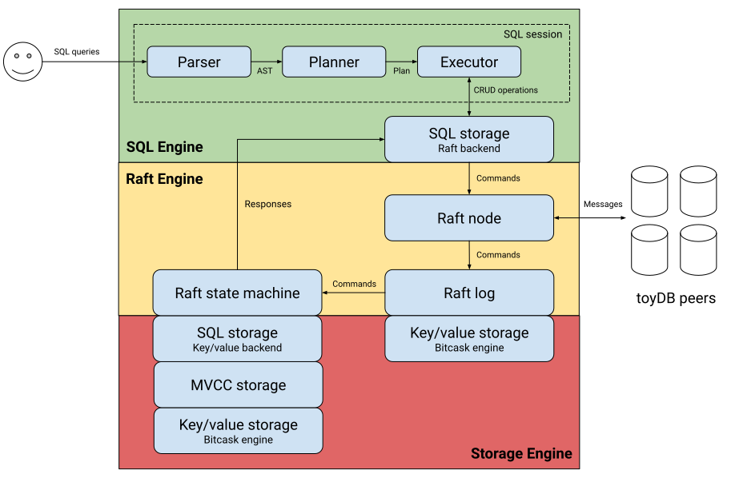

# <a></a> toyDB

Distributed SQL database in Rust, built from scratch as an educational project. Main features:

* [Raft distributed consensus engine][raft] for linearizable state machine replication.

* [ACID transaction engine][txn] with MVCC-based snapshot isolation.

* [Pluggable storage engine][storage] with [BitCask][bitcask] and [in-memory][memory] backends.

* [Iterator-based query engine][query] with [heuristic optimization][optimizer] and time-travel 
  support.

* [SQL interface][sql] including joins, aggregates, and transactions.

I originally wrote toyDB in 2020 to learn more about database internals. Since then, I've spent
several years building real distributed SQL databases at
[CockroachDB](https://github.com/cockroachdb/cockroach) and
[Neon](https://github.com/neondatabase/neon). Based on this experience, I've rewritten toyDB as a
simple illustration of the architecture and concepts behind distributed SQL databases.

toyDB is intended to be simple and understandable, and also functional and correct. Other aspects
like performance, scalability, and availability are non-goals -- these are major sources of
complexity in production-grade databases, and obscure the basic underlying concepts. Shortcuts have
been taken where possible.

[raft]: https://github.com/erikgrinaker/toydb/blob/main/src/raft/mod.rs
[txn]: https://github.com/erikgrinaker/toydb/blob/main/src/storage/mvcc.rs
[storage]: https://github.com/erikgrinaker/toydb/blob/main/src/storage/engine.rs
[bitcask]: https://github.com/erikgrinaker/toydb/blob/main/src/storage/bitcask.rs
[memory]: https://github.com/erikgrinaker/toydb/blob/main/src/storage/memory.rs
[query]: https://github.com/erikgrinaker/toydb/blob/main/src/sql/execution/executor.rs
[optimizer]: https://github.com/erikgrinaker/toydb/blob/main/src/sql/planner/optimizer.rs
[sql]: https://github.com/erikgrinaker/toydb/blob/main/src/sql/mod.rs

## Documentation

* [Architecture guide](docs/architecture/index.md): a guided tour of toyDB's code and architecture.

* [SQL examples](docs/examples.md): walkthrough of toyDB's SQL features.

* [SQL reference](docs/sql.md): toyDB's SQL reference documentation.

* [References](docs/references.md): research material used while building toyDB.

## Usage

With a [Rust compiler](https://www.rust-lang.org/tools/install) installed, a local five-node 
cluster can be built and started as:

```
$ ./cluster/run.sh
Starting 5 nodes on ports 9601-9605 with data under cluster/*/data/.
To connect to node 1, run: cargo run --release --bin toysql

toydb4 21:03:55 [INFO] Listening on [::1]:9604 (SQL) and [::1]:9704 (Raft)
toydb1 21:03:55 [INFO] Listening on [::1]:9601 (SQL) and [::1]:9701 (Raft)
toydb2 21:03:55 [INFO] Listening on [::1]:9602 (SQL) and [::1]:9702 (Raft)
toydb3 21:03:55 [INFO] Listening on [::1]:9603 (SQL) and [::1]:9703 (Raft)
toydb5 21:03:55 [INFO] Listening on [::1]:9605 (SQL) and [::1]:9705 (Raft)
toydb2 21:03:56 [INFO] Starting new election for term 1
[...]
toydb2 21:03:56 [INFO] Won election for term 1, becoming leader
```

A command-line client can be built and used with node 1 on `localhost:9601`:

```
$ cargo run --release --bin toysql
Connected to toyDB node n1. Enter !help for instructions.
toydb> CREATE TABLE movies (id INTEGER PRIMARY KEY, title VARCHAR NOT NULL);
toydb> INSERT INTO movies VALUES (1, 'Sicario'), (2, 'Stalker'), (3, 'Her');
toydb> SELECT * FROM movies;
1, 'Sicario'
2, 'Stalker'
3, 'Her'
```

toyDB supports most common SQL features, including joins, aggregates, and transactions. Below is an
`EXPLAIN` query plan of a more complex query (fetches all movies from studios that have released any
movie with an IMDb rating of 8 or more):

```
toydb> EXPLAIN SELECT m.title, g.name AS genre, s.name AS studio, m.rating
  FROM movies m JOIN genres g ON m.genre_id = g.id,
    studios s JOIN movies good ON good.studio_id = s.id AND good.rating >= 8
  WHERE m.studio_id = s.id
  GROUP BY m.title, g.name, s.name, m.rating, m.released
  ORDER BY m.rating DESC, m.released ASC, m.title ASC;

Remap: m.title, genre, studio, m.rating (dropped: m.released)
└─ Order: m.rating desc, m.released asc, m.title asc
   └─ Projection: m.title, g.name as genre, s.name as studio, m.rating, m.released
      └─ Aggregate: m.title, g.name, s.name, m.rating, m.released
         └─ HashJoin: inner on m.studio_id = s.id
            ├─ HashJoin: inner on m.genre_id = g.id
            │  ├─ Scan: movies as m
            │  └─ Scan: genres as g
            └─ HashJoin: inner on s.id = good.studio_id
               ├─ Scan: studios as s
               └─ Scan: movies as good (good.rating > 8 OR good.rating = 8)
```

## Architecture

toyDB's architecture is fairly typical for a distributed SQL database: a transactional
key/value store managed by a Raft cluster with a SQL query engine on top. See the
[architecture guide](./docs/architecture/index.md) for more details.

[](./docs/architecture/index.md)

## Tests

toyDB mainly uses [Goldenscripts](https://github.com/erikgrinaker/goldenscript) for tests. These 
script various scenarios, capture events and output, and later assert that the behavior remains the 
same. See e.g.:

* [Raft cluster tests](https://github.com/erikgrinaker/toydb/tree/main/src/raft/testscripts/node)
* [MVCC transaction tests](https://github.com/erikgrinaker/toydb/tree/main/src/storage/testscripts/mvcc)
* [SQL execution tests](https://github.com/erikgrinaker/toydb/tree/main/src/sql/testscripts)
* [End-to-end tests](https://github.com/erikgrinaker/toydb/tree/main/tests/scripts)

Run tests with `cargo test`, or have a look at the latest 
[CI run](https://github.com/erikgrinaker/toydb/actions/workflows/ci.yml).

## Benchmarks

toyDB is not optimized for performance, but comes with a `workload` benchmark tool that can run 
various workloads against a toyDB cluster. For example:

```sh
# Start a 5-node toyDB cluster.
$ ./cluster/run.sh
[...]

# Run a read-only benchmark via all 5 nodes.
$ cargo run --release --bin workload read
Preparing initial dataset... done (0.179s)
Spawning 16 workers... done (0.006s)
Running workload read (rows=1000 size=64 batch=1)...

Time   Progress     Txns      Rate       p50       p90       p99      pMax
1.0s      13.1%    13085   13020/s     1.3ms     1.5ms     1.9ms     8.4ms
2.0s      27.2%    27183   13524/s     1.3ms     1.5ms     1.8ms     8.4ms
3.0s      41.3%    41301   13702/s     1.2ms     1.5ms     1.8ms     8.4ms
4.0s      55.3%    55340   13769/s     1.2ms     1.5ms     1.8ms     8.4ms
5.0s      70.0%    70015   13936/s     1.2ms     1.5ms     1.8ms     8.4ms
6.0s      84.7%    84663   14047/s     1.2ms     1.4ms     1.8ms     8.4ms
7.0s      99.6%    99571   14166/s     1.2ms     1.4ms     1.7ms     8.4ms
7.1s     100.0%   100000   14163/s     1.2ms     1.4ms     1.7ms     8.4ms

Verifying dataset... done (0.002s)
```

The available workloads are:

* `read`: single-row primary key lookups.
* `write`: single-row inserts to sequential primary keys.
* `bank`: bank transfers between various customers and accounts. To make things interesting, this
  includes joins, secondary indexes, sorting, and conflicts.

For more information about workloads and parameters, run `cargo run --bin workload -- --help`.

Example workload results are listed below. Write performance is pretty atrocious, due to fsyncs 
and a lack of write batching at the Raft level. Disabling fsyncs, or using the in-memory engine, 
significantly improves write performance.

| Workload | BitCask     | BitCask w/o fsync | Memory      |
|----------|-------------|-------------------|-------------|
| `read`   | 14163 txn/s | 13941 txn/s       | 13949 txn/s |
| `write`  | 35 txn/s    | 4719 txn/s        | 7781 txn/s  |
| `bank`   | 21 txn/s    | 1120 txn/s        | 1346 txn/s  |

## Debugging

[VSCode](https://code.visualstudio.com) and the [CodeLLDB](https://marketplace.visualstudio.com/items?itemName=vadimcn.vscode-lldb)
extension can be used to debug toyDB, with the debug configuration under `.vscode/launch.json`.

Under the "Run and Debug" tag, select e.g. "Debug executable 'toydb'" or "Debug unit tests in
library 'toydb'".

## Credits

toyDB logo is courtesy of [@jonasmerlin](https://github.com/jonasmerlin).