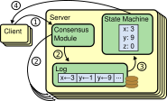
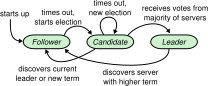

# toyDB Architecture

toyDB is a simple distributed SQL database, intended to illustrate how such systems are built. The
overall structure is similar to real-world distributed databases, but the design and implementation
has been kept as simple as possible for understandability. Performance and scalability are explicit
non-goals, as these are major sources of complexity in real-world systems.

> ℹ️ On GitHub, click ☰ in the top-right corner to show a table of contents.

## Properties

toyDB consists of a cluster of nodes that execute [SQL](https://en.wikipedia.org/wiki/SQL)
transactions against a replicated state machine. Clients can connect to any node in the cluster
and submit SQL statements. It is:

* **Distributed:** runs across a cluster of nodes.
* **Highly available:** tolerates loss of a minority of nodes.
* **SQL compliant:** correctly supports most common SQL features.
* **Strongly consistent:** committed writes are immediately visible to all readers ([linearizability](https://en.wikipedia.org/wiki/Linearizability)).
* **Transactional:** provides ACID transactions:
  * **Atomic:** groups of writes are applied as a single, atomic unit.
  * **Consistent:** database constraints and referential integrity are always enforced.
  * **Isolated:** concurrent transactions don't affect each other ([snapshot isolation](https://en.wikipedia.org/wiki/Snapshot_isolation)).
  * **Durable:** committed writes are never lost.

For simplicity, toyDB is:

* **Not scalable:** every node stores the full dataset, and all reads/writes happen on one node.
* **Not reliable:** only handles crash failures, not e.g. partial network partitions or node stalls.
* **Not performant:** data processing is slow, and not optimized at all.
* **Not efficient:** no compression or garbage collection, can load entire tables into memory.
* **Not full-featured:** only basic SQL functionality is implemented.
* **Not backwards compatible:** changes to data formats and protocols will break databases.
* **Not flexible:** nodes can't be added or removed while running, and take a long time to join.
* **Not secure:** there is no authentication, authorization, nor encryption.

## Overview

Internally, toyDB has a few main components:

* **Storage engine:** stores data on disk and manages transactions.
* **Raft consensus engine:** replicates data and coordinates cluster nodes.
* **SQL engine:** organizes SQL data, manages SQL sessions, and executes SQL statements.
* **Server:** manages network connections, both with SQL clients and Raft nodes.
* **Client:** provides a SQL user interface and communicates with the server.

This diagram illustrates the internal structure of a single toyDB node:


We will go through each of these components from the bottom up.

## Storage Engine

toyDB uses an embedded [key/value store](https://en.wikipedia.org/wiki/Key–value_database) for data
storage, located in the [`storage`](https://github.com/erikgrinaker/toydb/tree/213e5c02b09f1a3cac6a8bbd0a81773462f367f5/src/storage)
module. This stores arbitrary keys and values as binary byte strings, and doesn't care what they
contain. We'll see later how the SQL data model, with tables and rows, is mapped onto this key/value
structure.

The storage engine supports simple set/get/delete operations on individual keys. It does not itself
support transactions -- this is built on top, and we'll get back to it shortly.

Keys are stored in sorted order. This allows range scans, where we can iterate over all key/value
pairs between two specific keys, or with a specific key prefix. As we'll see later, this is needed
e.g. to scan all rows in a specific SQL table, to do limited SQL index scans, to scan the tail of
the Raft log, etc.

The storage engine is pluggable: there are multiple implementations, and the user can choose which
one to use in the config file. These implement the `storage::Engine` trait:

https://github.com/erikgrinaker/toydb/blob/4804df254034c51f367d1380d389d80695cd7054/src/storage/engine.rs#L8-L58

We'll discuss the two existing storage engine implementations next.

### `Memory` Storage Engine

The simplest storage engine is the `storage::Memory` engine. This is a trivial implementation which
stores all data in memory using the Rust standard library's
[`BTreeMap`](https://doc.rust-lang.org/std/collections/struct.BTreeMap.html), without persisting
data to disk. It is primarily used for testing.

This implementation is so simple that we can include it in its entirety here:

https://github.com/erikgrinaker/toydb/blob/8f8eae0dcf70b1a0df2e853b1f6600e0c7075340/src/storage/memory.rs#L8-L77

### `BitCask` Storage Engine

The main storage engine is `storage::BitCask`. This is a very simple variant of
[BitCask](https://riak.com/assets/bitcask-intro.pdf), used in the [Riak](https://riak.com/)
database. It is kind of like the [LSM-tree](https://en.wikipedia.org/wiki/Log-structured_merge-tree)'s
baby cousin.

https://github.com/erikgrinaker/toydb/blob/3e467512dca55843f0b071b3e239f14724f59a41/src/storage/bitcask.rs#L15-L55

toyDB's BitCask implementation uses a single append-only log file for storage. To write a key/value
pair, we simply append it to the file. To replace the key, we append a new key/value entry, and to
delete it, we append a special tombstone value. The last value in the file for a given key is used.
This also means that we don't need a separate [write-ahead log](https://en.wikipedia.org/wiki/Write-ahead_logging),
since the data file _is_ the write-ahead log.

The file format for a key/value pair is simply:

1. The key length, as a big-endian `u32` (4 bytes).
2. The value length, as a big-endian `i32` (4 bytes). -1 if tombstone.
3. The binary key (n bytes).
4. The binary value (n bytes).

For example, the key/value pair `foo=bar` would be written as follows (in hexadecimal):

```
keylen   valuelen key    value
00000003 00000003 666f6f 626172
```

https://github.com/erikgrinaker/toydb/blob/3e467512dca55843f0b071b3e239f14724f59a41/src/storage/bitcask.rs#L342-L366

To find key/value pairs, we maintain a `KeyDir` index which maps a key to the latest value's
position in the file. All keys must therefore fit in memory.

https://github.com/erikgrinaker/toydb/blob/3e467512dca55843f0b071b3e239f14724f59a41/src/storage/bitcask.rs#L57-L65

We generate this index by scanning through the entire file when it is opened, and then update it on
every subsequent write.

https://github.com/erikgrinaker/toydb/blob/3e467512dca55843f0b071b3e239f14724f59a41/src/storage/bitcask.rs#L267-L332

To read a value for a key, we simply look up the key's file location in the `KeyDir` index (if the
key exists), and then read it from the file:

https://github.com/erikgrinaker/toydb/blob/3e467512dca55843f0b071b3e239f14724f59a41/src/storage/bitcask.rs#L334-L340

To remove old garbage (replaced or deleted key/value pairs), the log file is compacted on startup.
This writes out the latest value of every live key/value pair to a new file, and replaces the old
file. They are written in sorted order by key, which makes later scans faster.

https://github.com/erikgrinaker/toydb/blob/3e467512dca55843f0b071b3e239f14724f59a41/src/storage/bitcask.rs#L172-L195

## Key and Value Encoding

The key/value store uses binary `Vec<u8>` keys and values, so we need an encoding scheme to 
translate between Rust in-memory data structures and the on-disk binary data. This is provided by
the [`encoding`](https://github.com/erikgrinaker/toydb/tree/213e5c02b09f1a3cac6a8bbd0a81773462f367f5/src/encoding)
module, with separate schemes for key and value encoding.

### `Bincode` Value Encoding

Values are encoded using [Bincode](https://github.com/bincode-org/bincode), a third-party binary
encoding scheme for Rust. Bincode is convenient because it can easily encode any arbitrary Rust
data type. But we could also have chosen e.g. [JSON](https://en.wikipedia.org/wiki/JSON),
[Protobuf](https://protobuf.dev), [MessagePack](https://msgpack.org/), or any other encoding.

We won't dwell on the actual binary format here, see the [Bincode specification](https://github.com/bincode-org/bincode/blob/trunk/docs/spec.md)
for details.

To use a consistent configuration for all encoding and decoding, we provide helper functions using
`bincode::config::standard()` in the [`encoding::bincode`](https://github.com/erikgrinaker/toydb/blob/213e5c02b09f1a3cac6a8bbd0a81773462f367f5/src/encoding/bincode.rs)
module:

https://github.com/erikgrinaker/toydb/blob/0ce1fb34349fda043cb9905135f103bceb4395b4/src/encoding/bincode.rs#L15-L27

Bincode uses the very common [Serde](https://serde.rs) framework for its API. toyDB also provides
an `encoding::Value` helper trait for value types with automatic `encode()` and `decode()` methods:

https://github.com/erikgrinaker/toydb/blob/b57ae6502e93ea06df00d94946a7304b7d60b977/src/encoding/mod.rs#L39-L68

Here's an example of how this is used to encode and decode an arbitrary `Dog` data type:

```rust
#[derive(serde::Serialize, serde::Deserialize)]
struct Dog {
    name: String,
    age: u8,
    good_boy: bool,
}

impl encoding::Value for Dog {}

let pluto = Dog { name: "Pluto".into(), age: 4, good_boy: true };
let bytes = pluto.encode();
println!("{bytes:02x?}");

// Outputs [05, 50, 6c, 75, 74, 6f, 04, 01].
//
// * Length of string "Pluto": 05.
// * String "Pluto": 50 6c 75 74 6f.
// * Age 4: 04.
// * Good boy: 01 (true).

let pluto = Dog::decode(&bytes)?; // gives us back Pluto
```

### `Keycode` Key Encoding

Unlike values, keys can't just use any binary encoding like Bincode. As mentioned before, the
storage engine sorts data by key to enable range scans, which will be used e.g. for SQL table scans,
limited SQL index scans, Raft log scans, etc. Because of this, the encoding needs to preserve the
[lexicographical order](https://en.wikipedia.org/wiki/Lexicographic_order) of the encoded values:
the binary byte slices must sort in the same order as the original values.

As an example of why we can't just use Bincode, let's consider two strings: "house" should be
sorted before "key", alphabetically. However, Bincode encodes strings prefixed by their length, so
"key" would be sorted before "house" in binary form:

```
03 6b 65 79       ← 3 bytes: key
05 68 6f 75 73 65 ← 5 bytes: house
```

For similar reasons, we can't just encode numbers in their native binary form, because the
[little-endian](https://en.wikipedia.org/wiki/Endianness) representation will sometimes order very
large numbers before small numbers, and the [sign bit](https://en.wikipedia.org/wiki/Sign_bit)
will order positive numbers before negative numbers.

We also have to be careful with value sequences, which should be ordered element-wise. For example,
the pair ("a", "xyz") should be ordered before ("ab", "cd"), so we can't just encode the strings
one after the other like "axyz" and "abcd" since that would sort "abcd" first.

toyDB provides an encoding called "Keycode" which provides these properties, in the
[`encoding::keycode`](https://github.com/erikgrinaker/toydb/blob/213e5c02b09f1a3cac6a8bbd0a81773462f367f5/src/encoding/keycode.rs)
module. It is implemented as a [Serde](https://serde.rs) (de)serializer, which
requires a lot of boilerplate code, but we'll just focus on the actual encoding.

Keycode only supports a handful of primary data types, and just needs to order values of the same
type:

* `bool`: `00` for `false` and `01` for `true`.

    https://github.com/erikgrinaker/toydb/blob/2027641004989355c2162bbd9eeefcc991d6b29b/src/encoding/keycode.rs#L113-L117

* `u64`: the [big-endian](https://en.wikipedia.org/wiki/Endianness) binary encoding.

    https://github.com/erikgrinaker/toydb/blob/2027641004989355c2162bbd9eeefcc991d6b29b/src/encoding/keycode.rs#L157-L161

* `i64`: the [big-endian](https://en.wikipedia.org/wiki/Endianness) binary encoding, but with the
   sign bit flipped to order negative numbers before positive ones.

    https://github.com/erikgrinaker/toydb/blob/2027641004989355c2162bbd9eeefcc991d6b29b/src/encoding/keycode.rs#L131-L143

* `f64`: the [big-endian IEEE 754](https://en.wikipedia.org/wiki/Double-precision_floating-point_format)
  binary encoding, but with the sign bit flipped, and all bits flipped for negative numbers, to
  order negative numbers correctly.

    https://github.com/erikgrinaker/toydb/blob/2027641004989355c2162bbd9eeefcc991d6b29b/src/encoding/keycode.rs#L167-L179

* `Vec<u8>`: terminated by `00 00`, with `00` escaped as `00 ff` to disambiguate it.

    https://github.com/erikgrinaker/toydb/blob/2027641004989355c2162bbd9eeefcc991d6b29b/src/encoding/keycode.rs#L190-L205

* `String`: like `Vec<u8>`.

    https://github.com/erikgrinaker/toydb/blob/2027641004989355c2162bbd9eeefcc991d6b29b/src/encoding/keycode.rs#L185-L188

* `Vec<T>`, `[T]`, `(T,)`: just the concatenation of the inner values.

    https://github.com/erikgrinaker/toydb/blob/2027641004989355c2162bbd9eeefcc991d6b29b/src/encoding/keycode.rs#L295-L307

* `enum`: the enum variant's numerical index as a `u8`, then the inner values (if any).

    https://github.com/erikgrinaker/toydb/blob/2027641004989355c2162bbd9eeefcc991d6b29b/src/encoding/keycode.rs#L223-L227

Decoding is just the inverse of the encoding.

Like `encoding::Value`, there is also an `encoding::Key` helper trait:

https://github.com/erikgrinaker/toydb/blob/b57ae6502e93ea06df00d94946a7304b7d60b977/src/encoding/mod.rs#L20-L37

We typically use enums to represent different kinds of keys. For example, if we wanted to store
cars and video games, we could use:

```rust
#[derive(serde::Serialize, serde::Deserialize)]
enum Key {
    Car(String, String, u64),    // make, model, year
    Game(String, u64, Platform), // name, year, platform
}

#[derive(serde::Serialize, serde::Deserialize)]
enum Platform {
    PC,
    PS5,
    Switch,
    Xbox,
}

impl encoding::Key for Key {}

let returnal = Key::Game("Returnal".into(), 2021, Platform::PS5);
let bytes = returnal.encode();
println!("{bytes:02x?}");

// Outputs [01, 52, 65, 74, 75, 72, 6e, 61, 6c, 00, 00, 00, 00, 00, 00, 00, 00, 07, e5, 01].
//
// * Key::Game: 01
// * Returnal: 52 65 74 75 72 6e 61 6c 00 00
// * 2021: 00 00 00 00 00 00 07 e5
// * Platform::PS5: 01

let returnal = Key::decode(&bytes)?;
```

Because the keys are sorted in element-wise order, this would allow us to e.g. perform a prefix
scan to fetch all platforms which Returnal (2021) was released on, or perform a range scan to fetch 
all models of Nissan Altima released between 2010 and 2015.

## MVCC Transactions

Transactions provide _atomicity_: a user can submit multiple writes which will take effect as a
single group, at the same instant, when they are _committed_. Other users should never see some of
the writes without the others. And they provide _durability_: committed writes should never be lost
(even if the system crashes), and should remain visible.

Transactions also provide _isolation_: they should appear to have the entire database to themselves,
unaffected by what other users may be doing at the same time. Two transactions may conflict, in
which case one has to retry, but if a transaction succeeds then the user can rest easy that the
operations were executed correctly without interference. This is a very powerful guarantee, since
it basically eliminates the risk of [race conditions](https://en.wikipedia.org/wiki/Race_condition)
(a class of bugs that are notoriously hard to fix). 

To illustrate how transactions work, here's an example test script for the MVCC code (there's a
bunch of [other test scripts](https://github.com/erikgrinaker/toydb/tree/aa14deb71f650249ce1cab8828ed7bcae2c9206e/src/storage/testscripts/mvcc)
there too):

https://github.com/erikgrinaker/toydb/blob/a73e24b7e77671b9f466e0146323cd69c3e27bdf/src/storage/testscripts/mvcc/bank#L1-L69

To provide such [ACID transactions](https://en.wikipedia.org/wiki/ACID), toyDB uses a common
technique called [Multi-Version Concurrency Control](https://en.wikipedia.org/wiki/Multiversion_concurrency_control)
(MVCC). It is implemented at the key/value storage level, in the
[`storage::mvcc`](https://github.com/erikgrinaker/toydb/blob/8f8eae0dcf70b1a0df2e853b1f6600e0c7075340/src/storage/mvcc.rs)
module. It sits on top of any `storage::Engine` implementation, which it uses for actual data
storage.

https://github.com/erikgrinaker/toydb/blob/8f8eae0dcf70b1a0df2e853b1f6600e0c7075340/src/storage/mvcc.rs#L220-L231

MVCC provides a guarantee called [snapshot isolation](https://en.wikipedia.org/wiki/Snapshot_isolation):
a transaction sees a snapshot of the database as it was when the transaction began. Any later
changes will be invisible to it.

It does this by storing several historical versions of key/value pairs. The version number is simply
a number that's incremented for every new transaction:

https://github.com/erikgrinaker/toydb/blob/8f8eae0dcf70b1a0df2e853b1f6600e0c7075340/src/storage/mvcc.rs#L155-L158

Each transaction has its own unique version number. When it writes a key/value pair it appends its
version number to the key as `Key::Version(&[u8], Version)`, via the Keycode encoding we saw above.
If an old version of the key already exists, it will have a different version number and therefore
be stored as a separate key/value in the storage engine, so it will be left intact. To delete a key,
it writes a special tombstone value.

https://github.com/erikgrinaker/toydb/blob/8f8eae0dcf70b1a0df2e853b1f6600e0c7075340/src/storage/mvcc.rs#L183-L189

Here's a simple diagram of what a history of versions 1 to 5 of keys `a` to `d` might look like:

https://github.com/erikgrinaker/toydb/blob/8f8eae0dcf70b1a0df2e853b1f6600e0c7075340/src/storage/mvcc.rs#L11-L26

Given this versioning scheme, we can summarize the MVCC protocol with a few simple rules:

1. When a new transaction begins, it:
    * Obtains the next available version number.
    * Adds its version number to the set of active transactions (the "active set").
    * Takes a snapshot of other uncommitted transaction versions from the active set.

2. When the transaction reads a key, it:
    * Ignores versions above its own version.
    * Ignores versions in its active set (uncommitted transactions).
    * Returns the latest version of the key at or below its own version.

3. When the transaction writes a key, it:
    * Looks for a key version above its own version; errors if found.
    * Looks for a key version in its active set (uncommitted transactions); errors if found.
    * Writes a key/value pair with its own version.

4. When the transaction commits, it:
    * Flushes all writes to disk.
    * Removes itself from the active set.

And that's basically it! The transaction's writes all become visible atomically at the instant it
commits and removes itself from the active set, since new transactions no longer ignore its version.
The transaction saw a stable snapshot of the database, since it ignored newer versions and versions
that were uncommitted when it began. The transaction can read its own writes, even though noone else
can. And if any of its writes conflict with another transaction it would get an error and have to
retry.

Not only that, this also allows us to do time-travel queries, where we can query the database as it
was at any time in the past: we simply pick a version number to read at.

There are a few more details that we've left out here. To roll back the transaction, it needs to
keep track of its writes to undo them. To delete keys we write tombstone versions. For read-only
queries we can avoid assigning new version numbers. And we don't garbage collect old versions. See
the module documentation for more details:

https://github.com/erikgrinaker/toydb/blob/8f8eae0dcf70b1a0df2e853b1f6600e0c7075340/src/storage/mvcc.rs#L1-L140

Let's walk through a simple example with code pointers to get a feel for how this works. Notice how
we don't have to mess with any version numbers here -- this is an internal MVCC implementation
detail.

```rust
// Open a BitCask database in the file "toy.db" with MVCC support.
let path = PathBuf::from("toy.db");
let db = MVCC::new(BitCask::new(path)?);

// Begin a new transaction.
let txn = db.begin()?;

// Read the key "foo", and decode the binary value as a u64 with bincode.
let bytes = txn.get(b"foo")?.expect("foo not found");
let mut value: u64 = bincode::deserialize(&bytes)?;

// Delete "foo".
txn.delete(b"foo")?;

// Add 1 to the value, and write it back to the key "bar".
value += 1;
let bytes = bincode::serialize(&value);
txn.set(b"bar", bytes)?;

// Commit the transaction.
txn.commit()?;
```

First, we begin a new transaction with `MVCC::begin()`. This calls through to
`Transaction::begin()`, which obtains a version number stored in `Key::NextVersion` and increments
it, then takes a snapshot of the active set in `Key::ActiveSet`, adds itself to it, and writes it
back:

https://github.com/erikgrinaker/toydb/blob/8f8eae0dcf70b1a0df2e853b1f6600e0c7075340/src/storage/mvcc.rs#L368-L391

This returns a `Transaction` object which provides the primary key/value API with get/set/delete
methods. It contains the main state of the transaction: it's version number and active set.

https://github.com/erikgrinaker/toydb/blob/8f8eae0dcf70b1a0df2e853b1f6600e0c7075340/src/storage/mvcc.rs#L294-L327

We then call `Transaction::get(b"foo")` to read the value of the key `foo`. We want to find the
latest version that's visible to us (ignoring future versions and the active set). Recall that
we store multiple version of each key as `Key::Version(key, version)`. The Keycode encoding ensures
that all versions are stored in sorted order, so we can do a reverse range scan from
`Key::Version(b"foo", 0)` to `Key::Version(b"foo", self.version)` and return the latest version
that's visible to us:

https://github.com/erikgrinaker/toydb/blob/8f8eae0dcf70b1a0df2e853b1f6600e0c7075340/src/storage/mvcc.rs#L564-L581

When we call `Transaction::delete(b"foo")` and `Transaction::set(b"bar", value)`, we're just calling
through to the same `Transaction::write_version()` method, but use `None` as a deletion tombstone
and `Some(value)` for a regular key/value pair:

https://github.com/erikgrinaker/toydb/blob/8f8eae0dcf70b1a0df2e853b1f6600e0c7075340/src/storage/mvcc.rs#L514-L522

To write a new version of a key, we first have to check for conflicts by seeing if there's a
version of the key that's invisible to us -- if it is, we conflicted with a concurrent transaction.
Like with `Transaction::get()`, we do this with a range scan.

We then just go on to write the `Key::Version(b"foo", self.version)` and encode the value as an
`Option<value>` to accomodate the `None` tombstone marker. We also write a
`Key::TxnWrite(version, key)` to keep a version-indexed list of our writes in case we have to roll
back.

https://github.com/erikgrinaker/toydb/blob/8f8eae0dcf70b1a0df2e853b1f6600e0c7075340/src/storage/mvcc.rs#L524-L562

Finally, `Transaction::commit()` will make our transaction take effect and become visible. It does
this simply by removing itself from the active set in `Key::ActiveSet`, and also cleaning up its
`Key::TxnWrite` write index. As the comment says, we don't actually have to flush to durable storage
here, because the Raft log will provide durability for us -- we'll get back to this later.

https://github.com/erikgrinaker/toydb/blob/8f8eae0dcf70b1a0df2e853b1f6600e0c7075340/src/storage/mvcc.rs#L466-L485

## Raft Consensus Protocol

[Raft](https://raft.github.io) is a distributed consensus protocol which replicates data across a
cluster of nodes in a consistent and durable manner. It is described in the very readable
[Raft paper](https://raft.github.io/raft.pdf), and the more comprehensive
[Raft thesis](https://web.stanford.edu/~ouster/cgi-bin/papers/OngaroPhD.pdf).

The toyDB Raft implementation is in the [`raft`](https://github.com/erikgrinaker/toydb/tree/213e5c02b09f1a3cac6a8bbd0a81773462f367f5/src/raft)
module, and is described in the module documentation:

https://github.com/erikgrinaker/toydb/blob/d96c6dd5ae7c0af55ee609760dcd958c289a44f2/src/raft/mod.rs#L1-L240

Raft is fundamentally the same protocol as [Paxos](https://lamport.azurewebsites.net/pubs/paxos-simple.pdf)
and [Viewstamped Replication](https://pmg.csail.mit.edu/papers/vr-revisited.pdf), but an
opinionated variant designed to be simple, understandable, and practical. It is widely used in the
industry.

Briefly, Raft elects a leader node which coordinates writes and replicates them to followers. Once a
majority (>50%) of nodes have acknowledged a write, it is considered durably committed. It is common
for the leader to also serve reads, since it always has the most recent data and is thus strongly
consistent.

A cluster must have a majority of nodes (known as a [quorum](https://en.wikipedia.org/wiki/Quorum_(distributed_computing)))
live and connected to remain available, otherwise it will not commit writes in order to guarantee
data consistency and durability. Since there can only be one majority in the cluster, this prevents
a [split brain](https://en.wikipedia.org/wiki/Split-brain_(computing)) scenario where two active
leaders can exist concurrently (e.g. during a [network partition](https://en.wikipedia.org/wiki/Network_partition))
and store conflicting values.

The Raft leader appends writes to an ordered command log, which is then replicated to followers.
Once a majority has replicated the log up to a given entry, that log prefix is committed and then
applied to a state machine. This ensures that all nodes will apply the same commands in the same
order and eventually reach the same state (assuming the commands are deterministic). Raft itself
doesn't care what the state machine and commands are, but in toyDB's case it is a key/value store
with put/delete commands.

This diagram from the Raft paper illustrates how a Raft node receives a command from a client (1),
adds it to its log and reaches consensus with other nodes (2), then applies it to its state machine
(3) before returning a result to the client (4):



You may notice that Raft is not very scalable, since all writes and reads go via the leader node,
and every node must store the entire dataset. Raft solves replication and availability, but not
scalability. Real-world systems typically provide horizontal scalability by splitting a large
dataset across many separate Raft clusters (i.e. sharding), but this is out of scope for toyDB.

For simplicitly, toyDB implements the bare minimum of Raft, and omits optimizations described in
the paper such as state snapshots, log truncation, leader leases, and more. The implementation is
in the [`raft`](https://github.com/erikgrinaker/toydb/blob/d96c6dd5ae7c0af55ee609760dcd958c289a44f2/src/raft/mod.rs)
module, and we'll walk through the main components next.

There is a comprehensive set of Raft test scripts in [`src/raft/testscripts/node`](https://github.com/erikgrinaker/toydb/blob/386153f5c00cb1a88b1ac8489ae132674d96f68a/src/raft/testscripts/node),
which illustrate the protocol in a wide variety of scenarios.

### Log Storage

Raft replicates an ordered command log consisting of `raft::Entry`:

https://github.com/erikgrinaker/toydb/blob/8782c2b05f11333c1586ef248f1a13dc1c8dec4a/src/raft/log.rs#L13-L26

`index` specifies the position in the log, and `command` contains the binary command to apply to the
state machine. The `term` identifies the leadership term in which the command was proposed: a new
term begins when a new leader election is held (we'll get back to this later).

Entries are appended to the log by the leader and replicated to followers. Once acknowledged by a
quorum, the log up to that index is committed, and will never change. Entries that are not yet
committed may be replaced or removed if the leader changes.

The Raft log enforces the following invariants:

https://github.com/erikgrinaker/toydb/blob/8782c2b05f11333c1586ef248f1a13dc1c8dec4a/src/raft/log.rs#L80-L91

`raft::Log` implements a Raft log, and stores log entries in a `storage::Engine` key/value store:

https://github.com/erikgrinaker/toydb/blob/8782c2b05f11333c1586ef248f1a13dc1c8dec4a/src/raft/log.rs#L43-L116

It also stores some additional metadata that we'll need later: the current term, vote, and commit
index. These are stored as separate keys:

https://github.com/erikgrinaker/toydb/blob/8782c2b05f11333c1586ef248f1a13dc1c8dec4a/src/raft/log.rs#L30-L39

Individual entries are appended to the log via `Log::append`, typically when the leader wants to
replicate a new write:

https://github.com/erikgrinaker/toydb/blob/8782c2b05f11333c1586ef248f1a13dc1c8dec4a/src/raft/log.rs#L190-L203

Entries can also be appended in bulk via `Log::splice`, typically when entries are replicated to
followers. This also allows replacing existing uncommitted entries, e.g. after a leader change:

https://github.com/erikgrinaker/toydb/blob/8782c2b05f11333c1586ef248f1a13dc1c8dec4a/src/raft/log.rs#L269-L343

Committed entries are marked by `Log::commit`, making them immutable and eligible for state machine
application:

https://github.com/erikgrinaker/toydb/blob/8782c2b05f11333c1586ef248f1a13dc1c8dec4a/src/raft/log.rs#L205-L222

It also has methods to read entries from the log, either individually as `Log::get` or by iterating
over a range with `Log::scan`:

https://github.com/erikgrinaker/toydb/blob/8782c2b05f11333c1586ef248f1a13dc1c8dec4a/src/raft/log.rs#L224-L267

### State Machine Interface

Raft doesn't know or care what the log commands are, nor what the state machine does with them. It
simply takes `raft::Entry` from the log and gives them to the state machine.

The Raft state machine is represented by the `raft::State` trait. Raft will ask about the last
applied entry via `State::get_applied_index`, and feed it newly committed entries via
`State::apply`. It also allows reads via `State::read`, but we'll get back to that later.

The state machine does not have to flush its state to durable storage after each transition; on node
crashes, the state machine is allowed to regress, and will be caught up by replaying the unapplied
log entries. It is also possible to implement a purely in-memory state machine (and in fact, toyDB
allows running the state machine with a `Memory` storage engine).

The state machine must take care to be deterministic: the same commands applied in the same order
must result in the same state across all nodes. This means that a command can't e.g. read the
current time or generate a random number -- these values must be included in the command. It also
means that non-deterministic errors, such as an IO error, must halt command application (in toyDB's
case, we just panic and crash the node).

In toyDB, the state machine is a key/value store that manages SQL data, as we'll see in the SQL
section.

https://github.com/erikgrinaker/toydb/blob/8782c2b05f11333c1586ef248f1a13dc1c8dec4a/src/raft/state.rs#L4-L51

### Node Roles

In Raft, a node can have one out of three roles:

* **Leader:** replicates writes to followers and serves client requests.
* **Follower:** replicates writes from a leader.
* **Candidate:** campaigns for leadership.

The Raft paper summarizes these roles and transitions in the following diagram (we'll discuss
leader election in detail below):



In toyDB, a node is represented by the `raft::Node` enum, with variants for each state:

https://github.com/erikgrinaker/toydb/blob/8782c2b05f11333c1586ef248f1a13dc1c8dec4a/src/raft/node.rs#L47-L66

This wraps the `raft::RawNode<Role>` type which contains the inner node state. It is generic over
the role, and uses the [typestate pattern](http://cliffle.com/blog/rust-typestate/) to provide
methods and transitions depending on the node's current role, enforcing state transitions and
invariants at compile time via Rust's type system. For example, only `RawNode<Candidate>` has an
`into_leader()` method, since only candidates can transition to leaders (when they win an election).

https://github.com/erikgrinaker/toydb/blob/8782c2b05f11333c1586ef248f1a13dc1c8dec4a/src/raft/node.rs#L156-L177

The `RawNode::role` field contains role-specific state as structs implementing the `Role` marker
trait:

https://github.com/erikgrinaker/toydb/blob/8782c2b05f11333c1586ef248f1a13dc1c8dec4a/src/raft/node.rs#L661-L680

https://github.com/erikgrinaker/toydb/blob/8782c2b05f11333c1586ef248f1a13dc1c8dec4a/src/raft/node.rs#L242-L255

https://github.com/erikgrinaker/toydb/blob/8782c2b05f11333c1586ef248f1a13dc1c8dec4a/src/raft/node.rs#L523-L531

### Node Interface and Communication

The `raft::Node` enum has two main methods that drive the node. These consume the current node and
return a new node, possibly with a different role.

`tick()` advances time by a logical tick. This is used to measure the passage of time, e.g. to
trigger election timeouts or periodic leader heartbeats. toyDB uses a tick interval of 100
milliseconds (see `raft::TICK_INTERVAL`), and will call `tick()` on the node at this rate.

https://github.com/erikgrinaker/toydb/blob/8782c2b05f11333c1586ef248f1a13dc1c8dec4a/src/raft/node.rs#L125-L132

`step()` processes an inbound message from a different node or client:

https://github.com/erikgrinaker/toydb/blob/8782c2b05f11333c1586ef248f1a13dc1c8dec4a/src/raft/node.rs#L107-L123

Outbound messages to other nodes are sent via the `RawNode::tx` channel:

https://github.com/erikgrinaker/toydb/blob/8782c2b05f11333c1586ef248f1a13dc1c8dec4a/src/raft/node.rs#L171-L172

Messages are wrapped in a `raft::Envelope` specifying the sender and recipient:

https://github.com/erikgrinaker/toydb/blob/d96c6dd5ae7c0af55ee609760dcd958c289a44f2/src/raft/message.rs#L10-L21

The envelope contains a `raft::Message`, an enum which encodes the Raft message protocol. We won't
dwell on the specific message types here, but discuss them invididually in the following sections.
Raft does not require reliable message delivery, so messages may be dropped or reordered at any
time, although toyDB's use of TCP provides stronger delivery guarantees.

https://github.com/erikgrinaker/toydb/blob/d96c6dd5ae7c0af55ee609760dcd958c289a44f2/src/raft/message.rs#L25-L152

This is an entirely synchronous and deterministic model -- the same sequence of calls on a given
node in a given initial state will always produce the same result. This is very convenient for
testing and understandability. We will see later how toyDB drives the node on a separate thread,
provides a network transport for messages, and ticks it at regular intervals.

### Leader Election and Terms

In the steady state, Raft simply has a leader which replicates writes to followers. But to reach
this steady state, we must elect a leader, which is where much of the subtle complexity lies. See
the Raft paper for comprehensive details and safety arguments, we'll summarize it briefly below.

Raft divides time into _terms_. The term is a monotonically increasing number starting at 1. There
can only be one leader in a term (or none if an election fails), and the term can never regress.
Replicated commands belong to the specific term under which they were proposed.

https://github.com/erikgrinaker/toydb/blob/8782c2b05f11333c1586ef248f1a13dc1c8dec4a/src/raft/node.rs#L20-L21

Let's walk through an election, where we bootstrap a brand new, empty toyDB cluster with 3 nodes.

Nodes are initialized by calling `Node::new()`. Since this is a new cluster, they are given an empty
`raft::Log` and `raft::State`, at term 0. Nodes start with role `Follower`, but without a leader.

https://github.com/erikgrinaker/toydb/blob/8782c2b05f11333c1586ef248f1a13dc1c8dec4a/src/raft/node.rs#L68-L87

https://github.com/erikgrinaker/toydb/blob/8782c2b05f11333c1586ef248f1a13dc1c8dec4a/src/raft/node.rs#L266-L290

Now, nothing really happens for a while, as the nodes are waiting to maybe hear from an existing
leader (there is none). Every 100 ms we call `tick()`, until we reach `election_timeout`:

https://github.com/erikgrinaker/toydb/blob/8782c2b05f11333c1586ef248f1a13dc1c8dec4a/src/raft/node.rs#L489-L497

Notice how `new()` set `election_timeout` to a random value (in the range `ELECTION_TIMEOUT_RANGE`
of 10-20 ticks, i.e. 1-2 seconds). If all nodes had the same timeout, they would likely campaign for
leadership simultaneously, resulting in an election tie -- Raft uses randomized election timeouts to
avoid such ties.

Once a node reaches `election_timeout` it transitions to role `Candidate`:

https://github.com/erikgrinaker/toydb/blob/8782c2b05f11333c1586ef248f1a13dc1c8dec4a/src/raft/node.rs#L292-L312

When it becomes a candidate it campaigns for leadership by increasing its term to 1, voting for
itself, and sending `Message::Campaign` to all peers asking for their vote:

https://github.com/erikgrinaker/toydb/blob/8782c2b05f11333c1586ef248f1a13dc1c8dec4a/src/raft/node.rs#L647-L658

In Raft, the term can't regress, and a node can only cast a single vote in each term (even across
restarts), so both of these are persisted to disk via `Log::set_term_vote()`.

When the two other nodes (still in state `Follower`) receive the `Message::Campaign` asking for a
vote, they will first increase their term to 1 (since this is a newer term than their local term 0):

https://github.com/erikgrinaker/toydb/blob/8782c2b05f11333c1586ef248f1a13dc1c8dec4a/src/raft/node.rs#L347-L351

They then grant the vote since they haven't yet voted for anyone else in term 1. They persist the
vote to disk via `Log::set_term_vote()` and return a `Message::CampaignResponse { vote: true }` to
the candidate:

https://github.com/erikgrinaker/toydb/blob/8782c2b05f11333c1586ef248f1a13dc1c8dec4a/src/raft/node.rs#L424-L449

They also check that the candidate's log is at least as long as theirs, which is trivially true in
this case since the log is empty. This is necessary to ensure that a leader has all committed
entries (see section 5.4.1 in the Raft paper).

When the candidate receives the `Message::CampaignResponse` it records the vote from each node. Once
it has a quorum (in this case 2 out of 3 votes including its own vote) it becomes leader in term 1:

https://github.com/erikgrinaker/toydb/blob/8782c2b05f11333c1586ef248f1a13dc1c8dec4a/src/raft/node.rs#L599-L606

When it becomes leader, it sends a `Message::Heartbeat` to all peers to tell them it is now the
leader in term 1. It also appends an empty entry to its log and replicates it, but we will ignore
this for now (see section 5.4.2 in the Raft paper for why).

https://github.com/erikgrinaker/toydb/blob/8782c2b05f11333c1586ef248f1a13dc1c8dec4a/src/raft/node.rs#L563-L583

When the other nodes receive the heartbeat, they will follow the leader:

https://github.com/erikgrinaker/toydb/blob/8782c2b05f11333c1586ef248f1a13dc1c8dec4a/src/raft/node.rs#L359-L384

From now on, the leader will send periodic `Message::Heartbeat` every 4 ticks, i.e. 400 ms (see
`HEARTBEAT_INTERVAL`) to assert its leadership:

https://github.com/erikgrinaker/toydb/blob/8782c2b05f11333c1586ef248f1a13dc1c8dec4a/src/raft/node.rs#L945-L953

The followers record when they last received any message from the leader, and will hold a new
election if they haven't heard from the leader in an election timeout (e.g. due to a leader crash
or network partition):

https://github.com/erikgrinaker/toydb/blob/8782c2b05f11333c1586ef248f1a13dc1c8dec4a/src/raft/node.rs#L353-L356

https://github.com/erikgrinaker/toydb/blob/8782c2b05f11333c1586ef248f1a13dc1c8dec4a/src/raft/node.rs#L489-L497

This entire process is illustrated in the test script [`election`](https://github.com/erikgrinaker/toydb/blob/cb234a0b776484608118fd9382869ee5bc30d4f0/src/raft/testscripts/node/election),
along with several other test scripts that show e.g. [election ties](https://github.com/erikgrinaker/toydb/blob/cb234a0b776484608118fd9382869ee5bc30d4f0/src/raft/testscripts/node/election_tie),
[contested elections](https://github.com/erikgrinaker/toydb/blob/cb234a0b776484608118fd9382869ee5bc30d4f0/src/raft/testscripts/node/election_contested),
and other scenarios:

https://github.com/erikgrinaker/toydb/blob/cb234a0b776484608118fd9382869ee5bc30d4f0/src/raft/testscripts/node/election#L1-L72

### Client Requests and Forwarding

Once a leader has been elected, we need to submit write and read requests to it. This is done by
stepping a request message into the node using the local node ID, marked with a unique request ID
(toyDB uses random UUIDv4), and waiting for an outbound response message with the same ID:

https://github.com/erikgrinaker/toydb/blob/d96c6dd5ae7c0af55ee609760dcd958c289a44f2/src/raft/message.rs#L134-L151

https://github.com/erikgrinaker/toydb/blob/d96c6dd5ae7c0af55ee609760dcd958c289a44f2/src/raft/message.rs#L164-L188

The requests and responses themselves are arbitrary binary data which is interpreted by the state
machine. For our purposes here, let's pretend the requests are:

* `Request::Write("key=value")` → `Response::Write("ok")`
* `Request::Read("key")` → `Response::Read("value")`

The fundamental difference between write and read requests are that write requests are replicated
through Raft and executed on all nodes, while read requests are only executed on the leader without
being appended to the log. It would be possible to execute reads on followers too, for load
balancing, but these reads would be eventually consistent and thus violate linearizability, so toyDB
only executes reads on the leader.

If a request is submitted to a follower, it will be forwarded to the leader and the response
forwarded back to the client (distinguished by the sender/recipient node ID -- a client always
uses the local node ID):

https://github.com/erikgrinaker/toydb/blob/8782c2b05f11333c1586ef248f1a13dc1c8dec4a/src/raft/node.rs#L451-L474

For simplicity, we cancel the request with `Error::Abort` if a request is submitted to a candidate,
and similarly if a follower changes its role to candidate or discovers a new leader. We could have
held on to these and redirected them to a new leader, but the client may as well retry.

We'll look at the actual write/read request processing next.

### Write Replication and Application

When the leader receives a write request, it proposes the command for replication to followers. It
keeps track of the in-flight write and its assigned log index in `writes`, such that it can
respond to the client with the command result once it has been committed and applied.

https://github.com/erikgrinaker/toydb/blob/8782c2b05f11333c1586ef248f1a13dc1c8dec4a/src/raft/node.rs#L895-L904

To propose the command, the leader appends it to its log and eagerly sends a `Message::Append` to
each follower to replicate it to their logs:

https://github.com/erikgrinaker/toydb/blob/8782c2b05f11333c1586ef248f1a13dc1c8dec4a/src/raft/node.rs#L966-L980

In steady state, `Message::Append` just contains the single log entry we appended above:

https://github.com/erikgrinaker/toydb/blob/d96c6dd5ae7c0af55ee609760dcd958c289a44f2/src/raft/message.rs#L87-L108

However, sometimes followers may be lagging behind the leader (e.g. after a crash), or their log may
have diverged from the leader (e.g. unsuccessful proposals from a stale leader after a network
partition). To handle these cases, the leader tracks the replication progress of each follower as
`raft::Progress`:

https://github.com/erikgrinaker/toydb/blob/8782c2b05f11333c1586ef248f1a13dc1c8dec4a/src/raft/node.rs#L682-L698

We'll gloss over these cases here (see the Raft paper and the code in `raft::Progress` and
`maybe_send_append()` for details). In the steady state, where each entry is successfully appended
and replicated one at a time, `maybe_send_append()` will fall through to the bottom and send a
single entry:

https://github.com/erikgrinaker/toydb/blob/8782c2b05f11333c1586ef248f1a13dc1c8dec4a/src/raft/node.rs#L1068-L1128

The `Message::Append` contains the index/term of the entry immediately before the new entry as
`base_index` and `base_term`. If the follower's log also contains an entry with this index and term
then its log is guaranteed to match (be equal to) the leader's log up to this entry (see section 5.3
in the Raft paper). The follower can then append the new log entry and return a
`Message::AppendResponse` confirming that the entry was appended and that its log matches the
leader's log up to `match_index`:

https://github.com/erikgrinaker/toydb/blob/8782c2b05f11333c1586ef248f1a13dc1c8dec4a/src/raft/node.rs#L386-L410

When the leader receives the `Message::AppendResponse`, it will update its view of the follower's
`match_index`.

https://github.com/erikgrinaker/toydb/blob/8782c2b05f11333c1586ef248f1a13dc1c8dec4a/src/raft/node.rs#L844-L858

https://github.com/erikgrinaker/toydb/blob/8782c2b05f11333c1586ef248f1a13dc1c8dec4a/src/raft/node.rs#L701-L710

Once a quorum of nodes (in our case 2 out of 3 including the leader) have the entry in their log,
the leader can commit the entry and apply it to the state machine. It looks up the in-flight write
request from `writes` and sends the command result back to the client as `Message::ClientResponse`:

https://github.com/erikgrinaker/toydb/blob/8782c2b05f11333c1586ef248f1a13dc1c8dec4a/src/raft/node.rs#L982-L1032

The leader will also propagate the new commit index to followers via the next heartbeat, so that
they can also apply any pending log entries to their state machine. This isn't strictly necessary,
since reads are executed on the leader and nodes have to apply pending entries before becoming
leaders, but we do it anyway so that they don't fall too far behind on application.

https://github.com/erikgrinaker/toydb/blob/8782c2b05f11333c1586ef248f1a13dc1c8dec4a/src/raft/node.rs#L359-L384

This process is illustrated in the test scripts [`append`](https://github.com/erikgrinaker/toydb/blob/cb234a0b776484608118fd9382869ee5bc30d4f0/src/raft/testscripts/node/append) and [`heartbeat_commits_follower`](https://github.com/erikgrinaker/toydb/blob/cb234a0b776484608118fd9382869ee5bc30d4f0/src/raft/testscripts/node/heartbeat_commits_follower)
(along with many other scenarios):

https://github.com/erikgrinaker/toydb/blob/cb234a0b776484608118fd9382869ee5bc30d4f0/src/raft/testscripts/node/append#L1-L43

https://github.com/erikgrinaker/toydb/blob/cb234a0b776484608118fd9382869ee5bc30d4f0/src/raft/testscripts/node/heartbeat_commits_follower#L1-L50

### Read Processing

For linearizable (aka strongly consistent) reads, we must execute read requests on the leader, as
mentioned above. However, this is not sufficient: under e.g. a network partition, a node may think
it's still the leader while in fact a different leader has been elected elsewhere (in a later term)
and executed writes there.

To handle this case, the leader must confirm that it is still the leader for each read, by sending a
`Message::Read` to its followers containing a read sequence number. Only if a quorum confirms that
it is still the leader can the read be executed. This incurs an additional network roundtrip, which
is clearly inefficient, so real-world systems often use leader leases instead (see section 6.4.1 of
the Raft _thesis_, not the paper) -- but it's fine for toyDB.

https://github.com/erikgrinaker/toydb/blob/d96c6dd5ae7c0af55ee609760dcd958c289a44f2/src/raft/message.rs#L125-L132

When the leader receives the read request, it increments the read sequence number, stores the
pending read request in `reads`, and sends a `Message::Read` to all followers:

https://github.com/erikgrinaker/toydb/blob/8782c2b05f11333c1586ef248f1a13dc1c8dec4a/src/raft/node.rs#L906-L917

When the followers receive the `Message::Read`, they simply respond with a `Message::ReadResponse`
if it's from their current leader (messages from stale terms are ignored):

https://github.com/erikgrinaker/toydb/blob/8782c2b05f11333c1586ef248f1a13dc1c8dec4a/src/raft/node.rs#L342-L346

https://github.com/erikgrinaker/toydb/blob/8782c2b05f11333c1586ef248f1a13dc1c8dec4a/src/raft/node.rs#L412-L422

When the leader receives the `Message::ReadResponse` it records it in the peer's `Progress`, and
executes the read once a quorum have confirmed the sequence number:

https://github.com/erikgrinaker/toydb/blob/8782c2b05f11333c1586ef248f1a13dc1c8dec4a/src/raft/node.rs#L860-L866

https://github.com/erikgrinaker/toydb/blob/8782c2b05f11333c1586ef248f1a13dc1c8dec4a/src/raft/node.rs#L1034-L1066


## SQL Engine

The SQL engine provides support for the SQL query language, and is the main database interface. It
uses the key/value store for data storage, MVCC for transactions, and Raft for replication. The SQL
engine itself consists of several distinct components that form a pipeline:

> Query → Session → Lexer → Parser → Planner → Optimizer → Executor → Storage

The SQL engine is located under [`src/sql`](https://github.com/erikgrinaker/toydb/tree/b2fe7b76ee634ca6ad31616becabfddb1c03d34b/src/sql).
We'll discuss each of the components in a bottom-up manner.

The SQL engine is tested as a whole by test scripts under
[`src/sql/testscripts`](https://github.com/erikgrinaker/toydb/tree/9419bcf6aededf0e20b4e7485e2a5fa3e975d79f/src/sql/testscripts).
These typically take a raw SQL string as input, execute them against an in-memory storage engine,
and output the result along with intermediate state such as the query plan, storage operations,
and stored binary key/value data.

### Data Types

toyDB supports four basic scalar data types as `sql::types::DataType`: booleans, floats, integers,
and strings.

https://github.com/erikgrinaker/toydb/blob/b2fe7b76ee634ca6ad31616becabfddb1c03d34b/src/sql/types/value.rs#L15-L27

Concrete values are represented as `sql::types::Value`, using corresponding Rust types. toyDB also
supports SQL `NULL` values, i.e. unknown values, following the rules of
[three-valued logic](https://en.wikipedia.org/wiki/Three-valued_logic).

https://github.com/erikgrinaker/toydb/blob/b2fe7b76ee634ca6ad31616becabfddb1c03d34b/src/sql/types/value.rs#L40-L64

The `Value` type provides basic formatting, conversion, and mathematical operations. It also
specifies comparison and ordering semantics, but these are subtly different from the SQL semantics.
For example, in Rust code `Value::Null == Value::Null` yields `true`, while in SQL `NULL = NULL`
yields `NULL`.  This mismatch is necessary for the Rust code to properly detect and process `Null`
values, and the desired SQL semantics are implemented higher up in the SQL execution engine (we'll
get back to this later).

https://github.com/erikgrinaker/toydb/blob/b2fe7b76ee634ca6ad31616becabfddb1c03d34b/src/sql/types/value.rs#L91-L162

During execution, a row of values will be represented as `sql::types::Row`, with multiple rows
emitted as `sql::types::Rows` row iterators:

https://github.com/erikgrinaker/toydb/blob/b2fe7b76ee634ca6ad31616becabfddb1c03d34b/src/sql/types/value.rs#L378-L388

### Schemas

toyDB schemas support a single object: a table. There's only a single, unnamed database, and no
named indexes, constraints, or other schema objects.

Tables are represented by `sql::types::Table`:

https://github.com/erikgrinaker/toydb/blob/c2b0f7f1d6cbf6e2cdc09fc0aec7b050e840ec21/src/sql/types/schema.rs#L12-L25

A table is made up of a set of columns, represented by `sql::types::Column`. These support the data
types described above, along with unique constraints, foreign keys, and secondary indexes.

https://github.com/erikgrinaker/toydb/blob/c2b0f7f1d6cbf6e2cdc09fc0aec7b050e840ec21/src/sql/types/schema.rs#L29-L53

The table name serves as a unique identifier, and can't be changed later. In fact, tables schemas
are entirely static: they can only be created or dropped (there are no schema changes).

Table schemas are stored in the catalog, represented by the `sql::engine::Catalog` trait. We'll
revisit the implementation of this trait in the storage section below.

https://github.com/erikgrinaker/toydb/blob/0839215770e31f1e693d5cccf20a68210deaaa3f/src/sql/engine/engine.rs#L60-L79

Table schemas are validated (e.g. during creation) via the `Table::validate()` method, which
enforces invariants and internal consistency. It uses the catalog to look up information about other
tables, e.g. that foreign key references point to a valid target column.

https://github.com/erikgrinaker/toydb/blob/c2b0f7f1d6cbf6e2cdc09fc0aec7b050e840ec21/src/sql/types/schema.rs#L98-L170

It also has a `Table::validate_row()` method which is used to validate that a given
`sql::types::Row` conforms to the schema (e.g. that the value data types match the column data
types). It uses a `sql::engine::Transaction` to look up other rows in the database, e.g. to check
for primary key conflicts (we'll get back to this below).

https://github.com/erikgrinaker/toydb/blob/c2b0f7f1d6cbf6e2cdc09fc0aec7b050e840ec21/src/sql/types/schema.rs#L172-L236

### SQL Storage

The SQL storage engine, in the [`sql::engine`](https://github.com/erikgrinaker/toydb/tree/213e5c02b09f1a3cac6a8bbd0a81773462f367f5/src/sql/engine)
module, stores tables and rows. toyDB has two SQL storage implementations:

* `sql::engine::Local`: a local key/value store using `storage::Engine`.
* `sql::engine::Raft` Raft-replicated storage, using `Local` on each node below Raft.

These implement the `sql::engine::Engine` trait, which specifies the SQL storage API. SQL execution
can use either simple local storage or Raft-replicated storage, as they're functionally equivalent.
toyDB itself always uses the Raft-replicated engine, but many tests use the local engine.

The `sql::engine::Engine` trait is fully transactional, based on the MVCC transaction engine
`storage::MVCC` that we've discussed previously. As such, the trait just has a few methods that
begin transactions -- the storage logic itself is implemented in the transaction. The trait also
has a `session()` method to run SQL sessions for query execution, which we'll revisit later.

https://github.com/erikgrinaker/toydb/blob/0839215770e31f1e693d5cccf20a68210deaaa3f/src/sql/engine/engine.rs#L9-L29

In this section we'll only look at the `Local` engine, and we'll discuss Raft replication
afterwards. `Local` itself is just a thin wrapper around a `storage::MVCC<storage::Engine>`:

https://github.com/erikgrinaker/toydb/blob/39c6b60afc4c235f19113dc98087176748fa091d/src/sql/engine/local.rs#L50-L97

#### SQL Key/Value Representation

A `storage::Engine` key/value store will be used to store SQL table schemas, table rows, and
secondary index entries. But how do we represent these as keys and values?

The keys are represented by the `sql::engine::Key` enum, and encoded using the Keycode encoding
that we've discussed previously:

https://github.com/erikgrinaker/toydb/blob/39c6b60afc4c235f19113dc98087176748fa091d/src/sql/engine/local.rs#L15-L31

The values are encoded using the Bincode encoding, where the value type depends on the key:

* `Key::Table` → `sql::types::Table` (table schemas)
* `Key::Index` → `BTreeSet<sql::types::Value>` (indexed primary keys)
* `Key::Row` → `sql::types::Row` (table rows)

Recall that the Keycode encoding will store keys in sorted order. This means that all `Key::Table`
entries come first, then all `Key::Index`, then all `Key::Row`. These are further grouped and
sorted by their fields.

For example, consider these SQL tables containing movies and genres, with a secondary index on
`movies.genre_id` for fast lookups of movies with a given genre:

```sql
CREATE TABLE genres (
    id INTEGER PRIMARY KEY,
    name STRING NOT NULL
);

CREATE TABLE movies (
    id INTEGER PRIMARY KEY,
    title STRING NOT NULL,
    released INTEGER NOT NULL,
    genre_id INTEGER NOT NULL INDEX REFERENCES genres
);

INSERT INTO genres VALUES (1, 'Drama'), (2, 'Action');

INSERT INTO movies VALUES
    (1, 'Sicario', 2015, 2),
    (2, '21 Grams', 2003, 1),
    (3, 'Heat', 1995, 2);
```

This would result in the following illustrated keys and values, in the given order:

```
/Table/genres → Table { name: "genres", primary_key: 0, columns: ... }
/Table/movies → Table { name: "movies", primary_key: 0, columns: ... }
/Index/movies/genre_id/Integer(1) → BTreeSet { Integer(2) }
/Index/movies/genre_id/Integer(2) → BTreeSet { Integer(1), Integer(3) }
/Row/genres/Integer(1) → Row { Integer(1), String("Action") }
/Row/genres/Integer(2) → Row { Integer(2), String("Drama") }
/Row/movies/Integer(1) → Row { Integer(1), String("Sicario"), Integer(2015), Integer(2) }
/Row/movies/Integer(2) → Row { Integer(2), String("21 Grams"), Integer(2003), Integer(1) }
/Row/movies/Integer(3) → Row { Integer(3), String("Heat"), Integer(1995), Integer(2) }
```

Thus, if we want to do a full table scan of the `movies` table, we just do a prefix scan of
`/Row/movies/`. If we want to do a secondary index lookup of all movies with `genre_id = 2`, we
fetch `/Index/movies/genre_id/Integer(2)` and find that movies with `id = {1,3}` have this genre.
To help with prefix scans, the valid key prefixes are represented as `sql::engine::KeyPrefix`:

https://github.com/erikgrinaker/toydb/blob/39c6b60afc4c235f19113dc98087176748fa091d/src/sql/engine/local.rs#L35-L48

For a look at the actual on-disk binary storage format, see the test scripts under
[`src/sql/testscripts/writes`](https://github.com/erikgrinaker/toydb/tree/c2b0f7f1d6cbf6e2cdc09fc0aec7b050e840ec21/src/sql/testscripts/writes),
which output the logical and raw binary representation of write operations.

#### Schema Catalog

The `sql::engine::Catalog` trait is used to store table schemas, i.e. `sql::types::Table`. It has a
handful of methods for creating, dropping and fetching tables (recall that toyDB does not support
schema changes). The `Table::name` field is used as a unique table identifier throughout.

https://github.com/erikgrinaker/toydb/blob/0839215770e31f1e693d5cccf20a68210deaaa3f/src/sql/engine/engine.rs#L60-L83

The `Catalog` trait is also fully transactional, as it must be implemented on a transaction via the
`type Transaction: Transaction + Catalog` trait bound on `sql::engine::Engine`.

Creating a table is straightforward: insert a key/value pair with a Keycode-encoded `Key::Table`
for the key, and a Bincode-encoded `sql::types::Table` for the value. We first check that the
table doesn't already exist, and validate the table schema using `Table::validate`.

https://github.com/erikgrinaker/toydb/blob/39c6b60afc4c235f19113dc98087176748fa091d/src/sql/engine/local.rs#L339-L345

Similarly, fetching and listing tables is straightforward: just key/value gets or scans using the
appropriate keys.

https://github.com/erikgrinaker/toydb/blob/39c6b60afc4c235f19113dc98087176748fa091d/src/sql/engine/local.rs#L388-L397

Dropping tables is a bit more involved, since we have to perform some validation and also delete
the actual table rows and any secondary index entries, but not terribly so:

https://github.com/erikgrinaker/toydb/blob/39c6b60afc4c235f19113dc98087176748fa091d/src/sql/engine/local.rs#L347-L386

#### Row Storage and Transactions

The workhorse of the SQL storage engine is the `Transaction` trait, which provides CRUD operations
(create, read, update, delete) on table rows and secondary index entries. For performance
(especially with Raft), it operates on row batches rather than individual rows.

https://github.com/erikgrinaker/toydb/blob/0839215770e31f1e693d5cccf20a68210deaaa3f/src/sql/engine/engine.rs#L31-L58

The `Local::Transaction` implementation is just a wrapper around an MVCC transaction, and the
commit/rollback methods just call straight through to it:

https://github.com/erikgrinaker/toydb/blob/39c6b60afc4c235f19113dc98087176748fa091d/src/sql/engine/local.rs#L99-L102

https://github.com/erikgrinaker/toydb/blob/39c6b60afc4c235f19113dc98087176748fa091d/src/sql/engine/local.rs#L182-L192

To insert new rows into a table, we first have to perform some validation: check that the table
exist, validate the rows against the table schema (including checking for e.g. primary key conflicts
and foreign key references). We then store the rows as a key/value pairs, using a `Key::Row` with
the table name and primary key value. And finally, we update secondary index entries (if any). We
don't have to worry about partial writes if something should go wrong -- the caller can roll back
the MVCC transaction to clean up our writes.

https://github.com/erikgrinaker/toydb/blob/39c6b60afc4c235f19113dc98087176748fa091d/src/sql/engine/local.rs#L252-L268

Row updates are similar to inserts, but in the case of a primary key change we instead delete the
old row and insert a new one, for simplicity. Secondary index updates also have to update both the
old and new entries.

https://github.com/erikgrinaker/toydb/blob/39c6b60afc4c235f19113dc98087176748fa091d/src/sql/engine/local.rs#L296-L337

Row deletions are also similar: validate that the deletion is safe (e.g. check that there are no
foreign key references to it), then delete the `Key::Row` keys and any secondary index entries:

https://github.com/erikgrinaker/toydb/blob/39c6b60afc4c235f19113dc98087176748fa091d/src/sql/engine/local.rs#L194-L246

To fetch rows by primary key, we simply call through to key/value gets using the appropriate
`Key::Row`:

https://github.com/erikgrinaker/toydb/blob/39c6b60afc4c235f19113dc98087176748fa091d/src/sql/engine/local.rs#L248-L250

https://github.com/erikgrinaker/toydb/blob/39c6b60afc4c235f19113dc98087176748fa091d/src/sql/engine/local.rs#L127-L133

Similarly, index lookups fetch a `Key::Index` for the indexed value, returning matching primary
keys:

https://github.com/erikgrinaker/toydb/blob/39c6b60afc4c235f19113dc98087176748fa091d/src/sql/engine/local.rs#L270-L273

https://github.com/erikgrinaker/toydb/blob/39c6b60afc4c235f19113dc98087176748fa091d/src/sql/engine/local.rs#L115-L125

Scanning table rows just performs a prefix scan with the appropriate `KeyPrefix::Row`, returning a
row iterator. This can optionally also do row filtering via filter pushdowns, which we'll revisit
when we look at the SQL optimizer.

https://github.com/erikgrinaker/toydb/blob/39c6b60afc4c235f19113dc98087176748fa091d/src/sql/engine/local.rs#L275-L294

And with that, we can now store and retrieve SQL tables and rows on disk. Let's see how to replicate
it across nodes via Raft.

### SQL Raft Replication

toyDB uses Raft to replicate SQL storage across a cluster of nodes (see the Raft section above for
details). All nodes will store a copy of the SQL database, and the Raft leader will replicate writes
across nodes and execute reads.

Recall the Raft state machine interface `raft::State`:

https://github.com/erikgrinaker/toydb/blob/8782c2b05f11333c1586ef248f1a13dc1c8dec4a/src/raft/state.rs#L4-L51

In toyDB, the state machine is just a `sql::engine::Local` storage engine with a thin wrapper:

https://github.com/erikgrinaker/toydb/blob/c2b0f7f1d6cbf6e2cdc09fc0aec7b050e840ec21/src/sql/engine/raft.rs#L278-L291

Raft will submit read and write commands to this state machine as binary `Vec<u8>` data, so we have
to represent the methods of `sql::engine::Engine` as binary Raft commands. We do this as two
enums, `sql::engine::raft::Read` and `sql::engine::raft::Write`, which we'll Bincode-encode:

https://github.com/erikgrinaker/toydb/blob/c2b0f7f1d6cbf6e2cdc09fc0aec7b050e840ec21/src/sql/engine/raft.rs#L16-L71

Notice that almost all requests include a `mvcc::TransactionState`. Most of the useful methods of
`sql::engine::Engine` are on the `sql::engine::Transaction`, but unlike the `Local` engine, below
Raft we can't hold on to a `Transaction` object in memory between each command -- nodes may restart
and leadership may move, and we want client transactions to keep working despite this. Instead, we
will use the client-supplied `mvcc::TransactionState` to reconstruct a `Transaction` for every
command via `mvcc::Transaction::resume()` and call methods on it.

When the state machine receives a write command, it decodes it as a `Write` and calls the
appropriate `Local` method. The result is Bincode-encoded and returned to the caller, who knows what
return type to expect for a given command. The state machine also keeps track of the Raft applied
index of each command as a separate key in the key/value store.

https://github.com/erikgrinaker/toydb/blob/c2b0f7f1d6cbf6e2cdc09fc0aec7b050e840ec21/src/sql/engine/raft.rs#L346-L367

https://github.com/erikgrinaker/toydb/blob/c2b0f7f1d6cbf6e2cdc09fc0aec7b050e840ec21/src/sql/engine/raft.rs#L306-L338

Similarly, read commands are decoded as a `Read` and the appropriate `Local` method is called:

https://github.com/erikgrinaker/toydb/blob/c2b0f7f1d6cbf6e2cdc09fc0aec7b050e840ec21/src/sql/engine/raft.rs#L369-L404

That's the state machine running below Raft. But how do we actually send these commands to Raft and
receive results? That's handled by the `sql::engine::Raft` implementation, which uses a channel to
send requests to the local Raft node (we'll see how this plumbing works in the server section):

https://github.com/erikgrinaker/toydb/blob/c2b0f7f1d6cbf6e2cdc09fc0aec7b050e840ec21/src/sql/engine/raft.rs#L80-L95

The channel takes a `raft::Request` containing binary Raft client requests, and also a return
channel where the Raft node can send back a `raft::Response`. The Raft engine has a few convenience
methods to send requests and receive responses, for both read and write requests:

https://github.com/erikgrinaker/toydb/blob/c2b0f7f1d6cbf6e2cdc09fc0aec7b050e840ec21/src/sql/engine/raft.rs#L114-L135

And the implementation of the `Engine` and `Transaction` traits simply send requests via Raft:

https://github.com/erikgrinaker/toydb/blob/c2b0f7f1d6cbf6e2cdc09fc0aec7b050e840ec21/src/sql/engine/raft.rs#L194-L276

One thing to note here is that we don't support streaming data via Raft, so e.g. the
`Transaction::scan` method will buffer the entire result in a `Vec`. With a full table scan, this
will load the entire table into memory -- that's unfortunate, but we keep it simple.

### Parsing

And so we finally arrive at SQL. The SQL parser is the first stage in processing SQL
queries and statements, located in the [`src/sql/parser`](https://github.com/erikgrinaker/toydb/tree/39c6b60afc4c235f19113dc98087176748fa091d/src/sql/parser)
module.

The SQL parser's job is to take a raw SQL string and turn it into a structured form that's more
convenient to work with. In doing so, it will validate that the string is in fact valid SQL
_syntax_. However, it doesn't know if the SQL statement actually makes sense -- it has no idea which
tables or columns exist, what their data types are, and so on. That's the job of the planner, which
we'll look at later.

For example, let's say the parser is given the following SQL query:

```sql
SELECT name, price, price * 25 / 100 AS vat
FROM products JOIN categories ON products.category_id = categories.id
WHERE categories.code = 'BLURAY' AND stock > 0
ORDER BY price DESC
LIMIT 10
```

It will generate a structure that looks something like this (in simplified syntax):

```rust
// A SELECT statement.
Statement::Select {
    // SELECT name, price, price * 25 / 100 AS vat
    select: [
        (Column("name"), None),
        (Column("price"), None),
        (
            Divide(
                Multiply(Column("price"), Integer(25)),
                Integer(100)
            ),
            Some("vat"),
        ),
    ]

    // FROM products JOIN categories ON products.category_id = categories.id
    from: [
        Join {
            left: Table("products"),
            right: Table("categories"),
            type: Inner,
            predicate: Some(
                Equal(
                    Column("products.category_id)",
                    Column("categories.id"),
                )
            )
        }
    ]

    // WHERE categories.code = 'BLURAY' AND stock > 0
    where: Some(
        And(
            Equal(
                Column("categories.code"),
                String("BLURAY"),
            ),
            GreaterThan(
                Column("stock"),
                Integer(0),
            )
        )
    )

    // ORDER BY price DESC
    order: [
        (Column("price"), Descending),
    ]

    // LIMIT 10
    limit: Some(Integer(10))
}
```

Let's have a look at how this happens.

#### Lexer

We begin with the `sql::parser::Lexer`, which takes the raw SQL string and performs
[lexical analysis](https://en.wikipedia.org/wiki/Lexical_analysis) to convert it into a sequence of
tokens. These tokens are things like number, string, identifier, SQL keyword, and so on.

This preprocessing is useful to deal with some of the "noise" of SQL text, such as whitespace,
string quotes, identifier normalization, and so on. It also specifies which symbols and keywords are
valid in our SQL queries. This makes the parser's life a lot easier.

The lexer doesn't care about SQL structure at all, only that the individual pieces (tokens) of a
string are well-formed. For example, the following input string:

```
'foo' ) 3.14 SELECT + x
```

Will result in these tokens:

```
String("foo"), CloseParen, Number("3.14"), Keyword(Select), Plus, Ident("x")
```

Tokens and keywords are represented by the `sql::parser::Token` and `sql::parser::Keyword` enums
respectively:

https://github.com/erikgrinaker/toydb/blob/39c6b60afc4c235f19113dc98087176748fa091d/src/sql/parser/lexer.rs#L8-L47

https://github.com/erikgrinaker/toydb/blob/39c6b60afc4c235f19113dc98087176748fa091d/src/sql/parser/lexer.rs#L86-L155

The lexer takes an input string and emits tokens as an iterator:

https://github.com/erikgrinaker/toydb/blob/39c6b60afc4c235f19113dc98087176748fa091d/src/sql/parser/lexer.rs#L311-L337

It does this by repeatedly attempting to scan the next token until it reaches the end of the string
(or errors). It can determine the kind of token by looking at the first character:

https://github.com/erikgrinaker/toydb/blob/39c6b60afc4c235f19113dc98087176748fa091d/src/sql/parser/lexer.rs#L358-L373

And then scan across the following characters as appropriate to generate a valid token. For example,
this is how a quoted string (e.g. `'foo'`) is lexed into a `Token::String` (including handling of
any escaped quotes inside the string):

https://github.com/erikgrinaker/toydb/blob/39c6b60afc4c235f19113dc98087176748fa091d/src/sql/parser/lexer.rs#L435-L451

These tokens become the input to the parser.

#### Abstract Syntax Tree

The end result of the parsing process will be an [abstract syntax tree](https://en.wikipedia.org/wiki/Abstract_syntax_tree)
(AST), which is a structured representation of a SQL statement, located in the
[`sql::parser::ast`](https://github.com/erikgrinaker/toydb/blob/39c6b60afc4c235f19113dc98087176748fa091d/src/sql/parser/ast.rs) module.

The root of this tree is the `sql::parser::ast::Statement` enum, which represents all the different
kinds of SQL statements that we support, along with their contents:

https://github.com/erikgrinaker/toydb/blob/39c6b60afc4c235f19113dc98087176748fa091d/src/sql/parser/ast.rs#L6-L145

The nested tree structure is particularly apparent with _expressions_ -- these represent values and
operations which will eventually _evaluate_ to a single value. For example, the expression
`2 * 3 - 4 / 2`, which evaluates to the value `4`.

These expressions are represented as `sql::parser::ast::Expression`, and can be nested indefinitely
into a tree structure.

https://github.com/erikgrinaker/toydb/blob/39c6b60afc4c235f19113dc98087176748fa091d/src/sql/parser/ast.rs#L147-L170

https://github.com/erikgrinaker/toydb/blob/39c6b60afc4c235f19113dc98087176748fa091d/src/sql/parser/ast.rs#L204-L234

For example, `2 * 3 - 4 / 2` is represented as:

```rust
Expression::Operator(Operator::Subtract(
    // The left-hand operand of -
    Expression::Operator(Operator::Multiply(
        // The left-hand operand of *
        Expression::Literal(Literal::Integer(2)),
        // The right-hand operand of *
        Expression::Literal(Literal::Integer(3)),
    )),
    // The right-hand operand of -
    Expression::Operator(Operator::Divide(
        // The left-hand operand of /
        Expression::Literal(Literal::Integer(4)),
        // The right-hand operand of /
        Expression::Literal(Literal::Integer(2)),
    )),
))
```

#### Parser

The parser, `sql::parser::Parser`, takes lexer tokens as input and builds an `ast::Statement`
from them:

https://github.com/erikgrinaker/toydb/blob/39c6b60afc4c235f19113dc98087176748fa091d/src/sql/parser/parser.rs#L9-L32

We can determine the kind of statement we're parsing simply by looking at the first keyword:

https://github.com/erikgrinaker/toydb/blob/39c6b60afc4c235f19113dc98087176748fa091d/src/sql/parser/parser.rs#L109-L130

Let's see how a `SELECT` statement is parsed. The different clauses in a `SELECT` (e.g. `FROM`,
`WHERE`, etc.) must always be given in a specific order, and they always begin with the appropriate
keyword, so we can simply try to parse each clause in the expected order:

https://github.com/erikgrinaker/toydb/blob/39c6b60afc4c235f19113dc98087176748fa091d/src/sql/parser/parser.rs#L330-L342

Parsing each clause is also just a matter of parsing the expected parts in order. For example, the
initial `SELECT` clause is just a comma-separated list of expressions with an optional alias:

https://github.com/erikgrinaker/toydb/blob/39c6b60afc4c235f19113dc98087176748fa091d/src/sql/parser/parser.rs#L344-L365

The `FROM` clause is a comma-separated list of table name, optionally joined with other tables:

https://github.com/erikgrinaker/toydb/blob/39c6b60afc4c235f19113dc98087176748fa091d/src/sql/parser/parser.rs#L367-L427

And the `WHERE` clause is just a predicate expression to filter by:

https://github.com/erikgrinaker/toydb/blob/39c6b60afc4c235f19113dc98087176748fa091d/src/sql/parser/parser.rs#L429-L435

Expression parsing is where this gets tricky, because we have to respect the rules of operator
precedence and associativity. For example, according to mathematical order of operations (aka
"PEMDAS") the expression `2 * 3 - 4 / 2` must be parsed as `(2 * 3) - (4 / 2)` which yields 4, not
`2 * (3 - 4) / 2` which yields -1.

toyDB does this using the [precedence climbing algorithm](https://en.wikipedia.org/wiki/Operator-precedence_parser#Precedence_climbing_method),
which is a fairly simple and compact algorithm as far as these things go. In a nutshell, it will
greedily and recursively group operators together as long as their precedence is the same or higher
than that of the operators preceding them (hence "precedence climbing"). For example:

```
-----   ----- Precedence 2: * and /
------------- Precedence 1: -
2 * 3 - 4 / 2
```

The algorithm is documented in more detail on `Parser::parse_expression`:

https://github.com/erikgrinaker/toydb/blob/39c6b60afc4c235f19113dc98087176748fa091d/src/sql/parser/parser.rs#L501-L696

### Expressions

As we saw above, the parser will parse expressions like `1 + 2 * 3` into a tree of `ast::Expression`
nodes. These represent the expression _syntax_ -- for example, it distinguishes between a function
call and an operator. The planner will turn these into a similar but more compact form for actual
evaluation: `sql::types::Expression`. We'll see how this conversion happens in a later section.

`sql::types::Expression`s are made up of values, as `sql::types::Value`, and operations on them.
They can be nested arbitrarily to represent compound operations.

https://github.com/erikgrinaker/toydb/blob/9419bcf6aededf0e20b4e7485e2a5fa3e975d79f/src/sql/types/expression.rs#L11-L64

An `Expression` can contain two kinds of values: constant values as
`Expression::Constant(sql::types::Value)`, and dynamic values as `Expression::Column(usize)` column
references. The latter will fetch a `sql::types::Value` from a `sql::types::Row` at the specified
index during evaluation.

Notice how the original `ast::Expression` contains column names, e.g. `price * 0.25`, while the
final `Expression` only contains column indexes, e.g. `row[3] * 0.25`. This name resolution is done
by the planner, and we'll revisit that in the next section.

Expressions are evaluated recursively via `Expression::evalute()`, given a `sql::types::Row` with
input values for column references, and return a final `sql::types::Value` result:

https://github.com/erikgrinaker/toydb/blob/9419bcf6aededf0e20b4e7485e2a5fa3e975d79f/src/sql/types/expression.rs#L73-L208

Many of the comparison operations like `==` are implemented explicitly here instead of using
`sql::types::Value` comparisons. This is where we implement the SQL semantics of special values like
`NULL`, such that `NULL = NULL` yields `NULL` instead of `TRUE`.

For mathematical operations however, we generally dispatch to these methods on `sql::types::Value`:

https://github.com/erikgrinaker/toydb/blob/b2fe7b76ee634ca6ad31616becabfddb1c03d34b/src/sql/types/value.rs#L185-L295

Expression parsing and evaluation is tested via test scripts in
[`sql/testscripts/expression`](https://github.com/erikgrinaker/toydb/tree/9419bcf6aededf0e20b4e7485e2a5fa3e975d79f/src/sql/testscripts/expressions).

### Planning

The SQL planner in [`sql/planner`](https://github.com/erikgrinaker/toydb/tree/c64012e29c5712d6fe028d3d5375a98b8faea266/src/sql/planner)
takes a SQL statement AST from the parser and generates an execution plan for it. We won't actually
execute it just yet though, only figure out how to execute it.

#### Execution Plan

A plan is represented by the `sql::planner::Plan` enum. The variant specifies the operation to
execute (e.g. `SELECT`, `INSERT`, `UPDATE`, `DELETE`):

https://github.com/erikgrinaker/toydb/blob/213e5c02b09f1a3cac6a8bbd0a81773462f367f5/src/sql/planner/plan.rs#L15-L73

Below the root, the plan is typically made of up of a tree of nested `sql::planner::Node`. Each node
emits a stream of SQL rows as output, and may take streams of input rows from child nodes.

https://github.com/erikgrinaker/toydb/blob/213e5c02b09f1a3cac6a8bbd0a81773462f367f5/src/sql/planner/plan.rs#L106-L175

Here is an example (taken from the `Plan` code comment above):

```sql
SELECT title, released, genres.name AS genre
FROM movies INNER JOIN genres ON movies.genre_id = genres.id
WHERE released >= 2000
ORDER BY released
```

Which results in this query plan:

```
Select
└─ Order: movies.released desc
   └─ Projection: movies.title, movies.released, genres.name as genre
      └─ Filter: movies.released >= 2000
         └─ NestedLoopJoin: inner on movies.genre_id = genres.id
            ├─ Scan: movies
            └─ Scan: genres
```

Rows flow from the tree leaves to the root:

1. `Scan` nodes read rows from the tables `movies` and `genres`.
2. `NestedLoopJoin` joins the rows from `movies` and `genres`.
3. `Filter` discards rows with release dates older than 2000.
4. `Projection` picks out the requested column values from the rows.
5. `Order` sorts the rows by release date.
6. `Select` returns the final rows to the client.

#### Scope and Name Resolution

One of the main jobs of the planner is to resolve column names to column indexes in the input rows
of each node.

In the query example above, the `WHERE released >= 2000` filter may refer to a column `released`
from either the joined `movies` table or the `genres` tables. The planner needs to figure out which
table has a `released` column, and also figure out which column number in the `NestedLoopJoin`
output rows corresponds to the `released` column (for example column number 2).

This job is further complicated by the fact that many nodes can alias, reorder, or drop columns,
and some nodes may also refer to columns that shouldn't be part of the result at all (for example,
it's possible to `ORDER BY` a column that won't be output by a `SELECT` projection at all, but
the `Order` node still needs access to the column data to sort by it).

The planner uses a `sql::planner::Scope` to keep track of which column names are currently visible,
and which column indexes they refer to. For each node the planner builds, starting from the leaves,
it creates a new `Scope` that tracks how columns are modified and rearranged by the node.

https://github.com/erikgrinaker/toydb/blob/6f6cec4db10bc015a37ee47ff6c7dae383147dd5/src/sql/planner/planner.rs#L577-L610

When an expression refers to a column name, the planner can use `Scope::lookup_column` to find out
which column number the expression should take its input value from.

https://github.com/erikgrinaker/toydb/blob/6f6cec4db10bc015a37ee47ff6c7dae383147dd5/src/sql/planner/planner.rs#L660-L686

#### Planner

The planner itself is `sql:planner::Planner`. It uses a `sql::engine::Catalog` to look up
information about tables and columns from storage.

https://github.com/erikgrinaker/toydb/blob/6f6cec4db10bc015a37ee47ff6c7dae383147dd5/src/sql/planner/planner.rs#L12-L20

To build an execution plan, the planner first looks at the `ast::Statement` kind to determine
what kind of plan to build:

https://github.com/erikgrinaker/toydb/blob/6f6cec4db10bc015a37ee47ff6c7dae383147dd5/src/sql/planner/planner.rs#L28-L47

Let's build this `SELECT` plan from above:

```sql
SELECT title, released, genres.name AS genre
FROM movies INNER JOIN genres ON movies.genre_id = genres.id
WHERE released >= 2000
ORDER BY released
```

Which should result in this plan:

```
Select
└─ Order: movies.released desc
   └─ Projection: movies.title, movies.released, genres.name as genre
      └─ Filter: movies.released >= 2000
         └─ NestedLoopJoin: inner on movies.genre_id = genres.id
            ├─ Scan: movies
            └─ Scan: genres
```

The planner is given the following (simplified) AST from the parser as input:

```rust
// A SELECT statement.
Statement::Select {
    // SELECT title, released, genres.name AS genre
    select: [
        (Column("title"), None),
        (Column("released"), None),
        (Column("genres.name"), "genre"),
    ]

    // FROM movies INNER JOIN genres ON movies.genre_id = genres.id
    from: [
        Join {
            left: Table("movies"),
            right: Table("genres"),
            type: Inner,
            predicate: Some(
                Equal(
                    Column("movies.genre_id"),
                    Column("genres.id"),
                )
            )
        }
    ]

    // WHERE released >= 2000
    where: Some(
        GreaterThanOrEqual(
            Column("released"),
            Integer(2000),
        )
    )

    // ORDER BY released
    order: [
        (Column("released"), Ascending),
    ]
}
```

The first thing `Planner::build_select` does is to create an empty scope (which will track column
names and indexes) and build the `FROM` clause which will generate the initial input rows:

https://github.com/erikgrinaker/toydb/blob/6f6cec4db10bc015a37ee47ff6c7dae383147dd5/src/sql/planner/planner.rs#L170-L179

https://github.com/erikgrinaker/toydb/blob/6f6cec4db10bc015a37ee47ff6c7dae383147dd5/src/sql/planner/planner.rs#L283-L289

`Planner::build_from` first encounters the `ast::From::Join` item, which joins `movies` and
`genres`. This will build a `Node::NestedLoopJoin` plan node for the join, which is the simplest and
most straightforward join algorithm -- it simply iterates over all rows in the `genres` table for
every row in the `movies` table and emits the joined rows (we'll see how to optimize it with a
better join algorithm later).

https://github.com/erikgrinaker/toydb/blob/6f6cec4db10bc015a37ee47ff6c7dae383147dd5/src/sql/planner/planner.rs#L319-L344

It first recurses into `Planner::build_from` to build each of the `ast::From::Table` nodes for each
table.  This will look up the table schemas in the catalog, add them to the current scope, and build
a `Node::Scan` node which will emit all rows from each table. The `Node::Scan` nodes are placed into
the `Node::NestedLoopJoin` above.

https://github.com/erikgrinaker/toydb/blob/6f6cec4db10bc015a37ee47ff6c7dae383147dd5/src/sql/planner/planner.rs#L312-L317

While building the `Node::NestedLoopJoin`, it also needs to convert the join expression
`movies.genre_id = genres.id` into a proper `sql::types::Expression`. This is done by
`Planner::build_expression`:

https://github.com/erikgrinaker/toydb/blob/6f6cec4db10bc015a37ee47ff6c7dae383147dd5/src/sql/planner/planner.rs#L493-L568

Expression building is mostly a direct translation from an `ast::Expression` variant to a
corresponding `sql::types::Expression` variant (for example from
`ast::Expression::Operator(ast::Operator::Equal)` to `sql::types::Expression::Equal`). However, as
mentioned earlier, `ast::Expression` contains column references by name, while
`sql::types::Expression` contains column references as row indexes. This name resolution is done
here, by looking up the column names in the scope:

https://github.com/erikgrinaker/toydb/blob/6f6cec4db10bc015a37ee47ff6c7dae383147dd5/src/sql/planner/planner.rs#L521-L523

The expression we're building is the join predicate of `Node::NestedLoopJoin`, so it operates on
joined rows containing all columns of `movies` then all columns of `genres`. It also operates on all
combinations of joined rows (the [Cartesian product](https://en.wikipedia.org/wiki/Cartesian_product)),
and the purpose of the join predicate is to determine which joined rows to actually keep. For
example, the full set of joined rows that are evaluated might be:

| movies.id | movies.title | movies.released | movies.genre_id | genres.id | genres.name |
|-----------|--------------|-----------------|-----------------|-----------|-------------|
| 1         | Sicario      | 2015            | 2               | 1         | Drama       |
| 2         | Sicario      | 2015            | 2               | 2         | Action      |
| 3         | 21 Grams     | 2003            | 1               | 1         | Drama       |
| 4         | 21 Grams     | 2003            | 1               | 2         | Action      |
| 5         | Heat         | 1995            | 2               | 1         | Drama       |
| 6         | Heat         | 1995            | 2               | 2         | Action      |

The join predicate should pick out the rows where `movies.genre_id = genres.id`. The scope will
reflect the column layout in the example above, and can resolve the column names to zero-based row
indexes as `#3 = #4`, which will be the final built `Expression`.

Now that we've built the `FROM` clause into a `Node::NestedLoopJoin` of two `Node::Scan` nodes, we
move on to the `WHERE` clause. This simply builds the `WHERE` expression `released >= 2000`, like
we've already seen with the join predicate, and creates a `Node::Filter` node which takes its input
rows from the `Node::NestedLoopJoin` and filters them by the given expression. Again, the scope
keeps track of which input columns we're getting from the join node and resolves the `released`
column reference in the expression.

https://github.com/erikgrinaker/toydb/blob/6f6cec4db10bc015a37ee47ff6c7dae383147dd5/src/sql/planner/planner.rs#L202-L206

We then build the `SELECT` clause, which emits the `title, released, genres.name AS genre` columns.
This is just a list of expressions that are built in the current scope and placed into a
`Node::Projection` (the expressions could be arbitrarily complex). However, we also have to make
sure to update the scope with the final three columns that are output to subsequent nodes, taking
into account the `genre` alias for the original `genres.name` column (we won't dwell on the "hidden
columns" mentioned there -- they're not relevant for our query).

https://github.com/erikgrinaker/toydb/blob/6f6cec4db10bc015a37ee47ff6c7dae383147dd5/src/sql/planner/planner.rs#L214-L234

Finally, we build the `ORDER BY` clause. Again, this just builds a trivial expression for `released`
and places it into an `Node::Order` node which takes input rows from the `Node::Projection` and
sorts them by the order expression.

https://github.com/erikgrinaker/toydb/blob/6f6cec4db10bc015a37ee47ff6c7dae383147dd5/src/sql/planner/planner.rs#L245-L252

And that's it. The `Node::Order` is placed into the root `Plan::Select`, and we have our final plan.
We'll see how to execute it soon, but first we should optimize it to see if we can make it run
faster -- in particular, to see if we can avoid reading all movies from storage, and if we can do
better than the very slow nested loop join.

```
Select
└─ Order: movies.released desc
   └─ Projection: movies.title, movies.released, genres.name as genre
      └─ Filter: movies.released >= 2000
         └─ NestedLoopJoin: inner on movies.genre_id = genres.id
            ├─ Scan: movies
            └─ Scan: genres
```

### Optimization

[Query optimization](https://en.wikipedia.org/wiki/Query_optimization) attempts to improve query
performance and efficiency by altering the execution plan. This is a deep and complex field, and
we can only scratch the surface here.

toyDB's query optimizer is very basic -- it only has a handful of rudimentary heuristic
optimizations to illustrate how the process works. Real-world optimizers use much more sophisticated
methods, including statistical analysis, cost estimation, adaptive execution, etc.

The optimizers are located in the [`sql::planner::optimizer`](https://github.com/erikgrinaker/toydb/blob/213e5c02b09f1a3cac6a8bbd0a81773462f367f5/src/sql/planner/optimizer.rs) module.
An optimizer `sql::planner::Optimizer` just takes in a plan node `sql::planner::Node` (the root node
in the plan), and returns an optimized node:

https://github.com/erikgrinaker/toydb/blob/213e5c02b09f1a3cac6a8bbd0a81773462f367f5/src/sql/planner/optimizer.rs#L20-L25

Optimizations are always implemented as recursive node transformations. To help with this, `Node`
has the helper methods `Node::transform` and `Node::transform_expressions` which recurse into a node
or expression tree and call a given transformation closure on each node, as either
[pre-order](https://en.wikipedia.org/wiki/Tree_traversal#Pre-order,_NLR) or
[post-order](https://en.wikipedia.org/wiki/Tree_traversal#Post-order,_LRN) transforms:

https://github.com/erikgrinaker/toydb/blob/213e5c02b09f1a3cac6a8bbd0a81773462f367f5/src/sql/planner/plan.rs#L269-L371

A technique that's often useful during optimization is to convert expressions into
[conjunctive normal form](https://en.wikipedia.org/wiki/Conjunctive_normal_form), i.e. "an AND of
ORs". For example, the two following expressions are equivalent, but the latter is in conjunctive
normal form (it's a chain of ANDs):

```
(a AND b) OR (c AND d)  →  (a OR c) AND (a OR d) AND (b OR c) AND (b OR d)
```

This is useful because we can often move each AND operand independently around in the plan tree
and still get the same result -- we'll see this in action later. Expressions are converted into
conjunctive normal form via `Expression::into_cnf`, which is implemented using
[De Morgan's laws](https://en.wikipedia.org/wiki/De_Morgan%27s_laws):

https://github.com/erikgrinaker/toydb/blob/9419bcf6aededf0e20b4e7485e2a5fa3e975d79f/src/sql/types/expression.rs#L289-L351

We'll have a brief look at all of toyDB's optimizers, which are listed here in the order they're
applied:

https://github.com/erikgrinaker/toydb/blob/213e5c02b09f1a3cac6a8bbd0a81773462f367f5/src/sql/planner/optimizer.rs#L9-L18

Test scripts for the optimizers are in [`src/sql/testscripts/optimizers`](https://github.com/erikgrinaker/toydb/tree/9419bcf6aededf0e20b4e7485e2a5fa3e975d79f/src/sql/testscripts/optimizers),
and show how query plans evolve as each optimizer is applied.

#### Constant Folding

The `ConstantFolding` optimizer performs [constant folding](https://en.wikipedia.org/wiki/Constant_folding).
This pre-evaluates constant expressions in the plan during planning, instead of evaluating them
for every row during execution.

https://github.com/erikgrinaker/toydb/blob/213e5c02b09f1a3cac6a8bbd0a81773462f367f5/src/sql/planner/optimizer.rs#L27-L30

For example, consider the query `SELECT 1 + 2 * 3 - foo FROM bar`. There is no point in
re-evaluating `1 + 2 * 3` for every row in `bar`, because the result is always the same, so we can
just evaluate this once during planning, transforming the expression into `7 - foo`.

Concretely, this plan:

```
Select
└─ Projection: 1 + 2 * 3 - bar.foo
   └─ Scan: bar
```

Should be transformed into this plan:

```
Select
└─ Projection: 7 - bar.foo
   └─ Scan: bar
```

To do this, `ConstantFolding` simply checks whether an `Expression` tree contains an
`Expression::Column` node -- if it doesn't, then it much be a constant expression (since that's the
only dynamic value in an expression), and we can evaluate it with a `None` input row and replace the
original expression node with an `Expression::Constant` node.

This is done recursively for each plan node, and recursively for each expression node (so it does
this both for `SELECT`, `WHERE`, `ORDER BY`, and all other parts of the query). Notably, it does a
post-order expression transform, so it starts at the expression leaf nodes and attempts to transform
each expression node as it moves back up the tree -- this allows it to iteratively evaluate constant
parts as far as possible for each branch.

https://github.com/erikgrinaker/toydb/blob/213e5c02b09f1a3cac6a8bbd0a81773462f367f5/src/sql/planner/optimizer.rs#L32-L56

Additionally, `ConstantFolding` also short-circuits logical expressions. For example, the expression
`foo AND FALSE` will always be `FALSE`, regardless of what `foo` is, so we can replace it with
`FALSE`:

https://github.com/erikgrinaker/toydb/blob/213e5c02b09f1a3cac6a8bbd0a81773462f367f5/src/sql/planner/optimizer.rs#L58-L84

As the code comment mentions though, this doesn't fold as far as possible. It doesn't attempt to
rearrange expressions, which would require knowledge of precedence rules. For example,
`(1 + foo) - 2` could be folded into `foo - 1` by first rearranging it as `foo + (1 - 2)`, but we
don't do this currently.

#### Filter Pushdown

The `FilterPushdown` optimizer attempts to push filter predicates as far down into the plan as
possible, to reduce the amount of work we do.

https://github.com/erikgrinaker/toydb/blob/213e5c02b09f1a3cac6a8bbd0a81773462f367f5/src/sql/planner/optimizer.rs#L90-L95

Recall the `movies` query plan from the planning section:

```
Select
└─ Order: movies.released desc
   └─ Projection: movies.title, movies.released, genres.name as genre
      └─ Filter: movies.released >= 2000
         └─ NestedLoopJoin: inner on movies.genre_id = genres.id
            ├─ Scan: movies
            └─ Scan: genres
```

Even though we're filtering on `release >= 2000`, the `Scan` node still has to read all of them
from disk and send them via Raft, and the `NestedLoopJoin` node still has to join all of them.
It would be nice if we could push this filtering into into the `NestedLoopJoin` and `Scan` nodes
and avoid this work, which is exactly what `FilterPushdown` does.

The only plan nodes that have predicates that can be pushed down are `Filter` nodes and
`NestedLoopJoin` nodes, so we recurse through the plan tree and look for these nodes, attempting
to push down.

https://github.com/erikgrinaker/toydb/blob/213e5c02b09f1a3cac6a8bbd0a81773462f367f5/src/sql/planner/optimizer.rs#L97-L110

When it encounters the `Filter` node, it will extract the predicate and attempt to push it down
into its `source` node:

https://github.com/erikgrinaker/toydb/blob/213e5c02b09f1a3cac6a8bbd0a81773462f367f5/src/sql/planner/optimizer.rs#L139-L153

If the source node is a `Filter`, `NestedLoopJoin`, or `Scan` node, then we can push the predicate
down into it by `AND`ing it with the existing predicate (if any).

https://github.com/erikgrinaker/toydb/blob/213e5c02b09f1a3cac6a8bbd0a81773462f367f5/src/sql/planner/optimizer.rs#L112-L137

In our case, we were able to push the `Filter` into the `NestedLoopJoin`, and our plan now looks
like this:

```
Select
└─ Order: movies.released desc
   └─ Projection: movies.title, movies.released, genres.name as genre
      └─ NestedLoopJoin: inner on movies.genre_id = genres.id AND movies.released >= 2000
         ├─ Scan: movies
         └─ Scan: genres
```

But we're still not done, as we'd like to push `movies.released >= 2000` down into the `Scan` node.
Pushdown for join nodes is a little more tricky, because we can only push down parts of the
expression that reference one of the source nodes.

We first have to convert the expression into conjunctive normal form, i.e. and AND of ORs, as we've
discussed previously. This allows us to examine and push down each AND part in isolation, because it
has the same effect regardless of whether it is evaluated in the `NestedLoopJoin` node or one of
the source nodes. Our expression is already in conjunctive normal form, though.

We then look at each AND part, and check which side of the join they have column references for.
If they only reference one of the sides, then the expression can be pushed down into it. We also
make some effort here to move primary/foreign key constants across to both sides, but we'll gloss
over that.

https://github.com/erikgrinaker/toydb/blob/213e5c02b09f1a3cac6a8bbd0a81773462f367f5/src/sql/planner/optimizer.rs#L155-L247

This allows us to push down the `movies.released >= 2000` predicate into the corresponding `Scan`
node, significantly reducing the amount of data transferred across Raft:

```
Select
└─ Order: movies.released desc
   └─ Projection: movies.title, movies.released, genres.name as genre
      └─ NestedLoopJoin: inner on movies.genre_id = genres.id
         ├─ Scan: movies (released >= 2000)
         └─ Scan: genres
```

#### Index Lookups

The `IndexLookup` optimizer uses primary key or secondary index lookups instead of full table
scans where possible.

https://github.com/erikgrinaker/toydb/blob/213e5c02b09f1a3cac6a8bbd0a81773462f367f5/src/sql/planner/optimizer.rs#L250-L252

The optimizer itself is fairly straightforward. It assumes that `FilterPushdown` has already pushed
predicates down into `Scan` nodes, so it only needs to examine these. It converts the predicate into
conjunctive normal form, and looks for any parts that are direct column lookups -- i.e.
`column = value` (possibly a long OR chain of these).

If it finds any, and the column is either a primary key or secondary index column, then we convert
the `Scan` node into either a `KeyLookup` or `IndexLookup` node respectively. If there are any
further AND predicates remaining, we add a parent `Filter` node to keep these predicates.

For example, the following plan:

```
Select
└─ Scan: movies ((id = 1 OR id = 7 OR id = 3) AND released >= 2000)
```

Will be transformed into one that does individual key lookups rather than a full table scan:

```
Select
└─ Filter: movies.released >= 2000
   └─ KeyLookup: movies (1, 3, 7)
```

The code is as outlined above:

https://github.com/erikgrinaker/toydb/blob/213e5c02b09f1a3cac6a8bbd0a81773462f367f5/src/sql/planner/optimizer.rs#L254-L303

Helped by `Expression::is_column_lookup` and `Expression::into_column_values`:

https://github.com/erikgrinaker/toydb/blob/9419bcf6aededf0e20b4e7485e2a5fa3e975d79f/src/sql/types/expression.rs#L363-L421

#### Hash Join

The `HashJoin` optimizer will replace a `NestedLoopJoin` with a `HashJoin` where possible.

https://github.com/erikgrinaker/toydb/blob/213e5c02b09f1a3cac6a8bbd0a81773462f367f5/src/sql/planner/optimizer.rs#L305-L307

A [nested loop join](https://en.wikipedia.org/wiki/Nested_loop_join) is a very inefficient O(n²)
algorithm, which iterates over all rows in the right source for each row in the left source to see
if they match. However, it is completely general, and can join on arbitraily complex predicates.

In the common case where the join predicate is an equality check (i.e. an
[equijoin](https://en.wikipedia.org/wiki/Relational_algebra#θ-join_and_equijoin)), such as
`movies.genre_id = genres.id`, then we can instead use a
[hash join](https://en.wikipedia.org/wiki/Hash_join). This scans the right table once, builds an
in-memory hash table from it, and for each left row it looks up any right rows in the hash table.
This is a much more efficient O(n) algorithm.

In our previous movie example, we are in fact doing an equijoin, and so our `NestedLoopJoin`:

```
Select
└─ Order: movies.released desc
   └─ Projection: movies.title, movies.released, genres.name as genre
      └─ NestedLoopJoin: inner on movies.genre_id = genres.id
         ├─ Scan: movies (released >= 2000)
         └─ Scan: genres
```

Will be replaced by a `HashJoin`:

```
Select
└─ Order: movies.released desc
   └─ Projection: movies.title, movies.released, genres.name as genre
      └─ HashJoin: inner on movies.genre_id = genres.id
         ├─ Scan: movies (released >= 2000)
         └─ Scan: genres
```

The `HashJoin` optimizer is extremely simple: if the join predicate is an equijoin, use a hash join.
This isn't always a good idea (the right source can be huge and we can run out of memory for the
hash table), but we keep it simple.

https://github.com/erikgrinaker/toydb/blob/213e5c02b09f1a3cac6a8bbd0a81773462f367f5/src/sql/planner/optimizer.rs#L309-L348

Of course there are many other join algorithms out there, and one of the harder problems in SQL
optimization is how to efficiently perform deep multijoins. We don't attempt to tackle these
problems here -- the `HashJoin` optimizer is just a very simple example of such join optimization.

#### Short Circuiting

The `ShortCircuit` optimizer tries to find nodes that can't possibly do any useful work, and either
removes them from the plan, or replaces them with trivial nodes that don't do anything. It is kind
of similar to the `ConstantFolding` optimizer in spirit, but works at the plan node level rather
than the expression node level.

https://github.com/erikgrinaker/toydb/blob/213e5c02b09f1a3cac6a8bbd0a81773462f367f5/src/sql/planner/optimizer.rs#L350-L354

For example, `Filter` nodes with a `TRUE` predicate won't actually filter anything:

```
Select
└─ Filter: true
   └─ Scan: movies
```

So we can just remove them:

```
Select
└─ Scan: movies
```

Similarly, `Filter` nodes with a `FALSE` predicate will never emit anything:

```
Select
└─ Filter: false
   └─ Scan: movies
```

There's no point doing a scan in this case, so we can just replace it with a `Nothing` node that
does no work and doesn't emit anything:

```
Select
└─ Nothing
```

The optimizer tries to find a bunch of such patterns. This can also tidy up query plans a fair bit
by removing unnecessary cruft.

https://github.com/erikgrinaker/toydb/blob/213e5c02b09f1a3cac6a8bbd0a81773462f367f5/src/sql/planner/optimizer.rs#L356-L438

### Execution

Ok, now that the planner and optimizer has done all the hard work of figuring out how to execute a
query, it's time to actually execute it. This is done by `sql::execution::Executor` in the
[`sql::execution`](https://github.com/erikgrinaker/toydb/tree/9419bcf6aededf0e20b4e7485e2a5fa3e975d79f/src/sql/execution)
module, using a `sql::engine::Transaction` to perform read/write operations on the SQL engine.

https://github.com/erikgrinaker/toydb/blob/213e5c02b09f1a3cac6a8bbd0a81773462f367f5/src/sql/execution/executor.rs#L14-L49

The executor takes a `sql::planner::Plan` as input, and will return an `ExecutionResult` depending
on the statement type.

https://github.com/erikgrinaker/toydb/blob/213e5c02b09f1a3cac6a8bbd0a81773462f367f5/src/sql/execution/executor.rs#L330-L338

When executing the plan, the executor will branch off depending on the statement type:

https://github.com/erikgrinaker/toydb/blob/213e5c02b09f1a3cac6a8bbd0a81773462f367f5/src/sql/execution/executor.rs#L56-L100

We'll focus on `SELECT` queries here, which is the most interesting.

toyDB uses the iterator model (also known as the volcano model) for query execution. In the case
of a `SELECT` query, the result is a result row iterator, and pulling from this iterator by calling
`next()` will drive the entire execution pipeline. This maps very naturally onto Rust's iterators,
and we leverage these to construct the execution pipeline as nested iterators.

Execution itself is fairly straightforward, since we're just doing exactly what the planner tells us
to do in the plan. We call `Executor::execute_node` recursively on each `sql::planner:Node`,
starting with the root node. Each node returns a result row iterator that the parent node can pull
its input rows from, process them, and output the resulting rows via its own row iterator (with the
root node's iterator being returned to the caller):

https://github.com/erikgrinaker/toydb/blob/213e5c02b09f1a3cac6a8bbd0a81773462f367f5/src/sql/execution/executor.rs#L102-L103

`Executor::execute_node` will simply look at the type of `Node`, recursively call
`Executor::execute_node` on any child nodes, and then process the rows accordingly.

https://github.com/erikgrinaker/toydb/blob/213e5c02b09f1a3cac6a8bbd0a81773462f367f5/src/sql/execution/executor.rs#L102-L211

We won't discuss every plan node in details, but let's consider the movie plan we've looked at
previously:

```
Select
└─ Order: movies.released desc
   └─ Projection: movies.title, movies.released, genres.name as genre
      └─ HashJoin: inner on movies.genre_id = genres.id
         ├─ Scan: movies (released >= 2000)
         └─ Scan: genres
```

We'll recursively call `execute_node` until we end up in the two `Scan` nodes. These simply
call through to the SQL engine (either using Raft or local disk) via `Transaction::scan`, passing
in the scan predicate if any, and return the resulting row iterator:

https://github.com/erikgrinaker/toydb/blob/213e5c02b09f1a3cac6a8bbd0a81773462f367f5/src/sql/execution/executor.rs#L202-L203

`HashJoin` will then join the output rows from the `movies` and `genres` iterators by using a
hash join. This builds an in-memory table for `genres` and then iterates over `movies`, joining
the rows:

https://github.com/erikgrinaker/toydb/blob/213e5c02b09f1a3cac6a8bbd0a81773462f367f5/src/sql/execution/executor.rs#L127-L140

https://github.com/erikgrinaker/toydb/blob/889aef9f24c0fa4d58e314877fa17559a9f3d5d2/src/sql/execution/join.rs#L103-L183

The `Projection` node will simply evaluate the (trivial) column expressions using each joined
row as input:

https://github.com/erikgrinaker/toydb/blob/213e5c02b09f1a3cac6a8bbd0a81773462f367f5/src/sql/execution/executor.rs#L178-L185

And finally the `Order` node will sort the results (which requires buffering them all in memory):

https://github.com/erikgrinaker/toydb/blob/213e5c02b09f1a3cac6a8bbd0a81773462f367f5/src/sql/execution/executor.rs#L172-L176

https://github.com/erikgrinaker/toydb/blob/213e5c02b09f1a3cac6a8bbd0a81773462f367f5/src/sql/execution/executor.rs#L297-L327

The output row iterator of `Order` is returned to the caller via `ExecutionResult::Select`, and
it can now go ahead and pull its query result.

### Session Management

The entry point to the SQL engine is the `sql::execution::Session`, which represents a single user
session. It is obtained via `sql::engine::Engine::session`.

https://github.com/erikgrinaker/toydb/blob/0839215770e31f1e693d5cccf20a68210deaaa3f/src/sql/execution/session.rs#L14-L21

The session takes a series of raw SQL statement strings as input, then parses, plans, and executes
them against the engine.

https://github.com/erikgrinaker/toydb/blob/0839215770e31f1e693d5cccf20a68210deaaa3f/src/sql/execution/session.rs#L29-L30

For each statement, it returns a result depending on the kind of statement:

https://github.com/erikgrinaker/toydb/blob/0839215770e31f1e693d5cccf20a68210deaaa3f/src/sql/execution/session.rs#L132-L148

In particular, the session performs transaction control. It handles `BEGIN`, `COMMIT`, and
`ROLLBACK` statements itself, and modifies the transaction accordingly.

https://github.com/erikgrinaker/toydb/blob/0839215770e31f1e693d5cccf20a68210deaaa3f/src/sql/execution/session.rs#L34-L70

Any other statements are processed by the SQL planner, optimizer, and executor as we've seen in
previous sections. These statements are always executed using the session's current transaction. If
there is no active transaction, the session will create a new, implicit transaction for each
statement.

https://github.com/erikgrinaker/toydb/blob/0839215770e31f1e693d5cccf20a68210deaaa3f/src/sql/execution/session.rs#L77-L83

https://github.com/erikgrinaker/toydb/blob/0839215770e31f1e693d5cccf20a68210deaaa3f/src/sql/execution/session.rs#L87-L112

And with that, we have a fully functional SQL engine!

## Server

Now that we've gone over the individual components, we'll tie them all together in the toyDB
server `toydb::Server`, located in the [`server`](https://github.com/erikgrinaker/toydb/blob/0839215770e31f1e693d5cccf20a68210deaaa3f/src/server.rs) module.

The server wraps an inner Raft node `raft::Node`, which manages the SQL state machine, and is
responsible for routing network traffic between the Raft node, its Raft peers, and SQL clients.

https://github.com/erikgrinaker/toydb/blob/0839215770e31f1e693d5cccf20a68210deaaa3f/src/server.rs#L27-L44

For network protocol, the server uses the Bincode encoding that we've discussed in the encoding
section, sent over a TCP connection. There's no need for any further framing, since Bincode knows
how many bytes to expect for each message depending on the type it's decoding into.

The server does not use async Rust and e.g. [Tokio](https://tokio.rs), instead opting for regular OS
threads. Async Rust can significantly complicate the code, which would obscure the main concepts,
and any efficiency gains would be entirely irrelevant for toyDB.

Internally in the server, messages are passed around between threads using
[Crossbeam channels](https://docs.rs/crossbeam/latest/crossbeam/channel/index.html).

The main server loop `Server::serve` listens for inbound TCP connections on port 9705 for Raft peers
and 9605 for SQL clients, and spawns threads to process them. We'll look at Raft and SQL services
separately.

https://github.com/erikgrinaker/toydb/blob/0839215770e31f1e693d5cccf20a68210deaaa3f/src/server.rs#L66-L110

### Raft Routing

The heart of the server is the Raft processing thread `Server::raft_route`. This is responsible
for periodically ticking the Raft node via `raft::Node::tick`, stepping inbound messages from
Raft peers into the node via `raft::Node::step`, and sending outbound messages to peers.

It also takes inbound Raft client requests from the `sql::engine::Raft` SQL engine, steps them
into the Raft node via `raft::Node::step`, and passes responses back to the appropriate client
as the node emits them.

https://github.com/erikgrinaker/toydb/blob/0839215770e31f1e693d5cccf20a68210deaaa3f/src/server.rs#L169-L249

When the node starts up, it spawns a `Server::raft_send_peer` thread for each Raft peer to send
outbound messages to them.

https://github.com/erikgrinaker/toydb/blob/0839215770e31f1e693d5cccf20a68210deaaa3f/src/server.rs#L84-L91

These threads continually attempt to connect to the peer via TCP, and then read any outbound
`raft::Envelope(raft::Message)` messages from `Server::raft_route` via a channel and writes the
messages into the TCP connection using Bincode:

https://github.com/erikgrinaker/toydb/blob/0839215770e31f1e693d5cccf20a68210deaaa3f/src/server.rs#L146-L167

The server also continually listens for inbound Raft TCP connections from peers in
`Server::raft_accept`:

https://github.com/erikgrinaker/toydb/blob/0839215770e31f1e693d5cccf20a68210deaaa3f/src/server.rs#L112-L134

When an inbound connection is accepted, a `Server::raft_receive_peer` thread is spawned that reads
Bincode-encoded `raft::Envelope(raft::Message)` messages from the TCP connection and sends them to
`Server::raft_route` via a channel.

https://github.com/erikgrinaker/toydb/blob/0839215770e31f1e693d5cccf20a68210deaaa3f/src/server.rs#L136-L144

The Raft cluster is now fully connected, and the nodes can all talk to each other.

### SQL Service

Next, let's serve some SQL clients. The SQL service uses the enums `toydb::Request` and
`toydb::Response` as a client protocol, again Bincode-encoded over TCP.

The primary request type is `Request::Execute` which executes a SQL statement against a
`sql::execution::Session` and returns a `sql::execution::StatementResult`, as we've seen previously.

https://github.com/erikgrinaker/toydb/blob/0839215770e31f1e693d5cccf20a68210deaaa3f/src/server.rs#L312-L337

The server sets up a `sql::engine::Raft` SQL engine, with a Crossbeam channel that's used to send
`raft::Request` Raft client requests to `Server::raft_route` and onwards to the local `raft::Node`.
It then spawns a `Server::sql_accept` thread to listen for inbound SQL client connections:

https://github.com/erikgrinaker/toydb/blob/0839215770e31f1e693d5cccf20a68210deaaa3f/src/server.rs#L104-L106

When a SQL client connection is accepted, a new client session `sql::execution::Session` is set up
for the client, and we spawn a `Server::sql_session` thread to serve the connection:

https://github.com/erikgrinaker/toydb/blob/0839215770e31f1e693d5cccf20a68210deaaa3f/src/server.rs#L251-L272

These session threads continually read `Request` messages from the client, execute them against the
SQL session (and ultimately the Raft node), before sending a `Response` back to the client.

https://github.com/erikgrinaker/toydb/blob/0839215770e31f1e693d5cccf20a68210deaaa3f/src/server.rs#L274-L309

### `toydb` Binary

The `toydb` binary in `src/bin/toydb.rs` launches the server, and is is a thin wrapper around
`toydb::Server`. It is a tiny [`clap`](https://docs.rs/clap/latest/clap/) command:

https://github.com/erikgrinaker/toydb/blob/8f8eae0dcf70b1a0df2e853b1f6600e0c7075340/src/bin/toydb.rs#L82-L89

It first parses a server configuration from the `toydb.yaml` file:

https://github.com/erikgrinaker/toydb/blob/8f8eae0dcf70b1a0df2e853b1f6600e0c7075340/src/bin/toydb.rs#L30-L59

Then it initializes the Raft log storage and SQL state machine:

https://github.com/erikgrinaker/toydb/blob/8f8eae0dcf70b1a0df2e853b1f6600e0c7075340/src/bin/toydb.rs#L105-L133

And finally it launches the `toydb::Server`:

https://github.com/erikgrinaker/toydb/blob/8f8eae0dcf70b1a0df2e853b1f6600e0c7075340/src/bin/toydb.rs#L135-L137

toyDB is now up and running!

## Client

The main client library `toydb::Client` in the [`client`](https://github.com/erikgrinaker/toydb/blob/213e5c02b09f1a3cac6a8bbd0a81773462f367f5/src/client.rs)
module is used to connect to a toyDB server:

https://github.com/erikgrinaker/toydb/blob/213e5c02b09f1a3cac6a8bbd0a81773462f367f5/src/client.rs#L15-L24

When initialized, it connects to a toyDB server over TCP:

https://github.com/erikgrinaker/toydb/blob/213e5c02b09f1a3cac6a8bbd0a81773462f367f5/src/client.rs#L27-L33

It can then send Bincode-encoded `toydb::Request` to the server, and receives `toydb::Response`
back.

https://github.com/erikgrinaker/toydb/blob/213e5c02b09f1a3cac6a8bbd0a81773462f367f5/src/client.rs#L35-L40


In particular, `Client::execute` can be used to execute arbitrary SQL statements in the client's
session:

https://github.com/erikgrinaker/toydb/blob/213e5c02b09f1a3cac6a8bbd0a81773462f367f5/src/client.rs#L42-L56

### `toysql` Binary

However, `toydb::Client` is a programmatic API, and we want a more convenient user interface.
The `toysql` client in [`src/bin/toysql.rs`](https://github.com/erikgrinaker/toydb/blob/0839215770e31f1e693d5cccf20a68210deaaa3f/src/bin/toysql.rs)
provides a typical [REPL](https://en.wikipedia.org/wiki/Read–eval–print_loop) (read-evaluate-print loop) where users can enter SQL statements and view the results.

Like `toydb`, `toysql` is a tiny [`clap`](https://docs.rs/clap/latest/clap/) command that takes a
toyDB server address to connect to and starts an interactive shell:

https://github.com/erikgrinaker/toydb/blob/0839215770e31f1e693d5cccf20a68210deaaa3f/src/bin/toysql.rs#L29-L53

This first attempts to connect to the toyDB server using the `toydb::Client` client, and then starts
an interactive shell using the [Rustyline](https://docs.rs/rustyline/latest/rustyline/) library.

https://github.com/erikgrinaker/toydb/blob/0839215770e31f1e693d5cccf20a68210deaaa3f/src/bin/toysql.rs#L55-L81

The shell is simply a loop that prompts the user to input a SQL statement:

https://github.com/erikgrinaker/toydb/blob/0839215770e31f1e693d5cccf20a68210deaaa3f/src/bin/toysql.rs#L216-L250

Each statement is the executed against the server via `toydb::Client::execute`, and the response
is formatted and printed as output:

https://github.com/erikgrinaker/toydb/blob/0839215770e31f1e693d5cccf20a68210deaaa3f/src/bin/toysql.rs#L83-L92

https://github.com/erikgrinaker/toydb/blob/0839215770e31f1e693d5cccf20a68210deaaa3f/src/bin/toysql.rs#L175-L204

And with that, we have a fully functional SQL database system and can run queries to our heart's
content. Have fun!