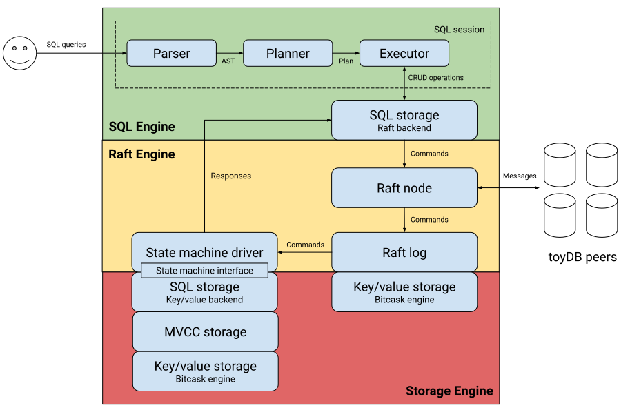

# toyDB Architecture

At the highest level, toyDB consists of a cluster of nodes that execute SQL transactions against
a replicated state machine. Clients can connect to any node in the cluster and submit SQL
statements. It aims to provide
[linearizability](https://jepsen.io/consistency/models/linearizable) (i.e. strong consistency)
and [serializability](https://jepsen.io/consistency/models/serializable), but falls slightly
short as it currently only implements
[snapshot isolation](https://jepsen.io/consistency/models/snapshot-isolation).

The [Raft algorithm](https://raft.github.io) is used for cluster consensus, which tolerates the
failure of any node as long as a majority of nodes are still available. One node is elected
leader, and replicates commands to the others which apply them to local copies of the state
machine. If the leader is lost, a new leader is elected and the cluster continues operation.
Client commands are automatically forwarded to the leader.

This architecture guide will begin with a high-level overview of node components, before
discussing each component from the bottom up. Along the way, we will make note of tradeoffs and
design choices.

- [Node Components](#node-components)
- [Storage Engine](#storage-engine)
  - [Key/Value Storage](#keyvalue-storage)
  - [MVCC Transactions](#mvcc-transactions)
  - [Log-structured Storage](#log-structured-storage)
- [Raft Consensus Engine](#raft-consensus-engine)
- [SQL Engine](#sql-engine)
  - [Types](#types)
  - [Schemas](#schemas)
  - [Storage](#storage)
  - [Parsing](#parsing)
  - [Planning](#planning)
  - [Execution](#execution)
- [Server](#server)
- [Client](#client)

## Node Components

A toyDB node consists of three main components:

* **Storage engine:** stores data and manages transactions, on disk and in memory.

* **Raft consensus engine:** handles cluster coordination and state machine replication.

* **SQL engine:** parses, plans, and executes SQL statements for clients.

These components are integrated in the toyDB server, which handles network communication with
clients and other nodes. The following diagram illustrates its internal structure:



At the bottom is a simple [key/value store](https://en.wikipedia.org/wiki/Key–value_database), 
which stores all SQL data. This is wrapped inside an
[MVCC](https://en.wikipedia.org/wiki/Multiversion_concurrency_control) key/value store that adds 
[ACID transactions](https://en.wikipedia.org/wiki/ACID). On top of that is a SQL storage engine,
providing basic [CRUD operations](https://en.wikipedia.org/wiki/Create,_read,_update_and_delete)
on tables, rows, and indexes. This makes up the node's core storage engine.

The SQL storage engine is wrapped in a Raft state machine interface, allowing it to be managed
by the Raft consensus engine. The Raft node receives commands from clients and coordinates with
other Raft nodes to reach consensus on an ordered command log. Once commands are committed to
the log, they are sent to the state machine driver which applies them to the local state machine.

On top of the Raft engine is a Raft-based SQL storage engine, which implements the SQL storage
interface and submits commands to the Raft cluster. This allows the rest of the SQL layer to use
the Raft cluster as if it was local storage. The SQL engine manages client SQL sessions, which
take SQL queries as text, parse them, generate query plans, and execute them against the SQL
storage engine.

Surrounding these components is the toyDB server, which in addition to network communication also
handles configuration, logging, and other process-level concerns.

## Storage Engine

The storage engine is actually two different storage engines: key/value storage used by the SQL
engine, and log-structured storage used by the Raft node. These are both pluggable via the
`storage_sql` and `storage_raft` configuration options, and have multiple implementations with
different characteristics.

The SQL storage engine will be discussed separately in the [SQL section](#sql-engine).

### Key/Value Storage

A key/value storage engine stores arbitrary key/value pairs as binary byte slices, and implements
the
[`storage::Engine`](https://github.com/erikgrinaker/toydb/blob/master/src/storage/engine/mod.rs) 
trait:

```rust
/// A key/value storage engine, where both keys and values are arbitrary byte
/// strings between 0 B and 2 GB, stored in lexicographical key order. Writes
/// are only guaranteed durable after calling flush().
///
/// Only supports single-threaded use since all methods (including reads) take a
/// mutable reference -- serialized access can't be avoided anyway, since both
/// Raft execution and file access is serial.
pub trait Engine: std::fmt::Display + Send + Sync {
    /// The iterator returned by scan(). Traits can't return "impl Trait", and
    /// we don't want to use trait objects, so the type must be specified.
    type ScanIterator<'a>: DoubleEndedIterator<Item = Result<(Vec<u8>, Vec<u8>)>> + 'a
    where
        Self: 'a;

    /// Deletes a key, or does nothing if it does not exist.
    fn delete(&mut self, key: &[u8]) -> Result<()>;

    /// Flushes any buffered data to the underlying storage medium.
    fn flush(&mut self) -> Result<()>;

    /// Gets a value for a key, if it exists.
    fn get(&mut self, key: &[u8]) -> Result<Option<Vec<u8>>>;

    /// Iterates over an ordered range of key/value pairs.
    fn scan<R: std::ops::RangeBounds<Vec<u8>>>(&mut self, range: R) -> Self::ScanIterator<'_>;

    /// Sets a value for a key, replacing the existing value if any.
    fn set(&mut self, key: &[u8], value: Vec<u8>) -> Result<()>;
}
```

The `get`, `set` and `delete` methods simply read and write key/value pairs, and `flush` ensures
any buffered data is written out to storage (e.g. via the `fsync` system call). `scan` iterates
over a key/value range _in order_, a property that is crucial to higher-level functionality (e.g.
SQL table scans) and has a couple of important implications:

* Implementations should store data ordered by key, for performance.

* Keys should use an order-preserving byte encoding, to allow range scans.

The engine itself does not care what keys contain, but the storage module offers
an order-preserving key encoding called [KeyCode](https://github.com/erikgrinaker/toydb/blob/master/src/storage/keycode.rs)
for use by higher layers. These storage layers often use composite keys made up
of several possibly variable-length values (e.g. an index key consists of table,
column, and value), and the natural ordering of each segment must be preserved,
a property satisfied by this encoding:

* `bool`: `0x00` for `false`, `0x01` for `true`.
* `u64`: big-endian binary representation.
* `i64`: big-endian binary representation, with sign bit flipped.
* `f64`: big-endian binary representation, with sign bit flipped, and rest if negative.
* `Vec<u8>`: `0x00` is escaped as `0x00ff`, terminated with `0x0000`.
* `String`:  like `Vec<u8>`.

Additionally, several container types are supported:

* Tuple: concatenation of elements, with no surrounding structure.
* Array: like tuple.
* Vec: like tuple.
* Enum: the variant's enum index as a single `u8` byte, then contents.
* Value: like enum.

The default key/value engine is
[`storage::engine::BitCask`](https://github.com/erikgrinaker/toydb/blob/master/src/storage/kv/bitcask.rs),
a very simple variant of Bitcask, an append-only log-structured storage engine.
All writes are appended to a log file, with an index mapping live keys to file
positions maintained in memory.  When the amount of garbage (replaced or deleted
keys) in the file exceeds 20%, a new log file is written containing only live
keys, replacing the old log file.

#### Key/Value Tradeoffs

**Keyset in memory:** BitCask requires the entire key set to fit in memory, and must also scan
the log file on startup to construct the key index.

**Compaction volume:** unlike an LSM tree, this single-file BitCask
implementation requires rewriting the entire dataset during compactions, which
can produce significant write amplification over time.

**Key encoding:** does not make use of any compression, e.g. variable-length integers, preferring
simplicity and correctness.

### MVCC Transactions

[MVCC (Multi-Version Concurrency Control)](https://en.wikipedia.org/wiki/Multiversion_concurrency_control)
is a relatively simple concurrency control mechanism that provides
[ACID transactions](https://en.wikipedia.org/wiki/ACID) with
[snapshot isolation](https://en.wikipedia.org/wiki/Snapshot_isolation) without taking out locks or 
having writes block reads. It also versions all data, allowing querying of historical data.

toyDB implements MVCC at the storage layer as
[`storage::mvcc::MVCC`](https://github.com/erikgrinaker/toydb/blob/master/src/storage/mvcc.rs),
using any `storage::Engine` implementation for underlying storage. `begin` returns a new
transaction, which provides the usual key/value operations such as `get`, `set`, and `scan`.
Additionally, it has a `commit` method which persists the changes and makes them visible to
other transactions, and a `rollback` method which discards them.

When a transaction begins, it fetches the next available transaction ID from `Key::TxnNext` and
increments it, then records itself as an active transaction via `Key::TxnActive(id)`. It also
takes a `Snapshot`, containing the IDs of all other active transactions as of the transaction start,
and saves it as `Key::TxnSnapshot(id)`.

Key/value pairs are saved as `Key::Record(key, version)`, where `key` is the user-provided key
and `version` is the transaction ID which created the record. The visibility of key/value pairs
for a transaction is given as follows:

* For a given user key, do a reverse scan of `Key::Record(key, version)` starting at the current 
  transaction's ID.

* Skip any records whose version is in the list of active transaction IDs in the `Snapshot`.

* Return the first matching record, if any. This record may be either a `Some(value)` or a `None`
  if the key was deleted.

When writing a key/value pair, the transaction first checks for any conflicts by scanning for a
`Key::Record(key, version)` which is not visible to it. If one is found, a serialization error
is returned and the client must retry the transaction. Otherwise, the transaction writes the new
record and keeps track of the change as `Key::Update(id, key)` in case it must roll back later.

When the transaction commits, it simply deletes its `Txn::Active(id)` record, thus making its
changes visible to any subsequent transactions. If the transaction instead rolls back, it
iterates over all `Key::Update(id, key)` entries and removes the written key/value records before
removing its `Txn::Active(id)` entry.

This simple scheme is sufficient to provide ACID transaction guarantees with snapshot isolation:
commits are atomic, a transaction sees a consistent snapshot of the key/value store as of the
start of the transaction, and any write conflicts result in serialization errors which must be
retried.

To satisfy time travel queries, a read-only transaction simply loads the `Snapshot` entry of a
past transaction and applies the same visibility rules as for normal transactions.

#### MVCC Tradeoffs

**Read-only transaction IDs:** all transactions, even read-only transactions, are allocated a
unique transaction ID. This means that a single standalone `SELECT` query will result in a write
operation to increment the transaction ID counter, which can be expensive.

**Serializability:** snapshot isolation is not fully serializable, since it exhibits
[write skew anomalies](http://justinjaffray.com/what-does-write-skew-look-like/). This would
require [serializable snapshot isolation](https://courses.cs.washington.edu/courses/cse444/08au/544M/READING-LIST/fekete-sigmod2008.pdf),
which was considered unnecessary for a first version - it may be implemented later.

**Garbage collection:** old MVCC versions are never removed, leading to unbounded disk usage. 
However, this also allows for complete data history, and simplifies the implementation.

**Transaction ID overflow:** transaction IDs will overflow after 64 bits, but this is never going to
happen with toyDB.

### Log-structured Storage

The Raft node needs to keep a log of state machine commands encoded as arbitrary byte slices.
This log is mostly append-only, and storing it in a random-access key/value store would be
slower and more complex than using a log-structured store purpose-built for this access pattern.

Log stores implement the [`storage::log::Store`](https://github.com/erikgrinaker/toydb/blob/master/src/storage/log/mod.rs)
trait, a subset of which includes:

```rust
pub trait Store: Display + Sync + Send {
    /// Appends a log entry, returning its index.
    fn append(&mut self, entry: Vec<u8>) -> Result<u64>;

    /// Commits log entries up to and including the given index, making them immutable.
    fn commit(&mut self, index: u64) -> Result<()>;

    /// Fetches a log entry, if it exists.
    fn get(&self, index: u64) -> Result<Option<Vec<u8>>>;

    /// Iterates over an ordered range of log entries.
    fn scan(&self, range: Range) -> Scan;

    /// Truncates the log by removing any entries above the given index, and returns the
    /// highest remaining index. Attempting to truncate a committed entry will error.
    fn truncate(&mut self, index: u64) -> Result<u64>;
}
```

The Raft node appends all received commands to its local log, but only commits entries once they
are confirmed by consensus. The local log may need to be truncated, e.g. in the case of a leader
change, removing a number of uncommitted entries.

Additionally, the store must be able to store a handful of arbitrary key/value metadata pairs
for the Raft node, via `set_metadata(key, value)` and `get_metadata(key)` methods.

The default log store in toyDB is
[`storage::log::Hybrid`](https://github.com/erikgrinaker/toydb/blob/master/src/storage/log/hybrid.rs),
which stores uncommitted entries in memory and committed entries on disk. This allows the log to
be written append-only and in order, giving very good performance both for writes and bulk
reads. The number of uncommitted entries is also generally small since consensus is generally
fast.

New log entries are kept in a `VecDeque` (double-ended queue) until they are committed. On
commit, entries are appended to the file with a `u32` length prefix, and the file is fsynced (if
enabled). Entry positions are kept in an in-memory `HashMap` keyed by entry index, for
retrieval, and this map is rebuilt on startup by scanning the log file.

Metadata key/value pairs are kept in an in-memory `HashMap` and the entire hashmap is written to
a separate file on every write.

#### Log Tradeoffs

**Startup log scan:** scanning the entire file on startup to build the entry index can be
time-consuming, and the index requires a bit of memory. However, this avoids having to maintain
separate index storage, which could be expensive to fsync, and data sets are expected to be small.

**Metadata storage:** metadata key/value pairs should be stored in e.g. an on-disk B-tree
key/value store, but toyDB current does not have such a store. However, the number of metadata items
is very small - specifically 1: the current Raft term/vote tuple.

**Memory buffering:** buffering uncommitted entries in memory may require a lot of memory if
consensus halts, e.g. due to loss of quorum. However, for toyDB use-cases this is not a major
problem, and it avoid having to do additional (possibly random) disk IO, greatly improving
performance.

**Garbage collection:** there is no garbage collection of old log entries, so the log will grow
without bound.

## Raft Consensus Engine

The Raft consensus protocol is explained well in the
[original Raft paper](https://raft.github.io/raft.pdf), and will not be repeated here - refer to
it for details. toyDB's implementation follows the paper fairly closely.

The Raft node [`raft::Node`](https://github.com/erikgrinaker/toydb/tree/master/src/raft/node) is
the core of the implementation, a finite state machine with enum variants for the node roles:
leader, follower, and candidate. This enum wraps the `RoleNode` struct, which contains common
node functionality and is generic over the specific roles `Leader`, `Follower`, and `Candidate`
that implement the Raft protocol.

Nodes are initialized with an ID and a list of peer IDs, and communicate by passing
[`raft::Message`](https://github.com/erikgrinaker/toydb/blob/master/src/raft/message.rs)
messages. Inbound messages are received via `Node.step()` calls, and outbound messages are sent
via an `mpsc` channel. Nodes also use a logical clock to keep track of e.g. election timeouts
and heartbeats, and the clock is ticked at regular intervals via `Node.tick()` calls. These
methods are synchronous and may cause state transitions, e.g. changing a candidate into a leader
when it receives the winning vote.

Nodes have a command log [`raft::Log`](https://github.com/erikgrinaker/toydb/blob/master/src/raft/log.rs),
using a `storage::log::Store` for storage. Leaders receive client commands via request messages,
replicate them to peers, and commit the commands to the log subject to consensus. Once a command is
committed, is it applied to the state machine asynchronously.

The Raft-managed state machine (i.e. the SQL storage engine) implements the
[`raft::State`](https://github.com/erikgrinaker/toydb/blob/master/src/raft/state.rs) trait and
is given to the node on initialization. The state machine driver
[`raft::Driver`](https://github.com/erikgrinaker/toydb/blob/master/src/raft/state.rs) has
ownership of the state machine, and runs in a separate thread (or rather, a
[Tokio](https://tokio.rs) task) receiving instructions via an `mpsc` channel - this avoids
long-running commands blocking the main Raft node from responding to messages.

In addition to applying state machine commands, the driver also responds to client requests via
an outbound `mpsc` channel. When the leader receives a state _mutation_ request from a client,
it not only appends the command to its log, but it also tells the driver that the client is to
be notified with the result once the command is applied. When the leader receives a state
_query_ request, the state driver is notified about the query before the leader asks all peers
to confirm that it is still the leader (required to satisfy linearizability). The confirmations
are passed to the state machine driver, and once a majority vote is received the query is
executed against the state machine and the result returned to the client.

The actual network communication is handled by the server process, which will be described in a
[separate section](#server).

#### Raft Tradeoffs

**Single-threaded state:** all state operations run in a single thread on the leader, preventing
horizontal scalability. Improvements here would require running multiple sharded Raft clusters,
which is out of scope for the project.

**Log replication:** only the simplest form of Raft log replication is implemented, without
state snapshots or rapid log replay. Lagging nodes will be very slow to catch up.

**Cluster resizing:** the Raft cluster consists of a static set of nodes given at startup, resizing
it requires a complete cluster restart.

## SQL Engine

The SQL engine builds on Raft and MVCC to provide a SQL interface to clients. Logically, the
life of a SQL query is as follows:

> Query → Lexer → Parser → Planner → Optimizer → Executor → Storage Engine

We'll begin by looking at the basic SQL type and schema systems, as well as the SQL storage
engine and its session interface. Then we'll switch sides and look at how a query is executed,
starting at the front with the parser and following it until it's executed against the SQL
storage engine, completing the chain.

### Types

toyDB has a very simple type system, with the
[`sql::DataType`](https://github.com/erikgrinaker/toydb/blob/master/src/sql/types/mod.rs) enum 
specifying the available data types: `Boolean`, `Integer`, `Float`, and `String`.

The [`sql::Value`](https://github.com/erikgrinaker/toydb/blob/master/src/sql/types/mod.rs) enum 
represents a specific value using Rust's native type system, e.g. an integer value is 
`Value::Integer(i64)`. This enum also specifies comparison, ordering, and formatting of values. The 
special value `Value::Null` represents an unknown value of unknown type, following the rules of
[three-valued logic](https://en.wikipedia.org/wiki/Three-valued_logic).

Values can be grouped into a `Row`, which is an alias for `Vec<Value>`. The type `Rows` is an alias
for a fallible row iterator, and `Column` is a result column containing a name.

Expressions [`sql::Expression`](https://github.com/erikgrinaker/toydb/blob/master/src/sql/types/expression.rs)
represent operations on values. For example, `(1 + 2) * 3` is represented as:

```rust
Expression::Multiply(
    Expression::Add(
        Expression::Constant(Value::Integer(1)),
        Expression::Constant(Value::Integer(2)),
    ),
    Expression::Constant(Value::Integer(3)),
)
```

Calling `evaluate()` on the expression will recursively evaluate it, returning `Value::Integer(9)`.

### Schemas

The schema defines the tables [`sql::Table`](https://github.com/erikgrinaker/toydb/blob/master/src/sql/schema.rs)
and columns [`sql::Column`](https://github.com/erikgrinaker/toydb/blob/master/src/sql/schema.rs)
in a toyDB database. Tables have a name and a list of columns, while a column has several
attributes such as name, data type, and various constraints. They also have methods to
validate rows and values, e.g. to make sure a value is of the correct type for a column
or to enforce referential integrity.

The schema is stored and managed with [`sql::Catalog`](https://github.com/erikgrinaker/toydb/blob/master/src/sql/schema.rs),
a trait implemented by the SQL storage engine:

```rust
pub trait Catalog {
    /// Creates a new table.
    fn create_table(&mut self, table: &Table) -> Result<()>;

    /// Deletes a table, or errors if it does not exist.
    fn delete_table(&mut self, table: &str) -> Result<()>;

    /// Reads a table, if it exists.
    fn read_table(&self, table: &str) -> Result<Option<Table>>;

    /// Iterates over all tables.
    fn scan_tables(&self) -> Result<Tables>;
}
```

#### Schema Tradeoffs

**Single database:** only a single, unnamed database is supported per toyDB cluster. This is
sufficient for toyDB's use-cases, and simplifies the implementation.

**Schema changes:** schema changes other than creating or dropping tables is not supported. This
avoids complicated data migration logic, and allows using table/column names as storage identifiers 
(since they can never change) without any additional indirection.

### Storage

The SQL storage engine trait is [`sql::Engine`](https://github.com/erikgrinaker/toydb/blob/master/src/sql/engine/mod.rs):

```rust
pub trait Engine: Clone {
    type Transaction: Transaction;

    /// Begins a transaction in the given mode.
    fn begin(&self, mode: Mode) -> Result<Self::Transaction>;

    /// Resumes an active transaction with the given ID.
    fn resume(&self, id: u64) -> Result<Self::Transaction>;

    /// Begins a SQL session for executing SQL statements.
    fn session(&self) -> Result<Session<Self>> {
        Ok(Session { engine: self.clone(), txn: None })
    }
}
```

The main use of the trait is to dispense `sql::Session` instances, individual client sessions which
execute SQL queries submitted as plain text and track transaction state. The actual storage
engine functionality is exposed via the `sql::Transaction` trait, representing an ACID transaction
providing basic CRUD (create, read, update, delete) operations for tables, rows, and indexes:

```rust
pub trait Transaction: Catalog {
    /// Commits the transaction.
    fn commit(self) -> Result<()>;
    /// Rolls back the transaction.
    fn rollback(self) -> Result<()>;

    /// Creates a new table row.
    fn create(&mut self, table: &str, row: Row) -> Result<()>;
    /// Deletes a table row.
    fn delete(&mut self, table: &str, id: &Value) -> Result<()>;
    /// Reads a table row, if it exists.
    fn read(&self, table: &str, id: &Value) -> Result<Option<Row>>;
    /// Scans a table's rows, optionally filtering by the given predicate expression.
    fn scan(&self, table: &str, filter: Option<Expression>) -> Result<Scan>;
    /// Updates a table row.
    fn update(&mut self, table: &str, id: &Value, row: Row) -> Result<()>;

    /// Reads an index entry, if it exists.
    fn read_index(&self, table: &str, column: &str, value: &Value) -> Result<HashSet<Value>>;
    /// Scans a column's index entries.
    fn scan_index(&self, table: &str, column: &str) -> Result<IndexScan>;
}
```

The main SQL storage engine implementation is
[`sql::engine::KV`](https://github.com/erikgrinaker/toydb/blob/master/src/sql/engine/kv.rs), which 
is built on top of an MVCC key/value store and its transaction functionality.

The Raft SQL storage engine
[`sql::engine::Raft`](https://github.com/erikgrinaker/toydb/blob/master/src/sql/engine/raft.rs)
uses a Raft API client `raft::Client` to submit state machine commands specified by the enums 
`Mutation` and `Query` to the local Raft node. It also provides a Raft state machine 
`sql::engine::raft::State` which wraps a regular `sql::engine::KV` SQL storage engine and applies 
state machine commands to it. Since the Raft SQL engine implements the `sql::Engine` trait, it can 
be used interchangably with the local storage engine.

#### Storage Tradeoffs

**Raft result streaming:** result streaming is not implemented for Raft commands, so the Raft
SQL engine must buffer the entire result set in memory and serialize it before returning it to
the client - particularly expensive for table scans. Implementing streaming in Raft was considered 
out of scope for the project.

### Parsing

The SQL session [`sql::Session`](https://github.com/erikgrinaker/toydb/blob/master/src/sql/engine/mod.rs)
takes plain-text SQL queries via `execute()` and returns the result. The first step in this process 
is to parse the query into an [abstract syntax tree](https://en.wikipedia.org/wiki/Abstract_syntax_tree)
(AST) which represents the query semantics. This happens as follows:

> SQL → Lexer → Tokens → Parser → AST

The lexer
[`sql::Lexer`](https://github.com/erikgrinaker/toydb/blob/master/src/sql/parser/lexer.rs) takes
a SQL string, splits it into pieces, and classifies them as tokens `sql::Token`. It does not
care about the meaning of the tokens, but removes whitespace and tries to figure out if
something is a number, string, keyword, and so on. It also does some basic pre-processing, such as
interpreting string quotes, checking number formatting, and rejecting unknown keywords.

For example, the following input string results in the listed tokens, even though the query is 
invalid:

> `3.14 +UPDATE 'abc'` → `Token::Number("3.14")` `Token::Plus` `Token::Keyword(Keyword::Update)` `Token::String("abc")`

The parser [`sql::Parser`](https://github.com/erikgrinaker/toydb/blob/master/src/sql/parser/mod.rs)
iterates over the tokens generated by the lexer, interprets them, and builds an AST representing
the semantic query. For example, `SELECT name, 2020 - birthyear AS age FROM people` 
results in the following AST:

```rust
ast::Statement::Select{
    select: vec![
        (ast::Expression::Field(None, "name"), None),
        (ast::Expression::Operation(
            ast::Operation::Subtract(
                ast::Expression::Literal(ast::Literal::Integer(2020)),
                ast::Expression::Field(None, "birthyear"),
            )
        ), Some("age")),
    ],
    from: vec![
        ast::FromItem::Table{name: "people", alias: None},
    ],
    where: None,
    group_by: vec![],
    having: None,
    order: vec![],
    offset: None,
    limit: None,
}
```

The parser will interpret the SQL _syntax_, determining the type of query and its parameters,
returning an error for any invalid syntax. However, it has no idea if the table `people`
actually exists, or if the field `birthyear` is an integer - that is the job of the planner.

Notably, the parser also parses expressions, such as `1 + 2 * 3`. This is non-trivial due to
precedence rules, i.e. `2 * 3` should be evaluated first, but not if there are parentheses
around `(1 + 2)`. The toyDB parser uses the
[precedence climbing algorithm](https://eli.thegreenplace.net/2012/08/02/parsing-expressions-by-precedence-climbing)
for this. Also note that AST expressions are different from SQL engine expressions, and do not map 
one-to-one. This is clearest in the case of function calls, where the parser does not know (or 
care) if a given function exists, it just parses a function call as an arbitrary function name and 
arguments. The planner will translate this into actual expressions that can be evaluated.

### Planning

The SQL planner [`sql::Planner`](https://github.com/erikgrinaker/toydb/blob/master/src/sql/plan/planner.rs)
takes the AST generated by the parser and builds a SQL execution plan
[`sql::Plan`](https://github.com/erikgrinaker/toydb/blob/master/src/sql/plan/mod.rs), which is an 
abstract representation of the steps necessary to execute the query. For example, the following 
shows a simple query and corresponding execution plan, formatted as `EXPLAIN` output:

```
SELECT id, title, rating * 100 FROM movies WHERE released > 2010 ORDER BY rating DESC;

Order: rating desc
└─ Projection: id, title, rating * 100
   └─ Filter: released > 2010
      └─ Scan: movies
```

The plan nodes `sql::Node` in a query execution plan represent a
[relational algebra](https://en.wikipedia.org/wiki/Relational_algebra) operator, where the
output from one node flows as input into the next. In the example above, the query first does a
full table scan of the `movies` table, then applies the filter `released > 2010` to the rows,
before projecting (formatting) the result and sorting it by `rating`.

Most of the planning is fairly straightforward, translating AST nodes to plan nodes and expressions.
The trickiest part is resolving table and column names to result column indexes across multiple
layers of aliases, joins, and projections - this is handled with `sql::plan::Scope`, which keeps
track of what names are visible to the node being built and maps them to column indexes. Another
challenge is aggregate functions, which are implemented as a pre-projection of function
arguments and grouping/hidden columns, then an aggregation node, and finally a post-projection
evaluating the final aggregate expressions - like in the following example:

```
SELECT   g.name AS genre, MAX(rating * 100) - MIN(rating * 100)
FROM     movies m JOIN genres g ON m.genre_id = g.id
WHERE    m.released > 2000
GROUP BY g.id, g.name
HAVING   MIN(rating) > 7 
ORDER BY g.id ASC;

Projection: #0, #1
└─ Order: g.id asc
   └─ Filter: #2 > 7
      └─ Projection: genre, #0 - #1, #2, g.id
         └─ Aggregation: maximum, minimum, minimum
            └─ Projection: rating * 100, rating * 100, rating, g.id, g.name
               └─ Filter: m.released > 2000
                  └─ NestedLoopJoin: inner on m.genre_id = g.id
                     ├─ Scan: movies as m
                     └─ Scan: genres as g
```

The planner generates a very naïve execution plan, primarily concerned with producing one that
is _correct_ but not necessarily _fast_. This means that it will always do full table scans,
always use [nested loop joins](https://en.wikipedia.org/wiki/Nested_loop_join), and so on. The plan 
is then optimized by a series of optimizers implementing
[`sql::Optimizer`](https://github.com/erikgrinaker/toydb/blob/master/src/sql/plan/optimizer.rs):

* `ConstantFolder`: pre-evaluates constant expressions to avoid having to re-evaluate them for each 
  row.

* `FilterPushdown`: pushes filters deeper into the query to reduce the number of rows evaluated by
  each node, e.g. by pushing single-table predicates all the way to the table scan node such that
  filtered nodes won't have to go across the Raft layer.

* `IndexLookup`: transforms table scans into primary key or index lookups where possible.

* `NoopCleaner`: attempts to remove noop operations, e.g. filter nodes that evaluate to a constant 
  `TRUE` value.

* `JoinType`: transforms nested loop joins into hash joins for equijoins (equality join predicate).

Optimizers make heavy use of [boolean algebra](https://en.wikipedia.org/wiki/Boolean_algebra) to
transform expressions into forms that are more convenient to work with. For example, partial
filter pushdown (e.g. across join nodes) can only push down conjunctive clauses (i.e. AND parts),
so expressions are converted into
[conjunctive normal form](https://en.wikipedia.org/wiki/Conjunctive_normal_form) first such that
each part can be considered separately.

Below is an example of a complex optimized plan where table scans have been replaced with
key and index lookups, filters have been pushed down into scan nodes, and nested loop joins have
been replaced by hash joins. It fetches science fiction movies released since 2000 by studios
that have released any movie with a rating of 8 or more:

```
SELECT   m.id, m.title, g.name AS genre, m.released, s.name AS studio
FROM     movies m JOIN genres g ON m.genre_id = g.id,
         studios s JOIN movies good ON good.studio_id = s.id AND good.rating >= 8
WHERE    m.studio_id = s.id AND m.released >= 2000 AND g.id = 1
ORDER BY m.title ASC;

Order: m.title asc
└─ Projection: m.id, m.title, g.name, m.released, s.name
   └─ HashJoin: inner on m.studio_id = s.id
      ├─ HashJoin: inner on m.genre_id = g.id
      │  ├─ Filter: m.released > 2000 OR m.released = 2000
      │  │  └─ IndexLookup: movies as m column genre_id (1)
      │  └─ KeyLookup: genres as g (1)
      └─ HashJoin: inner on s.id = good.studio_id
         ├─ Scan: studios as s
         └─ Scan: movies as good (good.rating > 8 OR good.rating = 8)
```

#### Planning Tradeoffs

**Type checking:** expression type conflicts are only detected at evaluation time, not during 
planning.

### Execution

Every SQL plan node has a corresponding executor, implementing the
[`sql::Executor`](https://github.com/erikgrinaker/toydb/blob/master/src/sql/execution/mod.rs) trait:

```rust
pub trait Executor<T: Transaction> {
    /// Executes the executor, consuming it and returning a result set
    fn execute(self: Box<Self>, txn: &mut T) -> Result<ResultSet>;
}
```

Executors are given a `sql::Transaction` to access the SQL storage engine, and return a 
`sql::ResultSet` with the query result. Most often, the result is of type `sql::ResultSet::Query` 
containing a list of columns and a row iterator. Most executors contain other executors that
they use as inputs, for example the `Filter` executor will often have a `Scan` executor as a source:

```rust
pub struct Filter<T: Transaction> {
    source: Box<dyn Executor<T>>,
    predicate: Expression,
}
```

Calling `execute` on a `sql::Plan` will build and execute the root node's executor, which in
turn will recursively call `execute` on its source executors (if any) and process their results.
Executors typically augment the source's returned row iterator using Rust's
[`Iterator`](https://doc.rust-lang.org/std/iter/trait.Iterator.html) functionality, e.g. by
calling `filter()` on it and returning a new iterator. The entire execution engine thus works in
a streaming fashion and leverages Rust's [zero-cost iterator
abstractions](https://doc.rust-lang.org/book/ch13-04-performance.html).

Finally, the root `ResultSet` is returned to the client.

## Server

The toyDB [`Server`](https://github.com/erikgrinaker/toydb/blob/master/src/server.rs) manages 
network traffic for the Raft and SQL engines, using the [Tokio](https://tokio.rs) async executor. 
It opens TCP listeners on port `9605` for SQL clients and  `9705` for Raft peers, both using 
length-prefixed [Bincode](https://github.com/servo/bincode)-encoded message passing via
[Serde](https://serde.rs)-encoded Tokio streams as a protocol.

The Raft server is split out to [`raft::Server`](https://github.com/erikgrinaker/toydb/blob/master/src/raft/server.rs),
which runs a main [event loop](https://en.wikipedia.org/wiki/Event_loop) routing Raft messages 
between the local Raft node, state machine driver, TCP peers, and local state machine clients (i.e. 
the Raft SQL engine wrapper), as well as ticking the Raft logical clock at regular intervals. It 
spawns separate Tokio tasks that maintain outbound TCP connections to all Raft peers, while 
internal communication happens via `mpsc` channels.

The SQL server spawns a new Tokio task for each SQL client that connects, running a separate
SQL session from the SQL storage engine on top of Raft. It communicates with the client by passing
`server::Request` and `server::Response` messages that are translated to `sql::Session` calls.

The main [`toydb`](https://github.com/erikgrinaker/toydb/blob/master/src/bin/toydb.rs) binary
simply initializes a toyDB server based on command-line arguments and configuration files, and then 
runs it via the Tokio runtime.

#### Server Tradeoffs

**Security:** all network traffic is unauthenticated an in plaintext, as security was considered
out of scope for the project.

## Client

The toyDB [`Client`](https://github.com/erikgrinaker/toydb/blob/master/src/client.rs) provides a 
simple API for interacting with a server, mainly by executing SQL statements via `execute()` 
returning `sql::ResultSet`. It also has the convenience method `with_txn()`, taking a closure 
that executes a series of SQL statements while automatically catching and retrying serialization
errors.

There is also `client::Pool`, which manages a set of pre-connected clients that can be retrieved
for running short-lived queries in a multi-threaded application without incurring connection
setup costs.

The [`toysql`](https://github.com/erikgrinaker/toydb/blob/master/src/bin/toysql.rs) command-line
client is a simple REPL client that connects to a server using the toyDB `Client` and continually 
prompts the user for a SQL query to execute, displaying the returned result.
