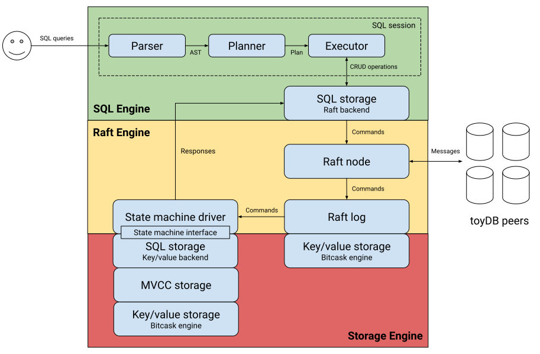
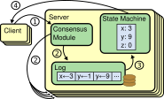

# toyDB Architecture

toyDB is a simple distributed SQL database, intended to illustrate how such systems are built. The
overall structure is similar to real-world distributed databases, but the design and implementation
has been kept as simple as possible for understandability. Performance and scalability are explicit
non-goals, as these are major sources of complexity in real-world systems.

## Properties

toyDB consists of a cluster of nodes that execute [SQL](https://en.wikipedia.org/wiki/SQL)
transactions against a replicated state machine. Clients can connect to any node in the cluster
and submit SQL statements. It is:

* **Distributed:** runs across a cluster of nodes.
* **Highly available:** tolerates loss of a minority of nodes.
* **SQL compliant:** correctly supports most common SQL features.
* **Strongly consistent:** committed writes are immediately visible to all readers ([linearizability](https://en.wikipedia.org/wiki/Linearizability)).
* **Transactional:** provides ACID transactions:
  * **Atomic:** groups of writes are applied as a single, atomic unit.
  * **Consistent:** database constraints and referential integrity are always enforced.
  * **Isolated:** concurrent transactions don't affect each other ([snapshot isolation](https://en.wikipedia.org/wiki/Snapshot_isolation)).
  * **Durable:** committed writes are never lost.

For simplicity, toyDB is:

* **Not scalable:** every node stores the full dataset, and all reads/writes happen on one node.
* **Not reliable:** only handles crash failures, not e.g. partial network partitions or node stalls.
* **Not performant:** data processing is slow, and not optimized at all.
* **Not efficient:** no compression or garbage collection, can load entire tables into memory.
* **Not full-featured:** only basic SQL functionality is implemented.
* **Not backwards compatible:** changes to data formats and protocols will break databases.
* **Not flexible:** nodes can't be added or removed while running, and take a long time to join.
* **Not secure:** there is no authentication, authorization, nor encryption.

## Overview

Internally, toyDB has a few main components:

* **Storage engine:** stores data on disk and manages transactions.
* **Raft consensus engine:** replicates data and coordinates cluster nodes.
* **SQL engine:** organizes SQL data, manages SQL sessions, and executes SQL statements.
* **Server:** manages network connections, both with SQL clients and Raft nodes.
* **Client:** provides a SQL user interface and communicates with the server.

This diagram illustrates the internal structure of a single toyDB node:



We will go through each of these components from the bottom up.

## Storage Engine

toyDB uses an embedded [key/value store](https://en.wikipedia.org/wiki/Key–value_database) for data
storage, located in the [`storage`](https://github.com/erikgrinaker/toydb/tree/d774e7ca46c21a7c93ac6a162966db74ea5329cf/src/storage)
module. This stores arbitrary keys and values as binary byte strings, and doesn't care what they
contain. We'll see later how the SQL data model, with tables and rows, is mapped onto this key/value
structure.

The storage engine supports simple set/get/delete operations on individual keys. It does not itself
support transactions -- this is built on top, and we'll get back to it shortly.

Keys are stored in sorted order. This allows range scans, where we can iterate over all key/value
pairs between two specific keys, or with a specific key prefix. As we'll see later, this is needed
e.g. to scan all rows in a specific SQL table, to do limited SQL index scans, to scan the tail of
the Raft log, etc.

The storage engine is pluggable: there are multiple implementations, and the user can choose which
one to use in the config file. These implement the [`storage::Engine`](https://github.com/erikgrinaker/toydb/blob/d774e7ca46c21a7c93ac6a162966db74ea5329cf/src/storage/engine.rs#L22-L58) 
trait:

https://github.com/erikgrinaker/toydb/blob/d774e7ca46c21a7c93ac6a162966db74ea5329cf/src/storage/engine.rs#L8-L58

We'll discuss the two existing storage engine implementations next.

### `Memory` Storage Engine

The simplest storage engine is the [`Memory`](https://github.com/erikgrinaker/toydb/blob/cf83b50a01fcb6ada6916c276ebeae849c340369/src/storage/memory.rs)
engine. This is a trivial implementation which stores all data in memory using the Rust standard
library's [`BTreeMap`](https://doc.rust-lang.org/std/collections/struct.BTreeMap.html), without
persisting data to disk. It is primarily used for testing.

This implementation is so simple that we can include it in its entirety here:

https://github.com/erikgrinaker/toydb/blob/cf83b50a01fcb6ada6916c276ebeae849c340369/src/storage/memory.rs#L8-L77

### `BitCask` Storage Engine

The main storage engine is [`BitCask`](https://github.com/erikgrinaker/toydb/blob/d774e7ca46c21a7c93ac6a162966db74ea5329cf/src/storage/bitcask.rs#L50-L55).
This is a very simple variant of [BitCask](https://riak.com/assets/bitcask-intro.pdf), used in the
[Riak](https://riak.com/) database. It is kind of like the
[LSM-tree](https://en.wikipedia.org/wiki/Log-structured_merge-tree)'s baby cousin.

https://github.com/erikgrinaker/toydb/blob/d774e7ca46c21a7c93ac6a162966db74ea5329cf/src/storage/bitcask.rs#L15-L55

This BitCask implementation uses a single append-only log file for storage. To write a key/value
pair, we simply append it to the file. To replace the key, we append a new key/value entry, and to
delete it, we append a special tombstone value. The last value in the file for a given key is used.
This also means that we don't need a separate [write-ahead log](https://en.wikipedia.org/wiki/Write-ahead_logging),
since the data file _is_ the write-ahead log.

The file format for a key/value pair is simply:

1. The key length, as a big-endian `u32` (4 bytes).
2. The value length, as a big-endian `i32` (4 bytes). -1 if tombstone.
3. The binary key (n bytes).
4. The binary value (n bytes).

For example, the key/value pair `foo=bar` would be written as follows (in hexadecimal):

```
keylen   valuelen key    value
00000003 00000003 666f6f 626172
```

https://github.com/erikgrinaker/toydb/blob/d774e7ca46c21a7c93ac6a162966db74ea5329cf/src/storage/bitcask.rs#L338-L363

To find key/value pairs, we maintain a [`KeyDir`](https://github.com/erikgrinaker/toydb/blob/d774e7ca46c21a7c93ac6a162966db74ea5329cf/src/storage/bitcask.rs#L57-L58)
index which maps a key to the latest value's position in the file. All keys must therefore fit in
memory.

https://github.com/erikgrinaker/toydb/blob/d774e7ca46c21a7c93ac6a162966db74ea5329cf/src/storage/bitcask.rs#L57-L65

We generate this index by [scanning](https://github.com/erikgrinaker/toydb/blob/d774e7ca46c21a7c93ac6a162966db74ea5329cf/src/storage/bitcask.rs#L263-L328)
through the entire file when it is opened, and then update it on every subsequent write.

To read a value for a key, we simply look up the key's file location in the `KeyDir` index (if the
key exists), and then read it from the file:

https://github.com/erikgrinaker/toydb/blob/d774e7ca46c21a7c93ac6a162966db74ea5329cf/src/storage/bitcask.rs#L330-L336

To remove old garbage (replaced or deleted key/value pairs), the log file is
[compacted](https://github.com/erikgrinaker/toydb/blob/d774e7ca46c21a7c93ac6a162966db74ea5329cf/src/storage/bitcask.rs#L170-L194)
on startup. This writes out the latest value of every live key/value pair to a new file, and
replaces the old file. They are written in sorted order by key, which makes later scans faster.

## Key and Value Encoding

The key/value store uses binary `Vec<u8>` keys and values, so we need an encoding scheme to 
translate between Rust in-memory data structures and the on-disk binary data. This is provided by
the [`encoding`](https://github.com/erikgrinaker/toydb/tree/c0977a41b39e980a58698822e98b2c78a23e98c3/src/encoding)
module, with separate schemes for key and value encoding.

### `Bincode` Value Encoding

Values are encoded using [Bincode](https://github.com/bincode-org/bincode), a third-party binary
encoding scheme for Rust. Bincode is convenient because it can easily encode any arbitrary Rust
data type. But we could also have chosen e.g. [JSON](https://en.wikipedia.org/wiki/JSON),
[Protobuf](https://protobuf.dev), [MessagePack](https://msgpack.org/), or any other encoding.

We won't dwell on the actual binary format here, see the [Bincode specification](https://github.com/bincode-org/bincode/blob/trunk/docs/spec.md)
for details.

Confusingly, `bincode::serialize()` uses fixed-width integer encoding (which takes up a lot of
space), while `bincode::DefaultOptions` uses [variable-width integers](https://en.wikipedia.org/wiki/Variable-length_quantity).
So we provide helper functions using `DefaultOptions` in the [`encoding::bincode`](https://github.com/erikgrinaker/toydb/blob/c0977a41b39e980a58698822e98b2c78a23e98c3/src/encoding/bincode.rs)
module:

https://github.com/erikgrinaker/toydb/blob/ae321c4f81a33b79283e695d069a7159c96f3015/src/encoding/bincode.rs#L20-L32

Bincode uses the very common [Serde](https://serde.rs) framework for its API. toyDB also provides
an `encoding::Value` helper trait for value types with automatic `encode()` and `decode()` methods:

https://github.com/erikgrinaker/toydb/blob/ae321c4f81a33b79283e695d069a7159c96f3015/src/encoding/mod.rs#L39-L68

Here's an example of how this is used to encode and decode an arbitrary `Dog` data type:

```rust
#[derive(serde::Serialize, serde::Deserialize)]
struct Dog {
    name: String,
    age: u8,
    good_boy: bool,
}

impl encoding::Value for Dog {}

let pluto = Dog { name: "Pluto".into(), age: 4, good_boy: true };
let bytes = pluto.encode();
println!("{bytes:02x?}");

// Outputs [05, 50, 6c, 75, 74, 6f, 04, 01].
//
// * Length of string "Pluto": 05.
// * String "Pluto": 50 6c 75 74 6f.
// * Age 4: 04.
// * Good boy: 01 (true).

let pluto = Dog::decode(&bytes)?; // gives us back Pluto
```

### `Keycode` Key Encoding

Unlike values, keys can't just use any binary encoding like Bincode. As mentioned before, the
storage engine sorts data by key to enable range scans, which will be used e.g. for SQL table scans,
limited SQL index scans, Raft log scans, etc. Because of this, the encoding needs to preserve the
[lexicographical order](https://en.wikipedia.org/wiki/Lexicographic_order) of the encoded values:
the binary byte slices must sort in the same order as the original values.

As an example of why we can't just use Bincode, let's consider two strings: "house" should be
sorted before "key", alphabetically. However, Bincode encodes strings prefixed by their length, so
"key" would be sorted before "house" in binary form:

```
03 6b 65 79       ← 3 bytes: key
05 68 6f 75 73 65 ← 5 bytes: house
```

For similar reasons, we can't just encode numbers in their native binary form, because the
[little-endian](https://en.wikipedia.org/wiki/Endianness) representation will sometimes order very
large numbers before small numbers, and the [sign bit](https://en.wikipedia.org/wiki/Sign_bit)
will order positive numbers before negative numbers.

We also have to be careful with value sequences, which should be ordered element-wise. For example,
the pair ("a", "xyz") should be ordered before ("ab", "cd"), so we can't just encode the strings
one after the other like "axyz" and "abcd" since that would sort "abcd" first.

toyDB provides an encoding called "Keycode" which provides these properties, in the
[`encoding::keycode`](https://github.com/erikgrinaker/toydb/blob/2027641004989355c2162bbd9eeefcc991d6b29b/src/encoding/keycode.rs)
module. It is implemented as a [Serde](https://serde.rs) (de)serializer, which
requires a lot of boilerplate code, but we'll just focus on the actual encoding.

Keycode only supports a handful of primary data types, and just needs to order values of the same
type:

* `bool`: `00` for `false` and `01` for `true`.

    https://github.com/erikgrinaker/toydb/blob/2027641004989355c2162bbd9eeefcc991d6b29b/src/encoding/keycode.rs#L113-L117

* `u64`: the [big-endian](https://en.wikipedia.org/wiki/Endianness) binary encoding.

    https://github.com/erikgrinaker/toydb/blob/2027641004989355c2162bbd9eeefcc991d6b29b/src/encoding/keycode.rs#L157-L161

* `i64`: the [big-endian](https://en.wikipedia.org/wiki/Endianness) binary encoding, but with the
   sign bit flipped to order negative numbers before positive ones.

    https://github.com/erikgrinaker/toydb/blob/2027641004989355c2162bbd9eeefcc991d6b29b/src/encoding/keycode.rs#L131-L143

* `f64`: the [big-endian IEEE 754](https://en.wikipedia.org/wiki/Double-precision_floating-point_format)
  binary encoding, but with the sign bit flipped, and all bits flipped for negative numbers, to
  order negative numbers correctly.

    https://github.com/erikgrinaker/toydb/blob/2027641004989355c2162bbd9eeefcc991d6b29b/src/encoding/keycode.rs#L167-L179

* `Vec<u8>`: terminated by `00 00`, with `00` escaped as `00 ff` to disambiguate it.

    https://github.com/erikgrinaker/toydb/blob/2027641004989355c2162bbd9eeefcc991d6b29b/src/encoding/keycode.rs#L190-L205

* `String`: like `Vec<u8>`.

    https://github.com/erikgrinaker/toydb/blob/2027641004989355c2162bbd9eeefcc991d6b29b/src/encoding/keycode.rs#L185-L188

* `Vec<T>`, `[T]`, `(T,)`: just the concatenation of the inner values.

    https://github.com/erikgrinaker/toydb/blob/2027641004989355c2162bbd9eeefcc991d6b29b/src/encoding/keycode.rs#L295-L307

* `enum`: the enum variant's numerical index as a `u8`, then the inner values (if any).

    https://github.com/erikgrinaker/toydb/blob/2027641004989355c2162bbd9eeefcc991d6b29b/src/encoding/keycode.rs#L223-L227

Decoding is just the inverse of the encoding.

Like `encoding::Value`, there is also an `encoding::Key` helper trait:

https://github.com/erikgrinaker/toydb/blob/2027641004989355c2162bbd9eeefcc991d6b29b/src/encoding/mod.rs#L20-L37

We typically use enums to represent different kinds of keys. For example, if we wanted to store
cars and video games, we could use:

```rust
#[derive(serde::Serialize, serde::Deserialize)]
enum Key {
    Car(String, String, u64),    // make, model, year
    Game(String, u64, Platform), // name, year, platform
}

#[derive(serde::Serialize, serde::Deserialize)]
enum Platform {
    PC,
    PS5,
    Switch,
    Xbox,
}

impl encoding::Key for Key {}

let returnal = Key::Game("Returnal".into(), 2021, Platform::PS5);
let bytes = returnal.encode();
println!("{bytes:02x?}");

// Outputs [01, 52, 65, 74, 75, 72, 6e, 61, 6c, 00, 00, 00, 00, 00, 00, 00, 00, 07, e5, 01].
//
// * Key::Game: 01
// * Returnal: 52 65 74 75 72 6e 61 6c 00 00
// * 2021: 00 00 00 00 00 00 07 e5
// * Platform::PS5: 01

let returnal = Key::decode(&bytes)?;
```

Because the keys are sorted in element-wise order, this would allow us to e.g. perform a prefix
scan to fetch all platforms which Returnal (2021) was released on, or perform a range scan to fetch 
all models of Nissan Altima released between 2010 and 2015.

## MVCC Transactions

Transactions provide _atomicity_: a user can submit multiple writes which will take effect as a
single group, at the same instant, when they are _committed_. Other users should never see some of
the writes without the others. And they provide _durability_: committed writes should never be lost
(even if the system crashes), and should remain visible.

Transactions also provide _isolation_: they should appear to have the entire database to themselves,
unaffected by what other users may be doing at the same time. Two transactions may conflict, in
which case one has to retry, but if a transaction succeeds then the user can rest easy that the
operations were executed correctly without interference. This is a very powerful guarantee, since
it basically eliminates the risk of [race conditions](https://en.wikipedia.org/wiki/Race_condition)
(a class of bugs that are notoriously hard to fix). 

To illustrate how transactions work, here's an example test script for the MVCC code (there's a
bunch of [other test scripts](https://github.com/erikgrinaker/toydb/tree/aa14deb71f650249ce1cab8828ed7bcae2c9206e/src/storage/testscripts/mvcc)
there too):

https://github.com/erikgrinaker/toydb/blob/a73e24b7e77671b9f466e0146323cd69c3e27bdf/src/storage/testscripts/mvcc/bank#L1-L69

To provide such [ACID transactions](https://en.wikipedia.org/wiki/ACID), toyDB uses a common
technique called [Multi-Version Concurrency Control](https://en.wikipedia.org/wiki/Multiversion_concurrency_control)
(MVCC). It is implemented at the key/value storage level, in the
[`storage::mvcc`](https://github.com/erikgrinaker/toydb/blob/2027641004989355c2162bbd9eeefcc991d6b29b/src/storage/mvcc.rs)
module. It sits on top of any `storage::Engine` implementation, which it uses for actual data
storage.

https://github.com/erikgrinaker/toydb/blob/2027641004989355c2162bbd9eeefcc991d6b29b/src/storage/mvcc.rs#L220-L231

MVCC provides a guarantee called [snapshot isolation](https://en.wikipedia.org/wiki/Snapshot_isolation):
a transaction sees a snapshot of the database as it was when the transaction began. Any later
changes will be invisible to it.

It does this by storing several historical versions of key/value pairs. The version number is simply
a number that's incremented for every new transaction:

https://github.com/erikgrinaker/toydb/blob/aa14deb71f650249ce1cab8828ed7bcae2c9206e/src/storage/mvcc.rs#L155-L158

Each transaction has its own unique version number. When it writes a key/value pair it appends its
version number to the key as `Key::Version(&[u8], Version)`, via the Keycode encoding we saw above.
If an old version of the key already exists, it will have a different version number and therefore
be stored as a separate key/value in the storage engine, so it will be left intact. To delete a key,
it writes a special tombstone value.

https://github.com/erikgrinaker/toydb/blob/a73e24b7e77671b9f466e0146323cd69c3e27bdf/src/storage/mvcc.rs#L183-L189

Here's a simple diagram of what a history of versions 1 to 5 of keys `a` to `d` might look like:

https://github.com/erikgrinaker/toydb/blob/2027641004989355c2162bbd9eeefcc991d6b29b/src/storage/mvcc.rs#L11-L26

Given this versioning scheme, we can summarize the MVCC protocol with a few simple rules:

1. When a new transaction begins, it:
    * Obtains the next available version number.
    * Adds its version number to the set of active transactions (the "active set").
    * Takes a snapshot of other uncommitted transaction versions from the active set.

2. When the transaction reads a key, it:
    * Ignores versions above its own version.
    * Ignores versions in its active set (uncommitted transactions).
    * Returns the latest version of the key at or below its own version.

3. When the transaction writes a key, it:
    * Looks for a key version above its own version; errors if found.
    * Looks for a key version in its active set (uncommitted transactions); errors if found.
    * Writes a key/value pair with its own version.

4. When the transaction commits, it:
    * Flushes all writes to disk.
    * Removes itself from the active set.

And that's basically it! The transaction's writes all become visible atomically at the instant it
commits and removes itself from the active set, since new transactions no longer ignore its version.
The transaction saw a stable snapshot of the database, since it ignored newer versions and versions
that were uncommitted when it began. The transaction can read its own writes, even though noone else
can. And if any of its writes conflict with another transaction it would get an error and have to
retry.

Not only that, this also allows us to do time-travel queries, where we can query the database as it
was at any time in the past: we simply pick a version number to read at.

There are a few more details that we've left out here. To roll back the transaction, it needs to
keep track of its writes to undo them. To delete keys we write tombstone versions. For read-only
queries we can avoid assigning new version numbers. And we don't garbage collect old versions.
See the [module documentation](https://github.com/erikgrinaker/toydb/blob/a73e24b7e77671b9f466e0146323cd69c3e27bdf/src/storage/mvcc.rs#L1-L140)
for more details.

Let's walk through a simple example with code pointers to get a feel for how this works. Notice how
we don't have to mess with any version numbers here -- this is an internal MVCC implementation
detail.

```rust
// Open a BitCask database in the file "toy.db" with MVCC support.
let path = PathBuf::from("toy.db");
let db = MVCC::new(BitCask::new(path)?);

// Begin a new transaction.
let txn = db.begin()?;

// Read the key "foo", and decode the binary value as a u64 with bincode.
let bytes = txn.get(b"foo")?.expect("foo not found");
let mut value: u64 = bincode::deserialize(&bytes)?;

// Delete "foo".
txn.delete(b"foo")?;

// Add 1 to the value, and write it back to the key "bar".
value += 1;
let bytes = bincode::serialize(&value);
txn.set(b"bar", bytes)?;

// Commit the transaction.
txn.commit()?;
```

First, we begin a new transaction with `MVCC::begin()`. This calls through to
`Transaction::begin()`, which obtains a version number stored in `Key::NextVersion` and increments
it, then takes a snapshot of the active set in `Key::ActiveSet`, adds itself to it, and writes it
back:

https://github.com/erikgrinaker/toydb/blob/a73e24b7e77671b9f466e0146323cd69c3e27bdf/src/storage/mvcc.rs#L368-L391

This returns a `Transaction` object which provides the primary key/value API with get/set/delete
methods. It contains the main state of the transaction: it's version number and active set.

https://github.com/erikgrinaker/toydb/blob/a73e24b7e77671b9f466e0146323cd69c3e27bdf/src/storage/mvcc.rs#L294-L327

We then call `Transaction::get(b"foo")` to read the value of the key `foo`. We want to find the
latest version that's visible to us (ignoring future versions and the active set). Recall that
we store multiple version of each key as `Key::Version(key, version)`. The Keycode encoding ensures
that all versions are stored in sorted order, so we can do a reverse range scan from
`Key::Version(b"foo", 0)` to `Key::Version(b"foo", self.version)` and return the latest version
that's visible to us:

https://github.com/erikgrinaker/toydb/blob/a73e24b7e77671b9f466e0146323cd69c3e27bdf/src/storage/mvcc.rs#L564-L581

When we call `Transaction::delete(b"foo")` and `Transaction::set(b"bar", value)`, we're just calling
through to the same `Transaction::write_version()` method, but use `None` as a deletion tombstone
and `Some(value)` for a regular key/value pair:

https://github.com/erikgrinaker/toydb/blob/a73e24b7e77671b9f466e0146323cd69c3e27bdf/src/storage/mvcc.rs#L514-L522

To write a new version of a key, we first have to check for conflicts by seeing if there's a
version of the key that's invisible to us -- if it is, we conflicted with a concurrent transaction.
Like with `Transaction::get()`, we do this with a range scan.

We then just go on to write the `Key::Version(b"foo", self.version)` and encode the value as an
`Option<value>` to accomodate the `None` tombstone marker. We also write a
`Key::TxnWrite(version, key)` to keep a version-indexed list of our writes in case we have to roll
back.

https://github.com/erikgrinaker/toydb/blob/a73e24b7e77671b9f466e0146323cd69c3e27bdf/src/storage/mvcc.rs#L524-L562

Finally, `Transaction::commit()` will make our transaction take effect and become visible. It does
this simply by removing itself from the active set in `Key::ActiveSet`, and also cleaning up its
`Key::TxnWrite` write index. As the comment says, we don't actually have to flush to durable storage
here, because the Raft log will provide durability for us -- we'll get back to this later.

https://github.com/erikgrinaker/toydb/blob/a73e24b7e77671b9f466e0146323cd69c3e27bdf/src/storage/mvcc.rs#L466-L485

## Raft Consensus Protocol

[Raft](https://raft.github.io) is a distributed consensus protocol which replicates data across a
cluster of nodes in a consistent and durable manner. It is described in the very readable
[Raft paper](https://raft.github.io/raft.pdf), and the more comprehensive
[Raft thesis](https://web.stanford.edu/~ouster/cgi-bin/papers/OngaroPhD.pdf). Raft is fundamentally
the same protocol as [Paxos](https://lamport.azurewebsites.net/pubs/paxos-simple.pdf) and
[Viewstamped Replication](https://pmg.csail.mit.edu/papers/vr-revisited.pdf), but an opinionated
variant designed to be simple, understandable, and practical. It is widely used in the industry.

Briefly, Raft elects a leader node which coordinates writes and replicates them to followers. Once a
majority (>50%) of nodes have acknowledged a write, it is considered durably committed. It is common
for the leader to also serve reads, since it always has the most recent data and is thus strongly
consistent.

A cluster must have a majority of nodes (known as a [quorum](https://en.wikipedia.org/wiki/Quorum_(distributed_computing)))
live and connected to remain available, otherwise it will not commit writes in order to guarantee
data consistency and durability. Since there can only be one majority in the cluster, this prevents
a [split brain](https://en.wikipedia.org/wiki/Split-brain_(computing)) scenario where two active
leaders can exist concurrently (e.g. during a [network partition](https://en.wikipedia.org/wiki/Network_partition))
and store conflicting values.

The Raft leader appends writes to an ordered command log, which is then replicated to followers.
Once a majority has replicated the log up to a given entry, that log prefix is committed and then
applied to a state machine. This ensures that all nodes will apply the same commands in the same
order and eventually reach the same state (assuming the commands are deterministic). Raft itself
doesn't care what the state machine and commands are, but in toyDB's case it is a key/value store
with put/delete commands.

This diagram from the Raft paper illustrates how a Raft node receives a command from a client (1),
adds it to its log and reaches consensus with other nodes (2), then applies it to its state machine
(3) before returning a result to the client (4):



You may notice that Raft is not very scalable, since all writes and reads go via the leader node,
and every node must store the entire dataset. Raft solves replication and availability, but not
scalability. Real-world systems typically provide horizontal scalability by splitting a large
dataset across many separate Raft clusters, but this is out of scope for toyDB.

For simplicitly, toyDB implements the bare minimum of Raft, and omits optimizations described in
the paper such as state snapshots, log truncation, leader leases, and more. The implementation is
in the [`raft`](https://github.com/erikgrinaker/toydb/blob/d96c6dd5ae7c0af55ee609760dcd958c289a44f2/src/raft/mod.rs)
module, and we'll walk through the main components next.

### Log Storage

Raft replicates an ordered command log consisting of `raft::Entry`:

https://github.com/erikgrinaker/toydb/blob/d96c6dd5ae7c0af55ee609760dcd958c289a44f2/src/raft/log.rs#L13-L26

`index` specifies the position in the log, and `command` contains the binary command to apply to the
state machine. The `term` identifies the leadership term in which the command was proposed: a new
term begins when a new leader election is held (we'll get back to this later).

Entries are appended to the log by the leader and replicated to followers. Once acknowledged by a
quorum, the log up to that index is committed, and will never change. Entries that are not yet
committed may be replaced or removed if the leader changes.

The Raft log enforces the following invariants:

https://github.com/erikgrinaker/toydb/blob/d96c6dd5ae7c0af55ee609760dcd958c289a44f2/src/raft/log.rs#L82-L91

`raft::Log` implements a Raft log, and stores log entries in a `storage::Engine` key/value store:

https://github.com/erikgrinaker/toydb/blob/d96c6dd5ae7c0af55ee609760dcd958c289a44f2/src/raft/log.rs#L43-L116

It also stores some additional metadata that we'll need later: the current term, vote, and commit
index. These are stored as separate keys:

https://github.com/erikgrinaker/toydb/blob/d96c6dd5ae7c0af55ee609760dcd958c289a44f2/src/raft/log.rs#L30-L39

Individual entries are appended to the log via `Log::append`, typically when the leader wants to
replicate a new write:

https://github.com/erikgrinaker/toydb/blob/d96c6dd5ae7c0af55ee609760dcd958c289a44f2/src/raft/log.rs#L190-L203

Entries can also be appended in bulk via `Log::splice`, typically when entries are replicated to
followers. This also allows replacing existing uncommitted entries, e.g. after a leader change:

https://github.com/erikgrinaker/toydb/blob/d96c6dd5ae7c0af55ee609760dcd958c289a44f2/src/raft/log.rs#L269-L349

Committed entries are marked by `Log::commit`, making them immutable and eligible for state machine
application:

https://github.com/erikgrinaker/toydb/blob/d96c6dd5ae7c0af55ee609760dcd958c289a44f2/src/raft/log.rs#L205-L222

It also has methods to read entries from the log, either individually as `Log::get` or by iterating
over a range with `Log::scan`:

https://github.com/erikgrinaker/toydb/blob/d96c6dd5ae7c0af55ee609760dcd958c289a44f2/src/raft/log.rs#L224-L267

### State Machine Interface

Raft doesn't know or care what the log commands are, nor what the state machine does with them. It
simply takes `raft::Entry` from the log and gives them to the state machine.

The Raft state machine is represented by the `raft::State` trait. Raft will ask about the last
applied entry via `State::get_applied_index`, and feed it newly committed entries via
`State::apply`. It also allows reads via `State::read`, but we'll get back to that later.

The state machine must take care to be deterministic: the same commands applied in the same order
must result in the same state across all nodes. This means that a command can't e.g. read the
current time or generate a random number -- these values must be included in the command. It also
means that non-deterministic errors, such as an IO error, must halt command application (in toyDB's
case, we just panic and crash the node).

In toyDB, the state machine is a key/value store that manages SQL data, as we'll see in the SQL
section.

https://github.com/erikgrinaker/toydb/blob/d96c6dd5ae7c0af55ee609760dcd958c289a44f2/src/raft/state.rs#L4-L51

### Node Communication and Interface

### Leader Election

### Write Replication

### Consistent Reads


---

# XXX Old 

The [Raft algorithm](https://raft.github.io) is used for cluster consensus, which tolerates the
failure of any node as long as a majority of nodes are still available. One node is elected
leader, and replicates commands to the others which apply them to local copies of the state
machine. If the leader is lost, a new leader is elected and the cluster continues operation.
Client commands are automatically forwarded to the leader.

This architecture guide will begin with a high-level overview of node components, before
discussing each component from the bottom up. Along the way, we will make note of tradeoffs and
design choices.

- [Node Components](#node-components)
- [Storage Engine](#storage-engine)
  - [Key/Value Storage](#keyvalue-storage)
  - [MVCC Transactions](#mvcc-transactions)
  - [Log-structured Storage](#log-structured-storage)
- [Raft Consensus Engine](#raft-consensus-engine)
- [SQL Engine](#sql-engine)
  - [Types](#types)
  - [Schemas](#schemas)
  - [Storage](#storage)
  - [Parsing](#parsing)
  - [Planning](#planning)
  - [Execution](#execution)
- [Server](#server)
- [Client](#client)

## Node Components

A toyDB node consists of three main components:

* **Storage engine:** stores data and manages transactions, on disk and in memory.

* **Raft consensus engine:** handles cluster coordination and state machine replication.

* **SQL engine:** parses, plans, and executes SQL statements for clients.

These components are integrated in the toyDB server, which handles network communication with
clients and other nodes. The following diagram illustrates its internal structure:


At the bottom is a simple [key/value store](https://en.wikipedia.org/wiki/Key–value_database), 
which stores all SQL data. This is wrapped inside an
[MVCC](https://en.wikipedia.org/wiki/Multiversion_concurrency_control) key/value store that adds 
[ACID transactions](https://en.wikipedia.org/wiki/ACID). On top of that is a SQL storage engine,
providing basic [CRUD operations](https://en.wikipedia.org/wiki/Create,_read,_update_and_delete)
on tables, rows, and indexes. This makes up the node's core storage engine.

The SQL storage engine is wrapped in a Raft state machine interface, allowing it to be managed
by the Raft consensus engine. The Raft node receives commands from clients and coordinates with
other Raft nodes to reach consensus on an ordered command log. Once commands are committed to
the log, they are applied to the local state machine.

On top of the Raft engine is a Raft-based SQL storage engine, which implements the SQL storage
interface and submits commands to the Raft cluster. This allows the rest of the SQL layer to use
the Raft cluster as if it was local storage. The SQL engine manages client SQL sessions, which
take SQL queries as text, parse them, generate query plans, and execute them against the SQL
storage engine.

Surrounding these components is the toyDB server, which in addition to network communication also
handles configuration, logging, and other process-level concerns.

## Storage Engine

ToyDB uses a pluggable key/value storage engine, with the SQL and Raft storage engines configurable
via the `storage_sql` and `storage_raft` options respectively. The higher-level SQL storage engine 
will be discussed separately in the [SQL section](#sql-engine).

### Key/Value Storage

A key/value storage engine stores arbitrary key/value pairs as binary byte slices, and implements
the
[`storage::Engine`](https://github.com/erikgrinaker/toydb/blob/main/src/storage/engine.rs) 
trait:

```rust
/// A key/value storage engine, where both keys and values are arbitrary byte
/// strings between 0 B and 2 GB, stored in lexicographical key order. Writes
/// are only guaranteed durable after calling flush().
///
/// Only supports single-threaded use since all methods (including reads) take a
/// mutable reference -- serialized access can't be avoided anyway, since both
/// Raft execution and file access is serial.
pub trait Engine: std::fmt::Display + Send + Sync {
    /// The iterator returned by scan(). Traits can't return "impl Trait", and
    /// we don't want to use trait objects, so the type must be specified.
    type ScanIterator<'a>: DoubleEndedIterator<Item = Result<(Vec<u8>, Vec<u8>)>> + 'a
    where
        Self: 'a;

    /// Deletes a key, or does nothing if it does not exist.
    fn delete(&mut self, key: &[u8]) -> Result<()>;

    /// Flushes any buffered data to the underlying storage medium.
    fn flush(&mut self) -> Result<()>;

    /// Gets a value for a key, if it exists.
    fn get(&mut self, key: &[u8]) -> Result<Option<Vec<u8>>>;

    /// Iterates over an ordered range of key/value pairs.
    fn scan<R: std::ops::RangeBounds<Vec<u8>>>(&mut self, range: R) -> Self::ScanIterator<'_>;

    /// Sets a value for a key, replacing the existing value if any.
    fn set(&mut self, key: &[u8], value: Vec<u8>) -> Result<()>;
}
```

The `get`, `set` and `delete` methods simply read and write key/value pairs, and `flush` ensures
any buffered data is written out to storage (e.g. via the `fsync` system call). `scan` iterates
over a key/value range _in order_, a property that is crucial to higher-level functionality (e.g.
SQL table scans) and has a couple of important implications:

* Implementations should store data ordered by key, for performance.

* Keys should use an order-preserving byte encoding, to allow range scans.

The engine itself does not care what keys contain, but the storage module offers
an order-preserving key encoding called [Keycode](https://github.com/erikgrinaker/toydb/blob/main/src/encoding/keycode.rs)
for use by higher layers. These storage layers often use composite keys made up
of several possibly variable-length values (e.g. an index key consists of table,
column, and value), and the natural ordering of each segment must be preserved,
a property satisfied by this encoding:

* `bool`: `0x00` for `false`, `0x01` for `true`.
* `u64`: big-endian binary representation.
* `i64`: big-endian binary representation, with sign bit flipped.
* `f64`: big-endian binary representation, with sign bit flipped, and rest if negative.
* `Vec<u8>`: `0x00` is escaped as `0x00ff`, terminated with `0x0000`.
* `String`:  like `Vec<u8>`.

Additionally, several container types are supported:

* Tuple: concatenation of elements, with no surrounding structure.
* Array: like tuple.
* Vec: like tuple.
* Enum: the variant's enum index as a single `u8` byte, then contents.
* Value: like enum.

The default key/value engine is
[`storage::BitCask`](https://github.com/erikgrinaker/toydb/blob/main/src/storage/bitcask.rs),
a very simple variant of Bitcask, an append-only log-structured storage engine.
All writes are appended to a log file, with an index mapping live keys to file
positions maintained in memory.  When the amount of garbage (replaced or deleted
keys) in the file exceeds 20%, a new log file is written containing only live
keys, replacing the old log file.

#### Key/Value Tradeoffs

**Keyset in memory:** BitCask requires the entire key set to fit in memory, and must also scan
the log file on startup to construct the key index.

**Compaction volume:** unlike an LSM tree, this single-file BitCask
implementation requires rewriting the entire dataset during compactions, which
can produce significant write amplification over time.

**Key encoding:** does not make use of any compression, e.g. variable-length integers, preferring
simplicity and correctness.

### MVCC Transactions

[MVCC (Multi-Version Concurrency Control)](https://en.wikipedia.org/wiki/Multiversion_concurrency_control)
is a relatively simple concurrency control mechanism that provides
[ACID transactions](https://en.wikipedia.org/wiki/ACID) with
[snapshot isolation](https://en.wikipedia.org/wiki/Snapshot_isolation) without taking out locks or 
having writes block reads. It also versions all data, allowing querying of historical data.

toyDB implements MVCC at the storage layer as
[`storage::mvcc::MVCC`](https://github.com/erikgrinaker/toydb/blob/main/src/storage/mvcc.rs),
using any `storage::Engine` implementation for underlying storage. `begin` returns a new
transaction, which provides the usual key/value operations such as `get`, `set`, and `scan`.
Additionally, it has a `commit` method which persists the changes and makes them visible to
other transactions, and a `rollback` method which discards them.

When a transaction begins, it fetches the next available version from `Key::NextVersion` and
increments it, then records itself as an active transaction via `Key::TxnActive(version)`. It also
takes a snapshot of the active set, containing the versions of all other active transactions as of
the transaction start, and saves it as `Key::TxnActiveSnapshot(id)`.

Key/value pairs are saved as `Key::Version(key, version)`, where `key` is the user-provided key
and `version` is the transaction's version. The visibility of key/value pairs for a transaction is 
given as follows:

* For a given user key, do a reverse scan of `Key::Version(key, version)` starting at the current 
  transaction's version.

* Skip any records whose version is in the transaction's snapshot of the active set.

* Return the first matching record, if any. This record may be either a `Some(value)` or a `None`
  if the key was deleted.

When writing a key/value pair, the transaction first checks for any conflicts by scanning for a
`Key::Version(key, version)` which is not visible to it. If one is found, a serialization error
is returned and the client must retry the transaction. Otherwise, the transaction writes the new
record and keeps track of the change as `Key::TxnWrite(version, key)` in case it must roll back.

When the transaction commits, it simply deletes its `Txn::Active(id)` record, thus making its
changes visible to any subsequent transactions. If the transaction instead rolls back, it
iterates over all `Key::TxnWrite(id, key)` entries and removes the written key/value records before
removing its `Txn::Active(id)` entry.

This simple scheme is sufficient to provide ACID transaction guarantees with snapshot isolation:
commits are atomic, a transaction sees a consistent snapshot of the key/value store as of the
start of the transaction, and any write conflicts result in serialization errors which must be
retried.

To satisfy time travel queries, a read-only transaction simply loads the `Key::TxnActiveSnapshot`
entry of a past transaction and applies the same visibility rules as for normal transactions.

#### MVCC Tradeoffs

**Serializability:** snapshot isolation is not fully serializable, since it exhibits
[write skew anomalies](http://justinjaffray.com/what-does-write-skew-look-like/). This would
require [serializable snapshot isolation](https://courses.cs.washington.edu/courses/cse444/08au/544M/READING-LIST/fekete-sigmod2008.pdf),
which was considered unnecessary for a first version - it may be implemented later.

**Garbage collection:** old MVCC versions are never removed, leading to unbounded disk usage. 
However, this also allows for complete data history, and simplifies the implementation.

**Transaction ID overflow:** transaction IDs will overflow after 64 bits, but this is never going to
happen with toyDB.

## Raft Consensus Engine

The Raft consensus protocol is explained well in the
[original Raft paper](https://raft.github.io/raft.pdf), and will not be repeated here - refer to
it for details. toyDB's implementation follows the paper fairly closely.

The Raft node [`raft::Node`](https://github.com/erikgrinaker/toydb/tree/main/src/raft/node.rs) is
the core of the implementation, a finite state machine with enum variants for the node roles:
leader, follower, and candidate. This enum wraps the `RawNode` struct, which contains common
node functionality and is generic over the specific roles `Leader`, `Follower`, and `Candidate`
that implement the Raft protocol.

Nodes are initialized with an ID and a list of peer IDs, and communicate by passing
[`raft::Message`](https://github.com/erikgrinaker/toydb/blob/main/src/raft/message.rs)
messages. Inbound messages are received via `Node.step()` calls, and outbound messages are sent
via an `mpsc` channel. Nodes also use a logical clock to keep track of e.g. election timeouts
and heartbeats, and the clock is ticked at regular intervals via `Node.tick()` calls. These
methods are synchronous and may cause state transitions, e.g. changing a candidate into a leader
when it receives the winning vote.

Nodes have a command log [`raft::Log`](https://github.com/erikgrinaker/toydb/blob/main/src/raft/log.rs),
using a `storage::Engine` for storage, and a [`raft::State`](https://github.com/erikgrinaker/toydb/blob/main/src/raft/state.rs)
state machine (the SQL engine). When the leader receives a write request, it appends the command
to its local log and replicates it to followers. Once a quorum have replicated it, the command is
committed and applied to the state machine, and the result returned the the client. When the leader
receives a read request, it needs to ensure it is still the leader in order to satisfy 
linearizability (a new leader could exist elsewhere resulting in a stale read). It increments a
read sequence number and broadcasts it via a Raft heartbeat. Once a quorum have confirmed the
leader at this sequence number, the read command is executed against the state machine and the
result returned to the client.

The actual network communication is handled by the server process, which will be described in a
[separate section](#server).

#### Raft Tradeoffs

**Single-threaded state:** all state operations run in a single thread on the leader, preventing
horizontal scalability. Improvements here would require running multiple sharded Raft clusters,
which is out of scope for the project.

**Synchronous application:** state machine application happens synchronously in the main Raft
thread. This is significantly simpler than asynchronous application, but may cause delays in
Raft processing.

**Log replication:** only the simplest form of Raft log replication is implemented, without
state snapshots or rapid log replay. Lagging nodes will be very slow to catch up.

**Cluster resizing:** the Raft cluster consists of a static set of nodes given at startup, resizing
it requires a complete cluster restart.

## SQL Engine

The SQL engine builds on Raft and MVCC to provide a SQL interface to clients. Logically, the
life of a SQL query is as follows:

> Query → Lexer → Parser → Planner → Optimizer → Executor → Storage Engine

We'll begin by looking at the basic SQL type and schema systems, as well as the SQL storage
engine and its session interface. Then we'll switch sides and look at how a query is executed,
starting at the front with the parser and following it until it's executed against the SQL
storage engine, completing the chain.

### Types

toyDB has a very simple type system, with the
[`sql::DataType`](https://github.com/erikgrinaker/toydb/blob/main/src/sql/types/mod.rs) enum 
specifying the available data types: `Boolean`, `Integer`, `Float`, and `String`.

The [`sql::Value`](https://github.com/erikgrinaker/toydb/blob/main/src/sql/types/mod.rs) enum 
represents a specific value using Rust's native type system, e.g. an integer value is 
`Value::Integer(i64)`. This enum also specifies comparison, ordering, and formatting of values. The 
special value `Value::Null` represents an unknown value of unknown type, following the rules of
[three-valued logic](https://en.wikipedia.org/wiki/Three-valued_logic).

Values can be grouped into a `Row`, which is an alias for `Vec<Value>`. The type `Rows` is an alias
for a fallible row iterator, and `Column` is a result column containing a name.

Expressions [`sql::Expression`](https://github.com/erikgrinaker/toydb/blob/main/src/sql/types/expression.rs)
represent operations on values. For example, `(1 + 2) * 3` is represented as:

```rust
Expression::Multiply(
    Expression::Add(
        Expression::Constant(Value::Integer(1)),
        Expression::Constant(Value::Integer(2)),
    ),
    Expression::Constant(Value::Integer(3)),
)
```

Calling `evaluate()` on the expression will recursively evaluate it, returning `Value::Integer(9)`.

### Schemas

The schema defines the tables [`sql::Table`](https://github.com/erikgrinaker/toydb/blob/main/src/sql/schema.rs)
and columns [`sql::Column`](https://github.com/erikgrinaker/toydb/blob/main/src/sql/schema.rs)
in a toyDB database. Tables have a name and a list of columns, while a column has several
attributes such as name, data type, and various constraints. They also have methods to
validate rows and values, e.g. to make sure a value is of the correct type for a column
or to enforce referential integrity.

The schema is stored and managed with [`sql::Catalog`](https://github.com/erikgrinaker/toydb/blob/main/src/sql/schema.rs),
a trait implemented by the SQL storage engine:

```rust
pub trait Catalog {
    /// Creates a new table.
    fn create_table(&mut self, table: &Table) -> Result<()>;

    /// Deletes a table, or errors if it does not exist.
    fn delete_table(&mut self, table: &str) -> Result<()>;

    /// Reads a table, if it exists.
    fn read_table(&self, table: &str) -> Result<Option<Table>>;

    /// Iterates over all tables.
    fn scan_tables(&self) -> Result<Tables>;
}
```

#### Schema Tradeoffs

**Single database:** only a single, unnamed database is supported per toyDB cluster. This is
sufficient for toyDB's use-cases, and simplifies the implementation.

**Schema changes:** schema changes other than creating or dropping tables is not supported. This
avoids complicated data migration logic, and allows using table/column names as storage identifiers 
(since they can never change) without any additional indirection.

### Storage

The SQL storage engine trait is [`sql::Engine`](https://github.com/erikgrinaker/toydb/blob/main/src/sql/engine/mod.rs):

```rust
pub trait Engine: Clone {
    type Transaction: Transaction;

    /// Begins a transaction in the given mode.
    fn begin(&self, mode: Mode) -> Result<Self::Transaction>;

    /// Resumes an active transaction with the given ID.
    fn resume(&self, id: u64) -> Result<Self::Transaction>;

    /// Begins a SQL session for executing SQL statements.
    fn session(&self) -> Result<Session<Self>> {
        Ok(Session { engine: self.clone(), txn: None })
    }
}
```

The main use of the trait is to dispense `sql::Session` instances, individual client sessions which
execute SQL queries submitted as plain text and track transaction state. The actual storage
engine functionality is exposed via the `sql::Transaction` trait, representing an ACID transaction
providing basic CRUD (create, read, update, delete) operations for tables, rows, and indexes:

```rust
pub trait Transaction: Catalog {
    /// Commits the transaction.
    fn commit(self) -> Result<()>;
    /// Rolls back the transaction.
    fn rollback(self) -> Result<()>;

    /// Creates a new table row.
    fn create(&mut self, table: &str, row: Row) -> Result<()>;
    /// Deletes a table row.
    fn delete(&mut self, table: &str, id: &Value) -> Result<()>;
    /// Reads a table row, if it exists.
    fn read(&self, table: &str, id: &Value) -> Result<Option<Row>>;
    /// Scans a table's rows, optionally filtering by the given predicate expression.
    fn scan(&self, table: &str, filter: Option<Expression>) -> Result<Scan>;
    /// Updates a table row.
    fn update(&mut self, table: &str, id: &Value, row: Row) -> Result<()>;

    /// Reads an index entry, if it exists.
    fn read_index(&self, table: &str, column: &str, value: &Value) -> Result<HashSet<Value>>;
    /// Scans a column's index entries.
    fn scan_index(&self, table: &str, column: &str) -> Result<IndexScan>;
}
```

The main SQL storage engine implementation is
[`sql::engine::KV`](https://github.com/erikgrinaker/toydb/blob/main/src/sql/engine/kv.rs), which 
is built on top of an MVCC key/value store and its transaction functionality.

The Raft SQL storage engine
[`sql::engine::Raft`](https://github.com/erikgrinaker/toydb/blob/main/src/sql/engine/raft.rs)
uses a Raft API client `raft::Client` to submit state machine commands specified by the enums 
`Mutation` and `Query` to the local Raft node. It also provides a Raft state machine 
`sql::engine::raft::State` which wraps a regular `sql::engine::KV` SQL storage engine and applies 
state machine commands to it. Since the Raft SQL engine implements the `sql::Engine` trait, it can 
be used interchangably with the local storage engine.

#### Storage Tradeoffs

**Raft result streaming:** result streaming is not implemented for Raft commands, so the Raft
SQL engine must buffer the entire result set in memory and serialize it before returning it to
the client - particularly expensive for table scans. Implementing streaming in Raft was considered 
out of scope for the project.

### Parsing

The SQL session [`sql::Session`](https://github.com/erikgrinaker/toydb/blob/main/src/sql/engine/mod.rs)
takes plain-text SQL queries via `execute()` and returns the result. The first step in this process 
is to parse the query into an [abstract syntax tree](https://en.wikipedia.org/wiki/Abstract_syntax_tree)
(AST) which represents the query semantics. This happens as follows:

> SQL → Lexer → Tokens → Parser → AST

The lexer
[`sql::Lexer`](https://github.com/erikgrinaker/toydb/blob/main/src/sql/parser/lexer.rs) takes
a SQL string, splits it into pieces, and classifies them as tokens `sql::Token`. It does not
care about the meaning of the tokens, but removes whitespace and tries to figure out if
something is a number, string, keyword, and so on. It also does some basic pre-processing, such as
interpreting string quotes, checking number formatting, and rejecting unknown keywords.

For example, the following input string results in the listed tokens, even though the query is 
invalid:

> `3.14 +UPDATE 'abc'` → `Token::Number("3.14")` `Token::Plus` `Token::Keyword(Keyword::Update)` `Token::String("abc")`

The parser [`sql::Parser`](https://github.com/erikgrinaker/toydb/blob/main/src/sql/parser/mod.rs)
iterates over the tokens generated by the lexer, interprets them, and builds an AST representing
the semantic query. For example, `SELECT name, 2020 - birthyear AS age FROM people` 
results in the following AST:

```rust
ast::Statement::Select{
    select: vec![
        (ast::Expression::Field(None, "name"), None),
        (ast::Expression::Operation(
            ast::Operation::Subtract(
                ast::Expression::Literal(ast::Literal::Integer(2020)),
                ast::Expression::Field(None, "birthyear"),
            )
        ), Some("age")),
    ],
    from: vec![
        ast::FromItem::Table{name: "people", alias: None},
    ],
    where: None,
    group_by: vec![],
    having: None,
    order: vec![],
    offset: None,
    limit: None,
}
```

The parser will interpret the SQL _syntax_, determining the type of query and its parameters,
returning an error for any invalid syntax. However, it has no idea if the table `people`
actually exists, or if the column `birthyear` is an integer - that is the job of the planner.

Notably, the parser also parses expressions, such as `1 + 2 * 3`. This is non-trivial due to
precedence rules, i.e. `2 * 3` should be evaluated first, but not if there are parentheses
around `(1 + 2)`. The toyDB parser uses the
[precedence climbing algorithm](https://eli.thegreenplace.net/2012/08/02/parsing-expressions-by-precedence-climbing)
for this. Also note that AST expressions are different from SQL engine expressions, and do not map 
one-to-one. This is clearest in the case of function calls, where the parser does not know (or 
care) if a given function exists, it just parses a function call as an arbitrary function name and 
arguments. The planner will translate this into actual expressions that can be evaluated.

### Planning

The SQL planner [`sql::Planner`](https://github.com/erikgrinaker/toydb/blob/main/src/sql/plan/planner.rs)
takes the AST generated by the parser and builds a SQL execution plan
[`sql::Plan`](https://github.com/erikgrinaker/toydb/blob/main/src/sql/plan/mod.rs), which is an 
abstract representation of the steps necessary to execute the query. For example, the following 
shows a simple query and corresponding execution plan, formatted as `EXPLAIN` output:

```
SELECT id, title, rating * 100 FROM movies WHERE released > 2010 ORDER BY rating DESC;

Order: rating desc
└─ Projection: id, title, rating * 100
   └─ Filter: released > 2010
      └─ Scan: movies
```

The plan nodes `sql::Node` in a query execution plan represent a
[relational algebra](https://en.wikipedia.org/wiki/Relational_algebra) operator, where the
output from one node flows as input into the next. In the example above, the query first does a
full table scan of the `movies` table, then applies the filter `released > 2010` to the rows,
before projecting (formatting) the result and sorting it by `rating`.

Most of the planning is fairly straightforward, translating AST nodes to plan nodes and expressions.
The trickiest part is resolving table and column names to result column indexes across multiple
layers of aliases, joins, and projections - this is handled with `sql::plan::Scope`, which keeps
track of what names are visible to the node being built and maps them to column indexes. Another
challenge is aggregate functions, which are implemented as a pre-projection of function
arguments and grouping/hidden columns, then an aggregation node, and finally a post-projection
evaluating the final aggregate expressions - like in the following example:

```
SELECT   g.name AS genre, MAX(rating * 100) - MIN(rating * 100)
FROM     movies m JOIN genres g ON m.genre_id = g.id
WHERE    m.released > 2000
GROUP BY g.id, g.name
HAVING   MIN(rating) > 7 
ORDER BY g.id ASC;

Projection: #0, #1
└─ Order: g.id asc
   └─ Filter: #2 > 7
      └─ Projection: genre, #0 - #1, #2, g.id
         └─ Aggregation: maximum, minimum, minimum
            └─ Projection: rating * 100, rating * 100, rating, g.id, g.name
               └─ Filter: m.released > 2000
                  └─ NestedLoopJoin: inner on m.genre_id = g.id
                     ├─ Scan: movies as m
                     └─ Scan: genres as g
```

The planner generates a very naïve execution plan, primarily concerned with producing one that
is _correct_ but not necessarily _fast_. This means that it will always do full table scans,
always use [nested loop joins](https://en.wikipedia.org/wiki/Nested_loop_join), and so on. The plan 
is then optimized by a series of optimizers implementing
[`sql::Optimizer`](https://github.com/erikgrinaker/toydb/blob/main/src/sql/plan/optimizer.rs):

* `ConstantFolder`: pre-evaluates constant expressions to avoid having to re-evaluate them for each 
  row.

* `FilterPushdown`: pushes filters deeper into the query to reduce the number of rows evaluated by
  each node, e.g. by pushing single-table predicates all the way to the table scan node such that
  filtered nodes won't have to go across the Raft layer.

* `IndexLookup`: transforms table scans into primary key or index lookups where possible.

* `NoopCleaner`: attempts to remove noop operations, e.g. filter nodes that evaluate to a constant 
  `TRUE` value.

* `JoinType`: transforms nested loop joins into hash joins for equijoins (equality join predicate).

Optimizers make heavy use of [boolean algebra](https://en.wikipedia.org/wiki/Boolean_algebra) to
transform expressions into forms that are more convenient to work with. For example, partial
filter pushdown (e.g. across join nodes) can only push down conjunctive clauses (i.e. AND parts),
so expressions are converted into
[conjunctive normal form](https://en.wikipedia.org/wiki/Conjunctive_normal_form) first such that
each part can be considered separately.

Below is an example of a complex optimized plan where table scans have been replaced with
key and index lookups, filters have been pushed down into scan nodes, and nested loop joins have
been replaced by hash joins. It fetches science fiction movies released since 2000 by studios
that have released any movie with a rating of 8 or more:

```
SELECT   m.id, m.title, g.name AS genre, m.released, s.name AS studio
FROM     movies m JOIN genres g ON m.genre_id = g.id,
         studios s JOIN movies good ON good.studio_id = s.id AND good.rating >= 8
WHERE    m.studio_id = s.id AND m.released >= 2000 AND g.id = 1
ORDER BY m.title ASC;

Order: m.title asc
└─ Projection: m.id, m.title, g.name, m.released, s.name
   └─ HashJoin: inner on m.studio_id = s.id
      ├─ HashJoin: inner on m.genre_id = g.id
      │  ├─ Filter: m.released > 2000 OR m.released = 2000
      │  │  └─ IndexLookup: movies as m column genre_id (1)
      │  └─ KeyLookup: genres as g (1)
      └─ HashJoin: inner on s.id = good.studio_id
         ├─ Scan: studios as s
         └─ Scan: movies as good (good.rating > 8 OR good.rating = 8)
```

#### Planning Tradeoffs

**Type checking:** expression type conflicts are only detected at evaluation time, not during 
planning.

### Execution

Every SQL plan node has a corresponding executor, implementing the
[`sql::Executor`](https://github.com/erikgrinaker/toydb/blob/main/src/sql/execution/mod.rs) trait:

```rust
pub trait Executor<T: Transaction> {
    /// Executes the executor, consuming it and returning a result set
    fn execute(self: Box<Self>, txn: &mut T) -> Result<ResultSet>;
}
```

Executors are given a `sql::Transaction` to access the SQL storage engine, and return a 
`sql::ResultSet` with the query result. Most often, the result is of type `sql::ResultSet::Query` 
containing a list of columns and a row iterator. Most executors contain other executors that
they use as inputs, for example the `Filter` executor will often have a `Scan` executor as a source:

```rust
pub struct Filter<T: Transaction> {
    source: Box<dyn Executor<T>>,
    predicate: Expression,
}
```

Calling `execute` on a `sql::Plan` will build and execute the root node's executor, which in
turn will recursively call `execute` on its source executors (if any) and process their results.
Executors typically augment the source's returned row iterator using Rust's
[`Iterator`](https://doc.rust-lang.org/std/iter/trait.Iterator.html) functionality, e.g. by
calling `filter()` on it and returning a new iterator. The entire execution engine thus works in
a streaming fashion and leverages Rust's [zero-cost iterator
abstractions](https://doc.rust-lang.org/book/ch13-04-performance.html).

Finally, the root `ResultSet` is returned to the client.

## Server

The toyDB [`Server`](https://github.com/erikgrinaker/toydb/blob/main/src/server.rs) manages 
network traffic for the Raft and SQL engines, using the [Tokio](https://tokio.rs) async executor. 
It opens TCP listeners on port `9601` for SQL clients and  `9701` for Raft peers, both using 
length-prefixed [Bincode](https://github.com/servo/bincode)-encoded message passing via
[Serde](https://serde.rs)-encoded Tokio streams as a protocol.

The Raft server is split out to [`raft::Server`](https://github.com/erikgrinaker/toydb/blob/main/src/raft/server.rs),
which runs a main [event loop](https://en.wikipedia.org/wiki/Event_loop) routing Raft messages 
between the local Raft node, TCP peers, and local state machine clients (i.e. the Raft SQL engine 
wrapper), as well as ticking the Raft logical clock at regular intervals. It spawns separate Tokio 
tasks that maintain outbound TCP connections to all Raft peers, while internal communication 
happens via `mpsc`channels.

The SQL server spawns a new Tokio task for each SQL client that connects, running a separate
SQL session from the SQL storage engine on top of Raft. It communicates with the client by passing
`server::Request` and `server::Response` messages that are translated to `sql::Session` calls.

The main [`toydb`](https://github.com/erikgrinaker/toydb/blob/main/src/bin/toydb.rs) binary
simply initializes a toyDB server based on command-line arguments and configuration files, and then 
runs it via the Tokio runtime.

#### Server Tradeoffs

**Security:** all network traffic is unauthenticated an in plaintext, as security was considered
out of scope for the project.

## Client

The toyDB [`Client`](https://github.com/erikgrinaker/toydb/blob/main/src/client.rs) provides a 
simple API for interacting with a server, mainly by executing SQL statements via `execute()` 
returning `sql::ResultSet`.

The [`toysql`](https://github.com/erikgrinaker/toydb/blob/main/src/bin/toysql.rs) command-line
client is a simple REPL client that connects to a server using the toyDB `Client` and continually 
prompts the user for a SQL query to execute, displaying the returned result.
